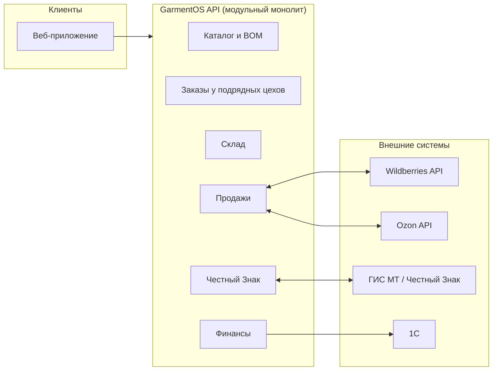

<div align="center">

# GarmentOS

**Операционная система для бренда одежды и селлера** (мы не шьём сами — размещаем заказы в подрядных цехах)

Закупка тканей → спецификации → заказы пошива в подрядных цехах → склад → маркетплейсы → «Честный Знак» → финансы — в едином цифровом контуре.

🚧 **Стадия проекта: Фаза 1 — MVP в разработке.** Фундамент (архитектура, стек, roadmap) закрыт, идёт итеративная реализация ядра системы — данные и домен впереди интерфейса. См. [`docs/ROADMAP.md`](./docs/ROADMAP.md).

[Видение проекта](./PROJECT_VISION.md) ·
[Архитектура](./docs/ARCHITECTURE.md) ·
[Технологический стек](./docs/TECH_STACK.md) ·
[Roadmap](./docs/ROADMAP.md) ·
[CLAUDE.md](./CLAUDE.md)

</div>

---

## Зачем нужен GarmentOS

Fashion-бренды и селлеры, работающие с подрядными швейными цехами, сегодня ведут учёт в пяти разных местах: Excel для остатков ткани, переписка с цехами в мессенджерах, отдельные личные кабинеты Wildberries/Ozon, отдельная маркировка «Честный Знак» и отдельно — 1С для бухгалтерии. Директор не видит бизнес целиком, а рутинная сверка данных съедает время ключевых людей.

**GarmentOS связывает весь путь изделия в одну систему**: от нормы расхода ткани на модель до фактической маржи по каждому артикулу на каждом канале продаж.

Подробнее о миссии, целях и пользователях — в [`PROJECT_VISION.md`](./PROJECT_VISION.md).

## Для кого

| Роль | Что получает в GarmentOS |
|---|---|
| 👔 Директор | Сводная маржинальность по моделям, каналам, заказам — в реальном времени |
| 📊 Бухгалтер | Себестоимость (включая услуги цехов и логистику), движение денег, выгрузка в 1С |
| 🧵 Технолог / менеджер по продукту | Спецификации (BOM), конструкторская документация, версии моделей в одном месте |
| 📦 Закупщик | Остатки материалов, точка перезаказа, заявки поставщикам |
| 🏬 Кладовщик | Приёмка, отгрузка, остатки по SKU (размер × цвет), инвентаризация — включая материалы, переданные цехам |
| 🛒 Менеджер маркетплейсов | Карточки, цены, остатки и заказы WB/Ozon в одном окне |
| 🏭 Менеджер по производству | Заказы у независимых подрядных цехов, контроль сроков и цен — **не управление собственным цехом** |

## Ключевые возможности (целевое состояние)

- **Каталог и SKU-матрица** — модели одежды с вариантами по размеру и цвету.
- **Спецификации (BOM)** — нормы расхода материалов на модель.
- **Заказы у подрядных цехов** — от размещения заказа до приёмки готовой продукции на склад.
- **Мультискладской учёт** — остатки, приёмки, отгрузки, инвентаризации по SKU (включая материалы у цехов-подрядчиков).
- **Интеграция с маркетплейсами** — единая точка управления остатками, ценами и заказами (Wildberries, Ozon).
- **«Честный Знак»** — учёт кодов маркировки, статусов, вывод из оборота при продаже.
- **Финансовый учёт** — себестоимость и маржа по модели/каналу/партии.

Границы MVP и то, что осознанно отложено — раздел 6 в [`PROJECT_VISION.md`](./PROJECT_VISION.md).

## Архитектура — коротко

Модульный монолит на TypeScript (готовый к выделению сервисов), API-first, с мультитенантностью, заложенной на уровне схемы БД с первого дня. Интеграции с маркетплейсами реализованы через единый интерфейс адаптера, чтобы добавление нового канала продаж не требовало изменений в домене.



Полная архитектура, диаграммы данных и сценариев — [`docs/ARCHITECTURE.md`](./docs/ARCHITECTURE.md).

## Технологический стек

| Слой | Технология |
|---|---|
| Backend | TypeScript, NestJS |
| Frontend | TypeScript, React, Vite |
| База данных | PostgreSQL, Drizzle ORM |
| Кэш / очереди | Redis, BullMQ |
| Хранилище файлов | S3-совместимое (фото, техпак/спецификации) |
| Инфраструктура | Docker, GitHub Actions, Turborepo/pnpm workspaces — **cloud-agnostic**, без привязки к провайдеру |

Полное обоснование выбора — [`docs/TECH_STACK.md`](./docs/TECH_STACK.md) и [`docs/INFRASTRUCTURE.md`](./docs/INFRASTRUCTURE.md).

## Быстрый старт

> ⚠️ Итерация 1 из Фазы 1 (`docs/ROADMAP.md`) — инфраструктурный скелет и `apps/api` с health-check. Доменные модули, схема БД, аутентификация и `apps/web` появятся по мере следующих итераций.

```bash
git clone <repo-url>
cd GarmentOS
cp .env.example .env
pnpm install

# lint / typecheck / test / build всего монорепозитория (Turborepo)
pnpm lint
pnpm typecheck
pnpm test
pnpm build

# локальный запуск API (health-check на /health)
pnpm --filter @garmentos/api dev
```

Локальная инфраструктура (Postgres/Redis/MinIO) — cloud-agnostic Docker Compose стек, подробности в [`docs/INFRASTRUCTURE.md`](./docs/INFRASTRUCTURE.md):
```bash
docker compose -f infra/docker-compose.yml up -d
```

## Структура репозитория

Кратко (полная версия — [`docs/REPOSITORY_STRUCTURE.md`](./docs/REPOSITORY_STRUCTURE.md)):

```
GarmentOS/
├── apps/           # приложения: api, web
├── packages/       # общий код: shared-types, ui-kit, db-schema, connectors
├── infra/          # docker, деплой, CI
├── docs/           # вся документация проекта
├── CLAUDE.md        # главный документ для разработки
├── PROJECT_VISION.md
└── README.md
```

## Документация

| | |
|---|---|
| 🎯 [`PROJECT_VISION.md`](./PROJECT_VISION.md) | Миссия, цели, пользователи, критерии успеха |
| 🏗️ [`docs/ARCHITECTURE.md`](./docs/ARCHITECTURE.md) | Полная системная архитектура |
| 🧱 [`docs/TECH_STACK.md`](./docs/TECH_STACK.md) | Технологический стек и обоснование |
| 📁 [`docs/REPOSITORY_STRUCTURE.md`](./docs/REPOSITORY_STRUCTURE.md) | Структура репозитория |
| 🗄️ [`docs/DATABASE_SCHEMA.md`](./docs/DATABASE_SCHEMA.md) | Структура базы данных |
| ☁️ [`docs/INFRASTRUCTURE.md`](./docs/INFRASTRUCTURE.md) | Cloud-agnostic инфраструктура: Start Lean, Scale Smart |
| 🗺️ [`docs/ROADMAP.md`](./docs/ROADMAP.md) | Дорожная карта |
| ⚙️ [`docs/PRINCIPLES.md`](./docs/PRINCIPLES.md) | Принципы разработки |
| ✅ [`docs/QUALITY_STANDARDS.md`](./docs/QUALITY_STANDARDS.md) | Стандарты качества |
| 🔍 [`docs/ARCHITECTURE_SELF_REVIEW.md`](./docs/ARCHITECTURE_SELF_REVIEW.md) | Самопроверка архитектуры |
| 🤖 [`CLAUDE.md`](./CLAUDE.md) | Главный документ для AI-агентов и разработчиков |

## Статус и контрибьютинг

Проект находится на стадии фундамента — приветствуется ревью архитектуры до начала реализации бизнес-логики (см. `CLAUDE.md`, раздел 0). Правила разработки — `docs/PRINCIPLES.md` и `docs/QUALITY_STANDARDS.md`.

## Лицензия

Лицензия будет определена перед первым публичным релизом.
