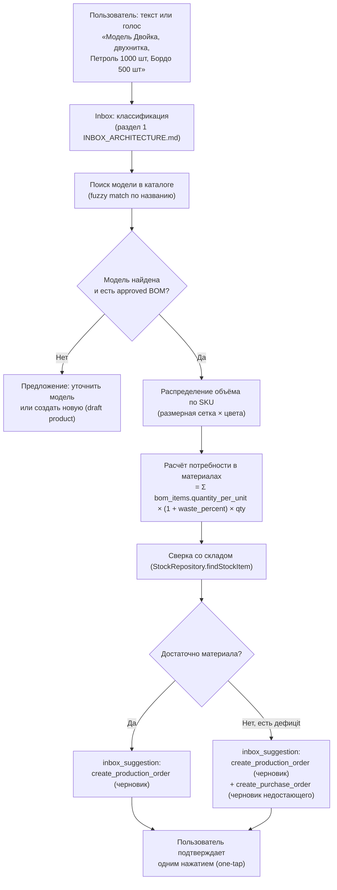

# AI Production Assistant — архитектура (без реализации)

> Связанные документы: [`INBOX_ARCHITECTURE.md`](./INBOX_ARCHITECTURE.md) (конвейер AI-классификации, draft-first, one-tap confirm — этот документ целиком на него опирается, а не дублирует), [`AUTH_ARCHITECTURE.md`](./AUTH_ARCHITECTURE.md), раздел 13 (AI не имеет собственных прав), [`DOCUMENT_ENGINE_ARCHITECTURE.md`](./DOCUMENT_ENGINE_ARCHITECTURE.md) (генерация PDF/e-signature, на который опирается сценарий согласования), [`WORKFLOW_ENGINE_ARCHITECTURE.md`](./WORKFLOW_ENGINE_ARCHITECTURE.md) (многошаговое согласование документов), [`TELEGRAM_INTEGRATION_ARCHITECTURE.md`](./TELEGRAM_INTEGRATION_ARCHITECTURE.md) (двусторонний канал с цехом), [`ROADMAP.md`](./ROADMAP.md), Фаза 2 (зафиксировано владельцем проекта 2026-07-25 как отдельный стратегический модуль).
>
> **Статус: архитектура утверждена к проектированию, реализация не начата.** Документ фиксирует решения до начала кодирования — по прямому указанию владельца проекта: 4 стратегических подсистемы (этот документ — один из них) должны быть спроектированы до того, как по ним пишется код.

## 0. Зачем и чем отличается от Inbox

`Inbox` (Итерация 9) уже решает задачу «принять неструктурированный вход и предложить действие» — универсально, для любого модуля. **AI Production Assistant не заменяет и не дублирует Inbox — это специализация того же конвейера на одной конкретной, самой трудоёмкой ручной операции владельца бренда: подготовке заказа пошива.** Разница не в механизме (draft-first/one-tap confirm/audit — везде тот же), а в глубине доменной логики одного конкретного сценария:

- Inbox распознаёт «это счёт» → создаёт черновик закупки с уже готовыми полями.
- AI Production Assistant распознаёт «нужно 1500 худи двух цветов» → **сам считает**, сколько для этого нужно ткани и фурнитуры по нормам BOM, сверяет со складом, находит дефицит, предлагает закупку недостающего — то есть выполняет расчёт, который сегодня делает технолог/закупщик в голове или в Excel.

Это то, что превращает систему из хранилища данных о заказе в реального помощника, который **готовит** заказ, а не просто **регистрирует** уже готовое решение человека.

## 1. Границы модуля

**AI Production Assistant не вводит новый bounded context и не создаёт собственных таблиц с доменным состоянием** — по тому же принципу, что и Inbox (`docs/ARCHITECTURE.md`, п.12, AI-First: AI работает через существующие application services, не в обход домена). Он:

- расширяет существующий Inbox-конвейер новыми типами `inbox_suggestions` (раздел 3);
- вызывает **уже существующие** use case'ы `packages/domain/bom`, `packages/domain/contract-manufacturing`, `packages/domain/procurement`, `packages/domain/warehouse` — не создаёт параллельных;
- добавляет один новый расчётный шаг без побочных эффектов — «посчитать потребность в материалах и сверить со складом» (раздел 2) — это **чтение**, не запись, до момента подтверждения;
- опирается на `Document Engine` (генерация PDF спецификации, подготовка к подписанию) и `Workflow Engine` (согласование документа несколькими ролями) как на инфраструктурные подсистемы, не реализует их сам.

Что явно **не** входит в этот модуль: собственно генерация PDF (`Document Engine`), собственно механизм согласования (`Workflow Engine`), сам Telegram-транспорт (`Telegram Integration`) — этот документ описывает только производственно-специфичную бизнес-логику поверх них.

## 2. Сценарий 1 — создание спецификации из текста/голоса



Ключевые решения:

1. **Расчёт потребности в материалах — не новый use case домена, а сервис уровня AI Production Assistant, читающий уже существующие данные** (`bom_items.quantity_per_unit`, `bom_items.waste_percent`, `stock_items.quantity_on_hand`). Он ничего не пишет — только готовит числа для предложения. Формула повторяет ту, что уже валидируется в `packages/domain/bom` при утверждении спецификации (не изобретается заново).
2. **Распределение объёма по SKU** — если у компании уже есть шаблон распределения по размерам для этой модели (типовая размерная сетка), он применяется автоматически; если шаблона нет — AI явно спрашивает пользователя, а не молча предполагает пропорцию (Zero Input не означает «угадывать финансово значимые числа», `PRINCIPLES.md`, принцип 17 — Zero Input экономит клики на очевидном, не на решениях, которые должен принять человек).
3. **И заказ пошива, и закупка недостающего материала создаются как черновики одновременно, одним предложением** — пользователь видит полную картину («вот что нужно сшить, и вот чего для этого не хватает») и подтверждает оба черновика одним действием, а не проходит два независимых диалога. Это расширение существующего правила Inbox «черновик безопасен и обратим» (`INBOX_ARCHITECTURE.md`, раздел 2) на составное предложение из нескольких связанных черновиков.
4. **Если модель не найдена или у неё нет утверждённого BOM** — AI не имеет права его придумать. Он либо предлагает создать модель/BOM как черновик (требующий ручного заполнения технологом), либо явно сообщает о недостающих данных. Инвариант «нельзя разместить заказ пошива без утверждённого BOM» (`packages/domain/contract-manufacturing`, `BomApprovalPort`) не обходится — черновик заказа может существовать без него, но подтверждение (`confirmProductionOrder`) остаётся заблокировано доменным слоем, как и для ручного создания.

## 3. Новые типы `inbox_suggestions`

Расширяют таблицу `docs/DATABASE_SCHEMA.md`, раздел 6, без изменения её структуры — `suggestion_type` уже не жёсткий enum (`INBOX_ARCHITECTURE.md`, раздел 6), поэтому добавление новых значений не требует миграции:

| Тип | Создаёт | Особенность |
|---|---|---|
| `create_production_order_from_spec` | Черновик `production_orders` (может быть несколько — по размеру/цвету/цеху) | `extractedData` включает результат расчёта потребности (раздел 2) — материалы, объёмы, дефицит — для показа пользователю перед подтверждением, не только предзаполненные поля формы |
| `create_purchase_order_for_shortage` | Черновик `purchase_orders` | Всегда создаётся **вместе** с `create_production_order_from_spec`, если обнаружен дефицит — связаны одним `inbox_item_id` |
| `generate_specification_document` | Не создаёт доменную запись — вызывает `Document Engine` (генерация PDF) по уже подтверждённому заказу | Выполняется **после** подтверждения заказа, не одновременно с созданием черновика — документ генерируется из финальных данных, не из черновика, который ещё может измениться |
| `workshop_status_update` | Предложение (не черновик) — обновление статуса существующего `production_order` | Источник — сообщение от цеха через Telegram (раздел 5, `TELEGRAM_INTEGRATION_ARCHITECTURE.md`), тот же паттерн, что уже описан в `INBOX_ARCHITECTURE.md`, раздел 4 (сценарий 2) — этот документ не меняет его, только называет как часть общего потока производственных сценариев |

## 4. Сценарий 2 — автогенерация документа спецификации

Не отдельная функциональность — прямое применение `Document Engine` (см. отдельный документ) к данным, уже существующим в системе на момент подтверждённого заказа пошива:

```
production_order (подтверждён) + bom (approved) + workshop + product_variants
                              ↓
              Document Engine: генерация PDF по шаблону
                              ↓
        documents (doc_type='specification') + document_links → production_order, bom, workshop
```

Ничего не нужно вводить повторно — документ собирается из тех же данных, которые уже верифицированы доменными инвариантами при подтверждении заказа. Пользователь получает готовый PDF вместо ручного заполнения Excel, но сам PDF — это представление уже существующих доменных данных, не новый источник истины.

## 5. Сценарий 3 — согласование и электронная подпись

**Обязательное ограничение, зафиксированное владельцем проекта вместе с этим модулем и не пересматриваемое без нового ADR: AI никогда не подписывает документ самостоятельно.** Он может:

1. Подготовить документ с местом для подписи (директор/бухгалтер/печать организации — настраивается компанией через `Workflow Engine`, раздел «многошаговое согласование»).
2. Если у компании заранее подключена система электронной подписи (интеграция за отдельным адаптером, по аналогии с `MarketplaceConnector`) — подготовить запрос на подписание и отправить его через эту систему.
3. **Никогда** не нажимает «подписать» от имени человека и не имеет доступа к приватным ключам/сертификатам ЭП пользователя — вызов подписания инициируется исключительно явным действием аутентифицированного человека, с тем же требованием прослеживаемости, что и любое другое AI-инициированное действие (`AUTH_ARCHITECTURE.md`, раздел 13).

Детальная архитектура согласования — `Workflow Engine`; электронная подпись как таковая (форматы, провайдеры, юридическая значимость в РФ) — открытый вопрос, требующий решения владельца проекта до реализации (не архитектурный, а юридически-продуктовый выбор конкретного провайдера ЭП).

## 6. Сценарий 4 — двусторонний обмен с цехом через Telegram

Цех отвечает на производственный заказ в Telegram (текст/фото готовой партии/голосовое о задержке) → тот же Inbox-конвейер, что и в `INBOX_ARCHITECTURE.md`, раздел 4 (сценарий 2, «предложение без черновика») — не новая логика, новый источник уже спроектированного события `update_production_order_status`. Транспортная часть (как бот определяет, к какому производственному заказу относится сообщение конкретного цеха) — предмет `TELEGRAM_INTEGRATION_ARCHITECTURE.md`, не этого документа.

## 7. Аудит и подотчётность (обязательное требование, не опция)

Каждое действие, инициированное этим модулем и подтверждённое человеком, попадает в `audit_log` (`packages/domain/audit`, Итерация 6) с уже готовой для этого структурой:

- `user_id` — кто подтвердил (никогда не сам AI — `AUTH_ARCHITECTURE.md`, раздел 13);
- `source = 'ai'` — что действие пришло через AI-конвейер, а не напрямую от человека;
- `inbox_suggestion_id` — какое именно предложение AI было подтверждено (nullable FK, добавлен в Итерации 6 заранее ровно для этого случая);
- `before_json`/`after_json` — что изменилось фактически (то же самое, что пишется при ручном действии — доменный use case не различает, кто его вызвал).

Реализация не требует новых полей — только использования уже существующего `AuditService.record(companyId, userId, "ai", {...})` в момент подтверждения AI-предложения, вместо `recordForUser(currentUser, {...})` (которое всегда пишет `source="http_api"`). Разница — какой источник передаётся, не новая инфраструктура.

## 8. Что осознанно не решено этим документом (открытые вопросы)

- **Конкретный провайдер LLM/мультимодальной модели** для распознавания голоса/текста производственного запроса — решается в рамках `docs/TECH_STACK.md`, не архитектурный вопрос этого документа.
- **Провайдер электронной подписи** (раздел 5) — юридически значимый выбор, требует решения владельца проекта, не техническая деталь.
- **Калибровка порога уверенности** для автоматического распределения объёма по SKU (раздел 2, п.2) — определяется по факту использования на пилоте, как и остальные пороги confidence в Inbox (`INBOX_ARCHITECTURE.md`, раздел 7.2).
- **Формат шаблона размерного распределения** (как компания задаёт «обычно 40% M, 35% L, 25% XL») — требует продуктового решения о UI хранения таких шаблонов, не входит в эту архитектуру.

## 9. Место в Roadmap

Не реализуется раньше Итерации 9 (Inbox — инфраструктура draft-first/one-tap уже должна существовать) и Итерации 5 (RBAC — реализована, без него нет от чьего имени выполнять AI-действия). Также зависит от `Document Engine` (раздел 4) и `Workflow Engine` (раздел 5) — оба должны быть спроектированы (не обязательно реализованы) раньше начала кодирования этого модуля, чтобы генерация документа и согласование не проектировались заново внутри AI Production Assistant. Сама реализация — Фаза 2, `docs/ROADMAP.md`.
