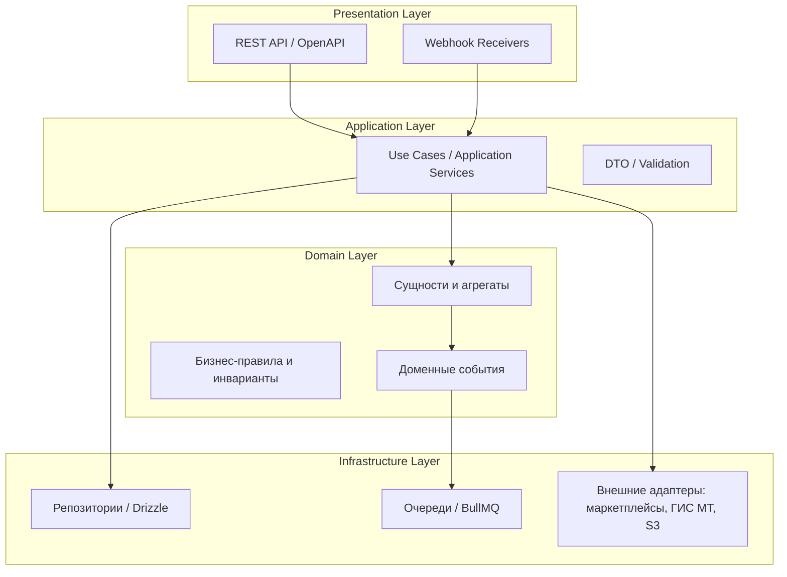
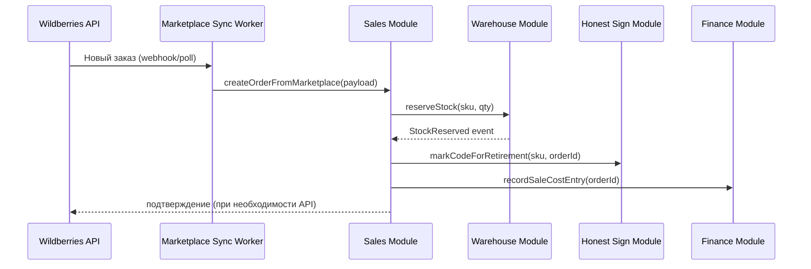
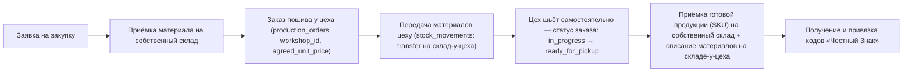
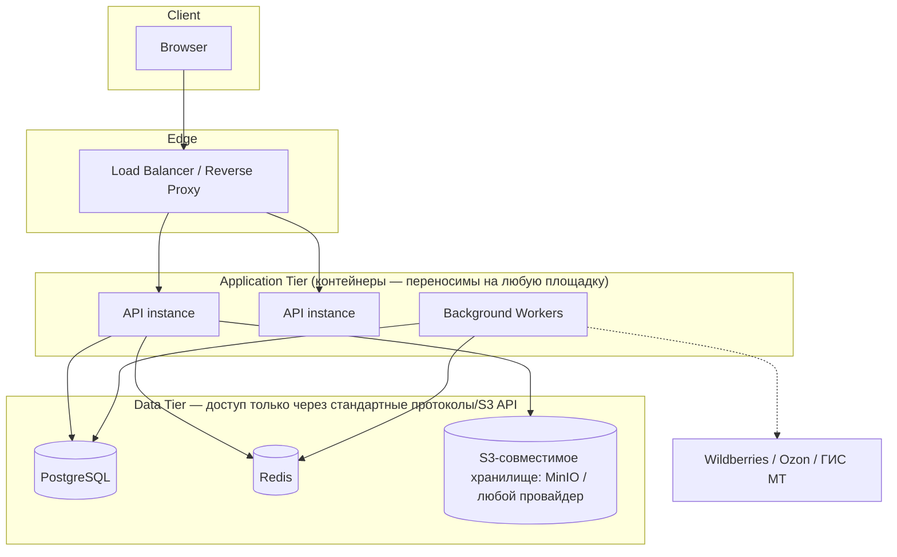

# Архитектура системы GarmentOS

> Связанные документы: [`PROJECT_VISION.md`](../PROJECT_VISION.md) (зачем), [`TECH_STACK.md`](./TECH_STACK.md) (на чём), [`DATABASE_SCHEMA.md`](./DATABASE_SCHEMA.md) (данные), [`REPOSITORY_STRUCTURE.md`](./REPOSITORY_STRUCTURE.md) (где лежит код), [`INFRASTRUCTURE.md`](./INFRASTRUCTURE.md) (где и как развёрнуто).

## 1. Архитектурный стиль

**Модульный монолит (modular monolith) с чёткими границами доменных модулей**, спроектированный так, чтобы любой модуль можно было выделить в отдельный сервис без переписывания бизнес-логики — если/когда это станет оправданным по нагрузке или организационно (отдельная команда на модуль).

Почему не микросервисы с самого начала:
- Команда на старте небольшая — распределённая система создаёт операционные издержки (сетевые вызовы, распределённые транзакции, наблюдаемость), не оправданные текущим масштабом.
- Домен GarmentOS сильно связан транзакционно (продажа одновременно списывает остаток, гасит код «Честного Знака» и создаёт финансовую проводку) — в монолите это последовательность в одной БД-транзакции, в микросервисах — Saga/event choreography, что сложнее и менее надёжно на старте.

Почему не «большой ком грязи» (big ball of mud):
- Модули общаются друг с другом **только через явные интерфейсы (application services)**, не через прямые обращения к чужим таблицам БД.
- Каждый модуль владеет своими таблицами; чтение чужих данных — через сервисный слой модуля-владельца.
- Граница модуля = граница потенциального будущего сервиса. Если два модуля должны стать отдельными сервисами — интерфейс между ними уже существует, меняется только транспорт (in-process call → HTTP/event).

## 2. Слои приложения



- **Presentation** — HTTP-контроллеры, валидация входных данных, маппинг DTO. Не содержит бизнес-логики.
- **Application** — оркестрация use case'ов («провести инвентаризацию», «создать производственный заказ»). Транзакционные границы живут здесь.
- **Domain** — сущности, агрегаты, инварианты предметной области (например: «нельзя отгрузить больше, чем есть на остатке»), доменные события (`StockDepleted`, `ProductionBatchCompleted`).
- **Infrastructure** — реализация репозиториев, очередей, внешних интеграций. Домен ничего не знает про Drizzle, Redis или Wildberries API — только про интерфейсы, которые Infrastructure реализует (Dependency Inversion).

## 3. Доменные модули (bounded contexts)

| Модуль | Ответственность | Ключевые сущности |
|---|---|---|
| **Identity & Access** | Пользователи, роли, права, компании (tenants) | `User`, `Role`, `Permission`, `Company` |
| **Catalog** | Модели одежды, SKU-матрица (размер × цвет) | `Product`, `ProductVariant` |
| **Materials & Procurement** | Материалы, поставщики, закупки | `Material`, `Supplier`, `PurchaseOrder` |
| **BOM** | Спецификации расхода материалов | `Bom`, `BomItem` |
| **Contract Manufacturing** (переименован из «Production» по итогам аудита бизнес-модели, см. `DATABASE_SCHEMA.md` п.0) | Заказы пошива у независимых подрядных цехов и контроль их исполнения — **не собственное производство** | `Workshop`, `ProductionOrder`, `ProductionOrderVariant` |
| **Warehouse & Inventory** | Остатки, приёмки, отгрузки, инвентаризации | `Warehouse`, `StockItem`, `StockMovement` |
| **Sales & Orders** | Унифицированные заказы всех каналов | `Order`, `OrderItem`, `SalesChannel` |
| **Marketplace Integration** | Адаптеры к внешним площадкам | `MarketplaceAccount`, `MarketplaceListing`, connector-интерфейс |
| **Honest Sign (Честный Знак)** | Учёт кодов маркировки и их статусов | `MarkingCode`, `MarkingCodeStatus` |
| **Finance** | Себестоимость, движение денег, документы | `CostEntry`, `Transaction`, `Invoice` |
| **Notifications** | Уведомления пользователям (низкий остаток, срыв сроков и т.д.) | `Notification`, `NotificationRule` |
| **Reporting/BI** | Агрегированная аналитика (только чтение из других модулей) | материализованные представления / read-models |

Полное описание таблиц каждого модуля — `DATABASE_SCHEMA.md`.

### Правило межмодульного взаимодействия

- Модуль A может вызвать **application service** модуля B (in-process, через DI), но не может читать/писать таблицы модуля B напрямую.
- Изменения состояния, которые интересны другим модулям, публикуются как **доменные события** (in-process event bus на старте, с возможностью перехода на очередь при выделении сервиса).
- Пример: `Sales` при создании заказа не списывает остаток сам — вызывает `Warehouse.reserveStock()`, а `Warehouse` публикует событие `StockReserved`, на которое подписан `HonestSign` (чтобы подготовить вывод кода из оборота) и `Finance` (для отражения резерва).

## 4. Ключевые сквозные сценарии (data flow)

### 4.1. Продажа через маркетплейс: от заказа до списания остатка и гашения кода маркировки



### 4.2. От закупки ткани до готового SKU на складе (через подрядный цех)

> Мы не производим — мы размещаем заказ у независимого швейного цеха (`workshops`) и контролируем исполнение. Этапы кроя/пошива/ОТК происходят внутри цеха и нам операционно не видны — мы отслеживаем факт и срок исполнения заказа, а не внутренние стадии (см. `DATABASE_SCHEMA.md` п.0 и п.7).



## 5. Интеграционная архитектура

### 5.1. Паттерн адаптера для маркетплейсов

Каждый маркетплейс (Wildberries, Ozon, Яндекс Маркет, ...) — это реализация общего интерфейса:

```typescript
interface MarketplaceConnector {
  syncCatalog(accountId: string): Promise<void>;
  syncStock(accountId: string): Promise<void>;
  syncPrices(accountId: string): Promise<void>;
  pullOrders(accountId: string): Promise<MarketplaceOrder[]>;
  pushStockUpdate(accountId: string, updates: StockUpdate[]): Promise<void>;
}
```

Домен (`Sales`, `Warehouse`) работает только с этим интерфейсом. Специфика API конкретной площадки (форматы, лимиты запросов, авторизация) инкапсулирована в `packages/connectors/wildberries`, `packages/connectors/ozon` и т.д. Добавление нового маркетплейса = новый пакет-коннектор, без изменений в домене.

**Решено окончательно**: первая реализация коннектора в Фазе 1 — `packages/connectors/wildberries`. Это выбор *приоритета реализации*, не архитектурное решение — интерфейс `MarketplaceConnector` спроектирован до и независимо от того, какой маркетплейс реализуется первым, поэтому Ozon/Яндекс Маркет в Фазе 2 добавляются как новые пакеты-коннекторы, реализующие тот же интерфейс, без изменений в `Sales`/`Warehouse`.

Причины для очереди/воркеров, а не синхронных вызовов из HTTP-запроса:
- API маркетплейсов имеют строгие rate limits — синхронизация выполняется фоновыми джобами (BullMQ) по расписанию и по вебхукам, с retry и backoff.
- Ошибка/недоступность внешнего API не должна блокировать основной UX системы.

### 5.2. Интеграция с «Честный Знак» (ГИС МТ / Национальный каталог)

Отдельный bounded context, инкапсулирующий:
- Заказ кодов маркировки (эмиссия).
- Нанесение кодов на единицы товара (привязка к `ProductVariant`/партии).
- Вывод из оборота при продаже (розница/маркетплейс) — включая сценарий продажи через маркетплейс, где отчёт в ГИС МТ формируется через оператора ЭДО или напрямую.
- Хранение истории статусов кода (`issued → applied → sold → retired`) для аудита и комплаенса.

Это осознанно не размазано по `Sales`/`Warehouse`, так как требования ГИС МТ меняются независимо от бизнес-логики продаж и производства, и модуль может потребовать отдельного релизного цикла из-за законодательных изменений.

### 5.3. Финансовая интеграция (1С и др.)

`Finance` формирует документы (проводки, себестоимость) внутри GarmentOS и предоставляет **экспортный слой** (файлы обмена 1С, CSV, в перспективе — API) — GarmentOS не заменяет бухгалтерский/налоговый учёт, а является источником управленческих данных для него (см. границы в `PROJECT_VISION.md`, п.6).

## 6. Мультитенантность

**Решено окончательно**: единая база данных с логической изоляцией по `company_id` в каждой доменной таблице (см. `DATABASE_SCHEMA.md`) — на весь MVP и Фазу 2. Это дешевле в разработке и сопровождении, чем отдельная БД/инстанс на клиента, и достаточно для целевого числа пилотов (`PROJECT_VISION.md`, горизонт 1 года).

Изоляция данных обеспечивается row-level: каждый запрос на чтение/запись доменных таблиц фильтруется по `company_id` на уровне application layer (репозитории не имеют способа обратиться к данным без указания тенанта — это гарантируется базовым классом репозитория, а не дисциплиной каждого разработчика). Путь к PostgreSQL Row-Level Security как дополнительному защитному слою (defense in depth) остаётся открытым и не требует миграции данных, если будет реализован позже.

**Никакая бизнес-логика домена не должна знать о схеме хранения тенанта.** `company_id` — деталь репозитория/инфраструктурного слоя (см. п.2, Dependency Inversion), а не параметр, который доменные сервисы передают друг другу вручную по всей цепочке вызовов — он инжектируется через контекст запроса (request-scoped) один раз на входе. Это условие того, что конкретная компания может быть переведена на отдельную БД или отдельный инстанс **без изменения кода домена** — меняется только реализация репозитория (подключение к другой БД по `company_id`), сама модель `packages/domain/*` остаётся прежней. Ни одна доменная сущность/use case не должна содержать SQL или прямых предположений о том, что все компании физически живут в одной таблице.

## 7. Безопасность

- **AuthN**: JWT (access + refresh токены), возможность добавления SSO позже без изменения доменной модели (авторизация — отдельный слой).
- **AuthZ**: RBAC, привязанный к ролям из `PROJECT_VISION.md` (директор, бухгалтер, закупщик, технолог, менеджер маркетплейсов, кладовщик) + гранулярные permissions на уровне модулей/действий.
- **Персональные данные (152-ФЗ)**: система хранит ПДн (сотрудники, контрагенты) — требуется учитывать требования к локализации хранения ПДн граждан РФ при выборе инфраструктуры (см. `docs/ARCHITECTURE_SELF_REVIEW.md`, открытый вопрос).
- **Секреты**: не хранятся в коде/репозитории, только через переменные окружения/секрет-менеджер инфраструктуры.
- **Аудит**: критические доменные операции (изменение остатков, списание кодов маркировки, финансовые проводки) пишут запись в `audit_log` с указанием пользователя, времени и предыдущего состояния.

## 8. Наблюдаемость (Observability)

- Структурированное логирование (JSON, с `traceId` на запрос).
- Метрики (Prometheus-совместимые) для health API, воркеров синхронизации, очередей.
- Трейсинг ключевых сквозных сценариев (продажа → списание → маркировка) через OpenTelemetry — критично, так как сценарий пересекает несколько модулей и фоновых джобов.
- Алертинг на: рассинхронизацию остатков с маркетплейсом, ошибки интеграции с ГИС МТ, просроченные очереди джобов.

## 9. Развёртывание

**Решено (см. [`INFRASTRUCTURE.md`](./INFRASTRUCTURE.md))**: инфраструктура **cloud-agnostic** по принципу «Start Lean, Scale Smart» — не привязана к конкретному облачному провайдеру, переносима между self-hosted сервером (в т.ч. в Кыргызстане, по критерию стоимости), Yandex Cloud, VK Cloud, AWS, Google Cloud и Azure без изменений в коде. Единственная зависимость приложения от среды исполнения — Docker, PostgreSQL-совместимая БД, Redis-совместимый кэш и S3-совместимое объектное хранилище, доступное через `StorageAdapter` (тот же паттерн адаптера, что и `MarketplaceConnector`, см. п.5.1).



- API stateless — горизонтально масштабируется за балансировщиком, на любой площадке.
- Background Workers — отдельный процесс(ы), масштабируется независимо от API (важно: синхронизация с маркетплейсами и обработка «Честного Знака» — I/O-bound и не должна конкурировать за ресурсы с обслуживанием пользовательских запросов).
- На Фазе 1 (Lean-старт) всё разворачивается на одном сервере через Docker Compose — эталонная схема и поэтапный план роста инфраструктуры без переписывания домена описаны в `INFRASTRUCTURE.md`.
- Юридическая применимость конкретной площадки для конкретного клиента (требования 152-ФЗ/242-ФЗ к ПДн граждан РФ) — бизнес-решение по каждому клиенту, не архитектурное ограничение; см. `INFRASTRUCTURE.md` п.8.

## 10. Путь к масштабированию

Если/когда конкретный модуль станет узким местом (например, `Marketplace Integration` при росте числа аккаунтов и частоты синхронизации):
1. Модуль уже имеет чёткую границу интерфейса → не требует рефакторинга домена.
2. In-process event bus заменяется на брокер сообщений (тот же Redis/BullMQ можно эволюционировать, либо перейти на Kafka/NATS при необходимости).
3. Данные модуля физически выносятся в собственную БД только тогда, когда это оправдано (не заранее).

Это описано как принцип, а не как задача Фазы 1 — см. `docs/PRINCIPLES.md` («эволюционная архитектура»).

## 11. Local-First: собственная БД как единственный источник истины

**Решено окончательно** (см. `docs/PRINCIPLES.md`, принцип 14): PostgreSQL-база GarmentOS — единственный Single Source of Truth для бизнес-состояния компании. Wildberries, Ozon, «Честный Знак»/ГИС МТ, 1С, банки, Telegram, Google и любые другие внешние системы участвуют в архитектуре только как **интеграции** через коннекторы (`packages/connectors/*`) — они никогда не являются местом, где хранится состояние, которое домен считает истинным.

Архитектурные следствия:
- **Синхронизация — одностороннее зеркалирование во внутрь, а не распределённая транзакция.** `Marketplace Sync Worker` читает состояние внешней площадки и **отражает** его в локальные таблицы (`marketplace_listings`, `orders`) — домен принимает решения (списать остаток, погасить код маркировки) на основе локальных данных, а не делает синхронный запрос к внешнему API в момент принятия решения.
- **Недоступность внешнего сервиса не останавливает бизнес-процесс.** Если Wildberries API не отвечает, GarmentOS продолжает работать с последним синхронизированным состоянием; факт "давно не синхронизировано" — это observability-сигнал (`marketplace_sync_logs`, алертинг, см. п.8), а не блокировка UX.
- **Конфликт между локальным и внешним состоянием разрешается явной политикой модуля**, а не имплицитным доверием последнему вебхуку (например: продажа, зарегистрированная локально после ручной инвентаризации, не должна быть перезаписана устаревшим состоянием остатка с площадки) — это проектируется предметно при реализации `Sales`/`Warehouse` в Фазе 1, а не оставляется на усмотрение конкретного коммита.
- **Экспорт в 1С/банки — то же самое зеркалирование, только наружу**: GarmentOS отдаёт данные, но не читает их обратно как источник истины для собственных решений (см. п.5.3).

## 12. Готовность к AI-агентам (AI-First)

**Решено окончательно** (см. `docs/PRINCIPLES.md`, принцип 15): GarmentOS не строит AI-функциональность в Фазе 1, но каждый модуль проектируется так, чтобы будущий AI-агент мог работать с системой **теми же средствами, что и человек**, без отдельного привилегированного пути:

| Возможность AI-агента (будущее) | Архитектурная опора (настоящее, уже спроектировано) |
|---|---|
| Выполнять действия самостоятельно | API-first (п.0 принципов) — AI вызывает те же application services через тот же REST/OpenAPI контракт, что и `apps/web`; никакого отдельного "AI backend" |
| Анализировать данные, находить ошибки | `audit_log`, `stock_movements`, `marking_code_events`, `inventory_count_items.discrepancy` (см. `DATABASE_SCHEMA.md`) — уже проектируются как полная история, а не только текущий агрегат (принцип 12) |
| Предлагать решения, прогнозировать показатели | `cost_entries`, история `orders`/`order_items` по каналам и периодам — данные для прогноза уже структурированы по модели/SKU/каналу, а не свалены в неструктурированный лог |
| Автоматически создавать документы | `Finance`/`invoices` и будущие генераторы отчётов используют те же доменные сущности, что и ручное создание — нет "теневой" AI-модели данных |
| Отвечать сотрудникам | `Notifications` — уже спроектирован как модуль, публикующий сообщения пользователю по доменным событиям (п.3); AI-агент — ещё один источник событий в этот же модуль, не новый канал |

**Явная граница**: это требование к *свойствам архитектуры* (API-first, событийность, полнота истории, отсутствие скрытых состояний), а не задача построить AI-агента сейчас. Проверка «AI-First» на код-ревью звучит так: «может ли будущий AI-агент сделать это через существующий API/событие, или ему пришлось бы обращаться к чему-то в обход домена?» — если пришлось бы, это сигнал, что API/событие спроектировано неполно независимо от AI (см. `docs/PRINCIPLES.md`, принцип 15).
