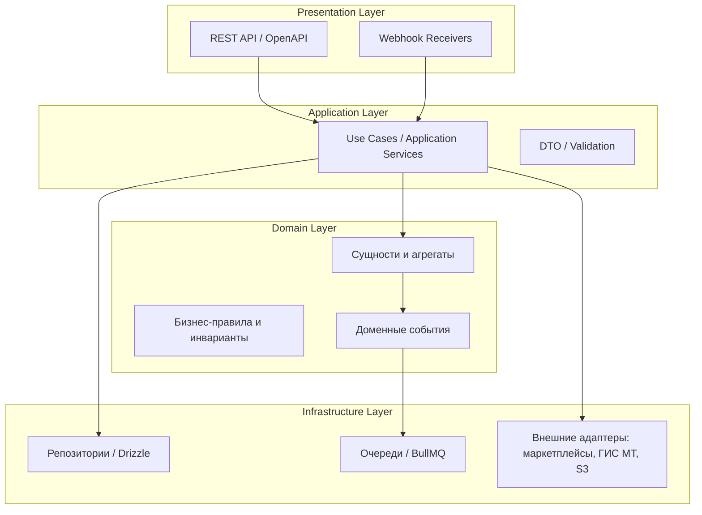
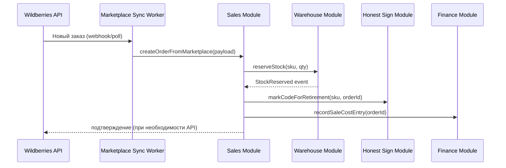
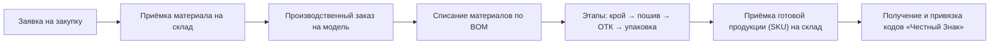
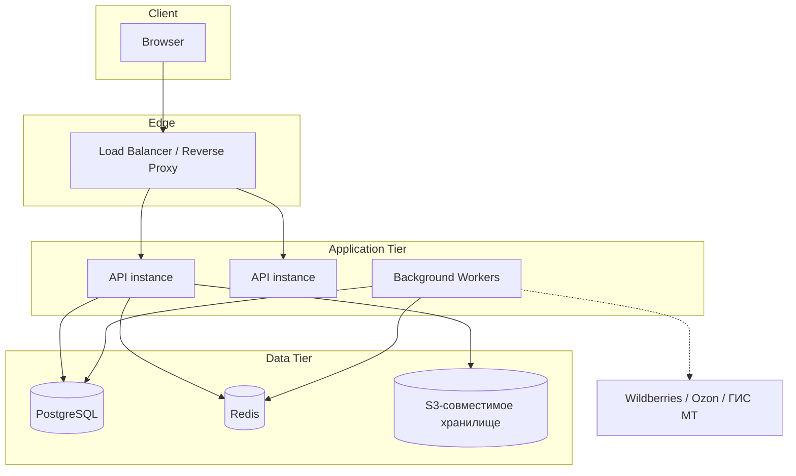

# Архитектура системы GarmentOS

> Связанные документы: [`PROJECT_VISION.md`](../PROJECT_VISION.md) (зачем), [`TECH_STACK.md`](./TECH_STACK.md) (на чём), [`DATABASE_SCHEMA.md`](./DATABASE_SCHEMA.md) (данные), [`REPOSITORY_STRUCTURE.md`](./REPOSITORY_STRUCTURE.md) (где лежит код).

## 1. Архитектурный стиль

**Модульный монолит (modular monolith) с чёткими границами доменных модулей**, спроектированный так, чтобы любой модуль можно было выделить в отдельный сервис без переписывания бизнес-логики — если/когда это станет оправданным по нагрузке или организационно (отдельная команда на модуль).

Почему не микросервисы с самого начала:
- Команда на старте небольшая — распределённая система создаёт операционные издержки (сетевые вызовы, распределённые транзакции, наблюдаемость), не оправданные текущим масштабом.
- Домен GarmentOS сильно связан транзакционно (продажа одновременно списывает остаток, гасит код «Честного Знака» и создаёт финансовую проводку) — в монолите это последовательность в одной БД-транзакции, в микросервисах — Saga/event choreography, что сложнее и менее надёжно на старте.

Почему не «большой ком грязи» (big ball of mud):
- Модули общаются друг с другом **только через явные интерфейсы (application services)**, не через прямые обращения к чужим таблицам БД.
- Каждый модуль владеет своими таблицами; чтение чужих данных — через сервисный слой модуля-владельца.
- Граница модуля = граница потенциального будущего сервиса. Если два модуля должны стать отдельными сервисами — интерфейс между ними уже существует, меняется только транспорт (in-process call → HTTP/event).

## 2. Слои приложения



- **Presentation** — HTTP-контроллеры, валидация входных данных, маппинг DTO. Не содержит бизнес-логики.
- **Application** — оркестрация use case'ов («провести инвентаризацию», «создать производственный заказ»). Транзакционные границы живут здесь.
- **Domain** — сущности, агрегаты, инварианты предметной области (например: «нельзя отгрузить больше, чем есть на остатке»), доменные события (`StockDepleted`, `ProductionBatchCompleted`).
- **Infrastructure** — реализация репозиториев, очередей, внешних интеграций. Домен ничего не знает про Drizzle, Redis или Wildberries API — только про интерфейсы, которые Infrastructure реализует (Dependency Inversion).

## 3. Доменные модули (bounded contexts)

| Модуль | Ответственность | Ключевые сущности |
|---|---|---|
| **Identity & Access** | Пользователи, роли, права, компании (tenants) | `User`, `Role`, `Permission`, `Company` |
| **Catalog** | Модели одежды, SKU-матрица (размер × цвет) | `Product`, `ProductVariant` |
| **Materials & Procurement** | Материалы, поставщики, закупки | `Material`, `Supplier`, `PurchaseOrder` |
| **BOM & Tech Specs** | Спецификации расхода, техкарты | `Bom`, `BomItem`, `TechSpec` |
| **Production** | Производственные заказы и этапы | `ProductionOrder`, `ProductionBatch`, `ProductionStage` |
| **Warehouse & Inventory** | Остатки, приёмки, отгрузки, инвентаризации | `Warehouse`, `StockItem`, `StockMovement` |
| **Sales & Orders** | Унифицированные заказы всех каналов | `Order`, `OrderItem`, `SalesChannel` |
| **Marketplace Integration** | Адаптеры к внешним площадкам | `MarketplaceAccount`, `MarketplaceListing`, connector-интерфейс |
| **Honest Sign (Честный Знак)** | Учёт кодов маркировки и их статусов | `MarkingCode`, `MarkingCodeStatus` |
| **Finance** | Себестоимость, движение денег, документы | `CostEntry`, `Transaction`, `Invoice` |
| **Notifications** | Уведомления пользователям (низкий остаток, срыв сроков и т.д.) | `Notification`, `NotificationRule` |
| **Reporting/BI** | Агрегированная аналитика (только чтение из других модулей) | материализованные представления / read-models |

Полное описание таблиц каждого модуля — `DATABASE_SCHEMA.md`.

### Правило межмодульного взаимодействия

- Модуль A может вызвать **application service** модуля B (in-process, через DI), но не может читать/писать таблицы модуля B напрямую.
- Изменения состояния, которые интересны другим модулям, публикуются как **доменные события** (in-process event bus на старте, с возможностью перехода на очередь при выделении сервиса).
- Пример: `Sales` при создании заказа не списывает остаток сам — вызывает `Warehouse.reserveStock()`, а `Warehouse` публикует событие `StockReserved`, на которое подписан `HonestSign` (чтобы подготовить вывод кода из оборота) и `Finance` (для отражения резерва).

## 4. Ключевые сквозные сценарии (data flow)

### 4.1. Продажа через маркетплейс: от заказа до списания остатка и гашения кода маркировки



### 4.2. От закупки ткани до готового SKU на складе



## 5. Интеграционная архитектура

### 5.1. Паттерн адаптера для маркетплейсов

Каждый маркетплейс (Wildberries, Ozon, Яндекс Маркет, ...) — это реализация общего интерфейса:

```typescript
interface MarketplaceConnector {
  syncCatalog(accountId: string): Promise<void>;
  syncStock(accountId: string): Promise<void>;
  syncPrices(accountId: string): Promise<void>;
  pullOrders(accountId: string): Promise<MarketplaceOrder[]>;
  pushStockUpdate(accountId: string, updates: StockUpdate[]): Promise<void>;
}
```

Домен (`Sales`, `Warehouse`) работает только с этим интерфейсом. Специфика API конкретной площадки (форматы, лимиты запросов, авторизация) инкапсулирована в `packages/connectors/wildberries`, `packages/connectors/ozon` и т.д. Добавление нового маркетплейса = новый пакет-коннектор, без изменений в домене.

Причины для очереди/воркеров, а не синхронных вызовов из HTTP-запроса:
- API маркетплейсов имеют строгие rate limits — синхронизация выполняется фоновыми джобами (BullMQ) по расписанию и по вебхукам, с retry и backoff.
- Ошибка/недоступность внешнего API не должна блокировать основной UX системы.

### 5.2. Интеграция с «Честный Знак» (ГИС МТ / Национальный каталог)

Отдельный bounded context, инкапсулирующий:
- Заказ кодов маркировки (эмиссия).
- Нанесение кодов на единицы товара (привязка к `ProductVariant`/партии).
- Вывод из оборота при продаже (розница/маркетплейс) — включая сценарий продажи через маркетплейс, где отчёт в ГИС МТ формируется через оператора ЭДО или напрямую.
- Хранение истории статусов кода (`issued → applied → sold → retired`) для аудита и комплаенса.

Это осознанно не размазано по `Sales`/`Warehouse`, так как требования ГИС МТ меняются независимо от бизнес-логики продаж и производства, и модуль может потребовать отдельного релизного цикла из-за законодательных изменений.

### 5.3. Финансовая интеграция (1С и др.)

`Finance` формирует документы (проводки, себестоимость) внутри GarmentOS и предоставляет **экспортный слой** (файлы обмена 1С, CSV, в перспективе — API) — GarmentOS не заменяет бухгалтерский/налоговый учёт, а является источником управленческих данных для него (см. границы в `PROJECT_VISION.md`, п.6).

## 6. Мультитенантность

Заложена на уровне схемы БД с первого дня (`company_id` в каждой доменной таблице, см. `DATABASE_SCHEMA.md`), даже если Фаза 1 разворачивается как single-tenant (один инстанс на клиента) или мульти-тенант в рамках одной БД для пилотных клиентов.

Стратегия изоляции данных (row-level через `company_id` + проверка на уровне application layer, с возможностью перехода на PostgreSQL Row-Level Security по мере роста) выбрана вместо "база на клиента", чтобы:
- Не усложнять операционку на старте (один набор миграций, один деплой).
- Сохранить путь к schema-per-tenant или database-per-tenant для крупных клиентов в будущем без изменения доменной модели.

## 7. Безопасность

- **AuthN**: JWT (access + refresh токены), возможность добавления SSO позже без изменения доменной модели (авторизация — отдельный слой).
- **AuthZ**: RBAC, привязанный к ролям из `PROJECT_VISION.md` (директор, бухгалтер, закупщик, технолог, менеджер маркетплейсов, кладовщик) + гранулярные permissions на уровне модулей/действий.
- **Персональные данные (152-ФЗ)**: система хранит ПДн (сотрудники, контрагенты) — требуется учитывать требования к локализации хранения ПДн граждан РФ при выборе инфраструктуры (см. `docs/ARCHITECTURE_SELF_REVIEW.md`, открытый вопрос).
- **Секреты**: не хранятся в коде/репозитории, только через переменные окружения/секрет-менеджер инфраструктуры.
- **Аудит**: критические доменные операции (изменение остатков, списание кодов маркировки, финансовые проводки) пишут запись в `audit_log` с указанием пользователя, времени и предыдущего состояния.

## 8. Наблюдаемость (Observability)

- Структурированное логирование (JSON, с `traceId` на запрос).
- Метрики (Prometheus-совместимые) для health API, воркеров синхронизации, очередей.
- Трейсинг ключевых сквозных сценариев (продажа → списание → маркировка) через OpenTelemetry — критично, так как сценарий пересекает несколько модулей и фоновых джобов.
- Алертинг на: рассинхронизацию остатков с маркетплейсом, ошибки интеграции с ГИС МТ, просроченные очереди джобов.

## 9. Развёртывание



- API stateless — горизонтально масштабируется за балансировщиком.
- Background Workers — отдельный процесс(ы), масштабируется независимо от API (важно: синхронизация с маркетплейсами и обработка «Честного Знака» — I/O-bound и не должна конкурировать за ресурсы с обслуживанием пользовательских запросов).
- Хостинг — см. открытый вопрос в `ARCHITECTURE_SELF_REVIEW.md` про требования к локализации данных.

## 10. Путь к масштабированию

Если/когда конкретный модуль станет узким местом (например, `Marketplace Integration` при росте числа аккаунтов и частоты синхронизации):
1. Модуль уже имеет чёткую границу интерфейса → не требует рефакторинга домена.
2. In-process event bus заменяется на брокер сообщений (тот же Redis/BullMQ можно эволюционировать, либо перейти на Kafka/NATS при необходимости).
3. Данные модуля физически выносятся в собственную БД только тогда, когда это оправдано (не заранее).

Это описано как принцип, а не как задача Фазы 1 — см. `docs/PRINCIPLES.md` («эволюционная архитектура»).
