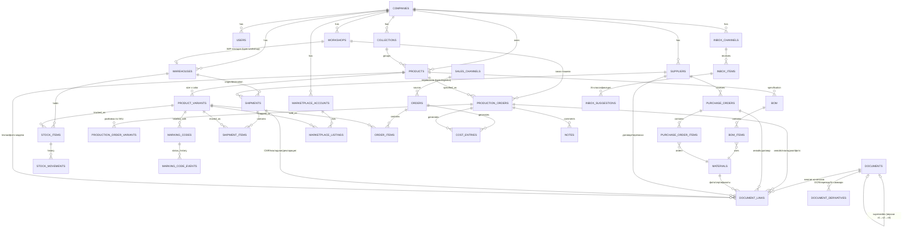
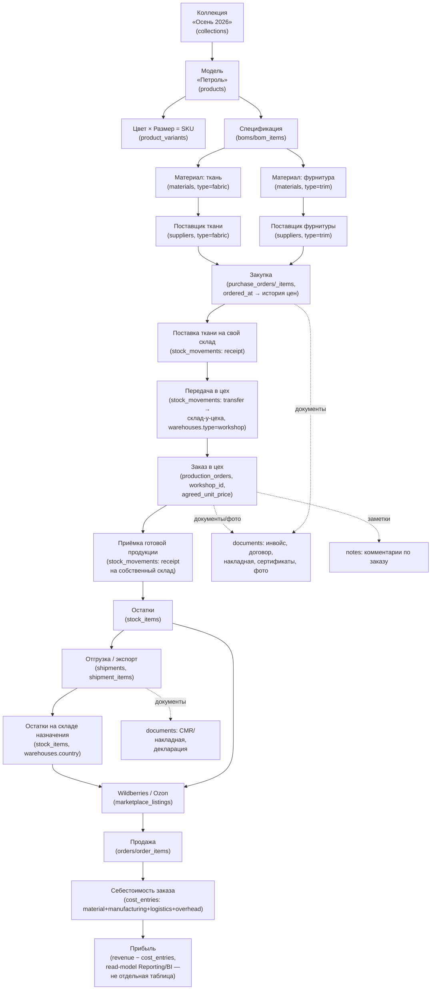

# Структура базы данных GarmentOS

> СУБД — PostgreSQL, ORM — Drizzle (обоснование в [`TECH_STACK.md`](./TECH_STACK.md)). Таблицы сгруппированы по доменным модулям из [`ARCHITECTURE.md`](./ARCHITECTURE.md). Это концептуальная схема (уровень сущностей и связей), а не финальный DDL — конкретные миграции создаются на Фазе 1.

## 0. Аудит бизнес-модели (2026-07-24) — почему схема отличается от первой версии

Первая версия этого документа была спроектирована по умолчанию как для вертикально интегрированного производителя (собственный цех, этапы кроя/пошива/ОТК/упаковки, штатные исполнители). Владелец проекта уточнил бизнес-модель: **GarmentOS обслуживает бренд одежды и селлера, а не фабрику**. Компания закупает ткани и фурнитуру, создаёт модели, размещает заказы в нескольких независимых подрядных швейных цехах, контролирует исполнение, принимает готовую продукцию, экспортирует её и продаёт через Wildberries/Ozon.

Проведён построчный аудит всех таблиц (4 вопроса на таблицу: нужна ли бизнесу / нужна ли для MVP / перенести в Future / удалить). Итог: удалены `tech_specs` и `production_stages` (структурно неприменимы — моделировали штатный цех), убраны из MVP `production_batches`/`production_batch_variants` (свёрнуты в `production_orders` + `production_order_variants`), добавлена `workshops`, расширены `production_orders`/`warehouses`/`cost_entries` под давальческую схему и оплату услуг подрядчика. Подробности решения — история этого документа (git log); действующая версия таблиц — ниже.

## 0b. Дополнение: полный жизненный цикл товара и документооборот (2026-07-24, второй проход)

После первого аудита владелец проекта попросил дополнительно проверить схему на соответствие **полному** жизненному циклу — от коллекции и закупки ткани до продажи на маркетплейсе и прибыли, — и явно смоделировать то, что раньше подразумевалось, но не было отражено в таблицах: коллекции, категории поставщиков, историю закупочных цен, экспорт/отгрузку и документооборот по партии. Результат:

| Изменение | Было | Стало | Почему |
|---|---|---|---|
| Добавлена `collections` | — | Новая сущность, `products.collection_id` | Модели группируются в сезонные коллекции («Осень 2026») — базовая единица планирования ассортимента, отсутствовала полностью |
| Расширены `suppliers` | `type` implicit (только материалы) | `type`: `fabric / trim / packaging / logistics` | Поставщики упаковки и транспортные компании — тоже поставщики, но не материалов на модель; нужна категоризация для отчётов и фильтрации |
| Расширены `materials` | `type`: `fabric/trim/accessory` | `type`: `fabric/trim/packaging/accessory` | Упаковка — тоже материал с расходом и остатком |
| Расширены `purchase_orders` | `expected_date` (план поставки) | + `ordered_at` (дата фактического размещения заказа) | Нужна отдельная от `expected_date` и от системного `created_at` бизнес-дата — основа для истории цен («Оксфорд 280 → март 270 → апрель 295 → июнь 320») |
| **История закупочных цен — не новая таблица** | — | Производный отчёт: `purchase_order_items.unit_price` + `purchase_orders.ordered_at` + `supplier_id`, сгруппировано по `material_id` | Дублировать цену в отдельную таблицу — нарушить принцип «данные как источник истины» (`PRINCIPLES.md`, №12): цена уже есть в позиции заказа, второе хранилище только создаёт риск рассинхронизации. Отчёт/материализованное представление — задача Reporting/BI (Фаза 2-3), не новая таблица сейчас |
| Расширены `warehouses` | `type`: `own/workshop/marketplace_fbo/consignment` | + `country` (текст/ISO) | Собственные склады физически могут быть в разных странах (склад в стране пошива и склад в стране продаж) — нужно для отчётности и для секции 10 (отгрузки/экспорт) |
| Добавлены `shipments`, `shipment_items` | — | Новые сущности | Экспорт/доставка между складами — по явному указанию владельца моделируется как простая сущность отгрузки, **не** полноценный таможенный модуль (декларации и т.п. прикрепляются как документы, см. ниже) |
| Добавлены `documents`, `notes` | — | Новые полиморфные сущности (`entity_type` + `entity_id`) | Открыть партию/заказ/отгрузку и сразу увидеть инвойс, договор, накладную, фото, сертификаты, декларацию, доп. соглашение к спецификации, а также произвольные заметки — раньше было негде хранить |

**Профиль/маржа не хранится отдельной таблицей** — это вычисляемая метрика (выручка из `orders`/`order_items` минус `cost_entries` минус `logistics_cost`), принадлежит модулю Reporting/BI как read-model, не доменной таблице (см. `ARCHITECTURE.md`, модуль Reporting/BI).

Все остальные таблицы прошли повторную проверку без изменений.

## 0c. Дополнение: аудит с точки зрения пользователя и Universal Inbox (2026-07-24, третий проход)

Владелец проекта попросил перед продолжением разработки пройти день владельца бизнеса в системе (11 шагов — от закупки ткани до анализа прибыли) и спроектировать максимально быстрый ввод данных, предполагая, что пользователь работает преимущественно с телефона через Telegram/WhatsApp/WeChat/email/фото/голос. Полный разбор — [`USER_JOURNEY_AUDIT.md`](./USER_JOURNEY_AUDIT.md), архитектура решения — [`INBOX_ARCHITECTURE.md`](./INBOX_ARCHITECTURE.md). Изменения в схеме:

| Изменение | Было | Стало | Почему |
|---|---|---|---|
| Добавлено `production_orders.received_at` | Только `status`, без фактической даты завершения | `received_at NULL` (timestamp) | Без фактической даты невозможно сравнить план (`due_date`) и факт для рейтинга цеха и алертов о просрочке (`USER_JOURNEY_AUDIT.md`, пробел №5) |
| Добавлены `inbox_channels`, `inbox_items`, `inbox_suggestions` (раздел 15) | — | Новые сущности | Главный найденный пробел: весь ручной ввод (закупки, заказы в цех, приёмка, отгрузка) требовал заполнения форм — нарушало принцип «Zero Input» (`docs/PRINCIPLES.md`, №17). AI распознаёт входящее сообщение/фото/голос и предлагает готовое действие, пользователь подтверждает одним нажатием — исполняет тот же application service, что и ручное создание (`INBOX_ARCHITECTURE.md`, раздел 1) |
| Задокументированы доменные инварианты (не новые таблицы) | — | «BOM должен быть approved перед production_order», «нельзя transfer/dispatch при недостатке остатка» (раздел 8) | Найдены как пробелы в аудите (№4, №6), закрываются в Итерации 3 тестами, не миграцией |
| Задокументирован read-model «заказы без cost_entries» (раздел 14) | — | — | Предупреждает об искажённой марже до того, как владелец увидит неверный отчёт (пробел №8) |

Остальные найденные в аудите пробелы (№1-3, №7) — read-model'ы и use case'ы, не требующие изменения схемы; см. таблицу решений в `USER_JOURNEY_AUDIT.md`.

## 0d. Дополнение: «черновики» вместо чистых предложений (2026-07-24, обратная связь по Inbox)

После представления архитектуры Inbox (п.0c) владелец проекта уточнил: Inbox должен быть не просто загрузкой файлов, а единой точкой входа для любого источника (включая CSV/ZIP/пересланные сообщения/облачные ссылки — см. `INBOX_ARCHITECTURE.md`, раздел 1), и там, где это безопасно, AI должен сразу создавать реальный черновик, а не только предложение, — «ты ничего не потерял», даже если не отреагировал сразу. Изменения в схеме:

| Изменение | Было | Стало | Почему |
|---|---|---|---|
| `production_order_status` получил значение `draft` | `placed/in_progress/ready_for_pickup/received/cancelled` | + `draft` (первое значение) | Черновик заказа в цех, созданный Inbox из входящего сообщения, виден в обычном списке заказов сразу, не только в разделе «Входящие» (`INBOX_ARCHITECTURE.md`, раздел 2.1) |
| Добавлен `suppliers.status` | — (не было статуса) | `partner_status`: `draft/active/archived` | AI встречает незнакомого поставщика в счёте → создаёт черновик поставщика, не блокируя черновик закупки, которая на него ссылается |
| `workshops.is_active` (boolean) заменён на `workshops.status` | `is_active: boolean` | `partner_status`: `draft/active/archived` | Единообразие с `suppliers` — тот же паттерн черновика для нового цеха, ранее замеченного в сообщении |

`partner_status` — общий enum для `suppliers`/`workshops` (не дублируется по одному на таблицу — обе сущности концептуально одинаковы: контрагент, который может быть черновиком/активным/архивным).

**Важно**: черновик — это не вторая копия данных для Inbox, а настоящая строка в `purchase_orders`/`production_orders`/`suppliers`/`workshops` со `status='draft'`, видимая в обычных списках приложения. `inbox_suggestions.suggested_entity_id` в этом случае указывает на только что созданный черновик, а не только на найденную существующую сущность (см. `INBOX_ARCHITECTURE.md`, раздел 2.1, таблица «что становится черновиком сразу»).

Миграция сгенерирована и применена к реальному Postgres (44 таблицы, 24 enum-типа, 89 внешних ключей); сценарий «Inbox создаёт черновик закупки и черновика поставщика → пользователь подтверждает → оба переходят в активный статус» проверен сквозным smoke-тестом.

## 0e. Дополнение: документ относится не к одной сущности, а ко многим (2026-07-24)

Владелец проекта уточнил главный принцип Inbox (`docs/PRINCIPLES.md`, принцип 18): документ или сообщение почти никогда не относится к одной сущности. Инвойс поставщика ткани — одновременно про поставщика, материал и закупку; фото партии — про производственный заказ, модель и конкретные SKU. Карточка модели должна показывать **всю** историю документов, связанных с ней, включая пересланные мимоходом в Telegram.

| Изменение | Было | Стало | Почему |
|---|---|---|---|
| `documents.entity_type`/`entity_id` удалены | Один документ = одна связь (один-к-одному) | — | Не позволяло одному документу относиться сразу к нескольким объектам |
| Добавлена `document_links` (раздел 16) | — | Новая many-to-many таблица: документ ↔ сущность, с `confidence` и `source` (`ai`/`manual`) | Один и тот же файл появляется на страницах материала, поставщика и закупки одновременно — без дублирования файла |
| `inbox_suggestions.suggestion_type` дополнен `link_document` | Одно предложение = одно действие | Одно входящее сообщение может породить **несколько** предложений `link_document` — по одному на каждую вероятную сущность, каждое со своей `confidence` | Высокая уверенность по конкретной сущности → готово к подтверждению; остальные — дополнительные варианты. Это не взаимоисключающий выбор («какой из этих один») — несколько связей могут быть верны одновременно |

**`notes` не меняется** — остаётся один-к-одному (`entity_type`/`entity_id` прямо на таблице): комментарий пользователя написан в контексте одной конкретной сущности, даже если упоминает другие, в отличие от документа, который самостоятельно относится сразу к нескольким объектам бизнеса.

**Ручное связывание** — не только через Inbox: с карточки любой сущности можно прикрепить существующий документ, создав строку в `document_links` напрямую (`source='manual'`, `confidence=NULL`, `linked_by`=пользователь). AI и человек создают связи одной и той же таблицей — нет отдельной «ручной» модели данных.

Миграция сгенерирована и применена к реальному Postgres (45 таблиц, 25 enum-типов); сценарий «одно фото ткани одновременно привязано к материалу (AI, 0.93), закупке (AI, 0.81) и вручную — к цеху» проверен сквозным smoke-тестом: запрос по `(entity_type, entity_id)` материала корректно возвращает документ независимо от того, к скольким ещё сущностям он привязан.

## 0f. Дополнение: версионность и неизменность документов (2026-07-24, финальное ревью Inbox)

Владелец проекта утвердил архитектуру Universal Inbox и потребовал зафиксировать до Итерации 3 ещё один пробел: `document_links` (п.0e) решает «к скольким сущностям относится документ», но не отвечает на вопрос «это тот же документ, что и вчера, только новая редакция, или другой файл» (пример: `Price_v1.xlsx` → `Price_final.xlsx` → `Price_final_NEW.xlsx`, или исправленный поставщиком инвойс) — и не гарантирует, что AI-обработка (OCR, перевод) не подменит исходный файл. Закрыто как принцип 19 `PRINCIPLES.md` («Immutable Original»); здесь — схемные изменения.

| Изменение | Было | Стало | Почему |
|---|---|---|---|
| `documents.supersedes_document_id` (self-FK, nullable) | — | Ссылка на предыдущую версию того же логического документа | v1→v2→v3 — цепочка версий, а не независимые файлы |
| `documents.is_current_version` (boolean, default true) | — | Денормализованный флаг актуальной версии | «Покажи актуальный прайс» без обхода всей цепочки на каждый запрос |
| Триггер `documents_file_url_immutable` на `documents` | — | `BEFORE UPDATE` блокирует изменение `file_url` с явной ошибкой | Гарантия на уровне БД, а не только на уровне приложения/соглашения — оригинал нельзя переписать по ошибке или по недосмотру в новом коде |
| Новая таблица `document_derivatives` | — | `id`, `document_id` (FK `documents`), `type` (`ocr_text`/`translation`/`structured_data`/`ai_summary`), `content` (jsonb), `language NULL`, `generated_by NULL`, `created_at` | OCR/перевод/структурные данные/AI-саммари — производные строки, ссылающиеся на неизменяемый оригинал, а не перезапись `documents.file_url` |

Триггер — единственный в схеме и написан вручную (`packages/db-schema/drizzle/0005_document_immutability_trigger.sql`, зарегистрирован в `drizzle/meta/_journal.json` вручную), потому что `drizzle-kit` не генерирует DDL для триггеров/функций из декларативной TS-схемы — это осознанное разовое исключение, отмеченное комментарием в файле миграции.

Проверено на реальном Postgres: цепочка `v1→v2→v3` (recursive CTE) возвращает версии в правильном порядке; `document_derivatives` остаются привязаны к неизменному оригиналу; `UPDATE documents SET file_url = ...` блокируется триггером с ожидаемым сообщением; `UPDATE documents SET title = ...` проходит без ошибки (неизменность касается только файла, не всей строки).

**Entity Timeline и Document Graph** (два других пункта финального ревью) не потребовали изменений схемы — оба реализуются как read-model/запросы поверх уже существующих таблиц (`document_links`, `notes`, `audit_log`, `inbox_suggestions` + существующие FK), без новых сущностей. Подробности — `PRINCIPLES.md`, принцип 18, пп.5-6; технический план запроса — `INBOX_ARCHITECTURE.md`, раздел 7.5-7.6.

## 1. Сквозные конвенции

- **Именование таблиц**: `snake_case`, множественное число (`products`, `stock_items`).
- **Первичные ключи**: `id UUID DEFAULT gen_random_uuid()` — UUID вместо serial, чтобы избежать угадываемых ID во внешних интеграциях (маркетплейсы видят наши ID через API) и упростить будущий шардинг.
- **Мультитенантность**: каждая «корневая» доменная таблица модуля содержит `company_id UUID NOT NULL REFERENCES companies(id)`. Строки-детали, которые существуют только в контексте родителя (`bom_items`, `purchase_order_items`, `product_variants`, `stock_items`, `stock_movements`, `order_items` и т.п. — везде, где в описании таблицы ниже `company_id` не перечислен), наследуют тенант через FK на родителя, а не дублируют колонку — родитель уже отфильтрован по `company_id`, повторение было бы избыточной денормализацией без выгоды. Все запросы приложения обязаны фильтровать по `company_id` (обеспечивается на уровне application layer + композитные индексы `(company_id, ...)`; путь к PostgreSQL Row-Level Security открыт на будущее).
- **Аудит-поля** на каждой таблице: `created_at TIMESTAMPTZ NOT NULL DEFAULT now()`, `updated_at TIMESTAMPTZ NOT NULL DEFAULT now()`, `created_by UUID REFERENCES users(id)`.
- **Бизнес-даты отделены от системных**: `created_at` — когда запись появилась в БД; бизнes-событие (когда заказ реально размещён, когда отгрузка реально ушла) хранится отдельным полем (`ordered_at`, `shipped_at` и т.п.) — они могут не совпадать (запись вносят в систему позже факта).
- **Мягкое удаление** для справочников и документов с историей (`deleted_at TIMESTAMPTZ NULL`) — обязательно для `products`, `product_variants`, `materials`, `orders` и т.д.; физическое удаление запрещено для сущностей с финансовым/комплаенс-следом (коды маркировки, проводки).
- **Деньги**: тип `numeric(14,2)` (никогда `float`), валюта фиксируется на уровне компании (мультивалютность — вне скоупа MVP).
- **Количества (SKU)**: `numeric(12,3)` — учитывает как штучный товар, так и материалы, которые могут измеряться в метрах/килограммах с дробной частью.
- **Внешние ID** (ID заказа в WB, ID SKU в Ozon и т.д.) хранятся рядом с нашим ID как `external_id text`, не заменяют собственный PK.
- **Полиморфные связи** (`document_links`, `notes`, `audit_log`): `entity_type text` + `entity_id UUID` вместо отдельной таблицы/FK на каждую комбинацию. Осознанный компромисс — теряется ссылочная целостность на уровне БД (нельзя `REFERENCES` на переменную таблицу), проверка `entity_type`/существования `entity_id` — на уровне application layer. Выбрано, чтобы не плодить `production_order_documents`, `purchase_order_documents`, `shipment_documents`, ... — по одной таблице на каждую пару. Пересмотреть, если реальные проблемы с целостностью данных проявятся на практике (принцип эволюционной архитектуры, `PRINCIPLES.md` №3).
- **Документы — многие-ко-многим, не полиморфная пара на самом файле** (`docs/PRINCIPLES.md`, принцип 18): `documents` хранит только файл и метаданные; связи с сущностями — в отдельной `document_links` (документ ↔ сущность, с `confidence`/`source`), потому что один файл обычно относится сразу к нескольким объектам (инвойс — к поставщику, материалу и закупке одновременно). `notes` и `audit_log` остаются один-к-одному — комментарий/лог всегда в контексте ровно одной операции/сущности.

## 2. ER-диаграмма (укрупнённо)

## 3. Жизненный цикл товара (процесс) — от коллекции до прибыли

> Это не ER-диаграмма (не все узлы — таблицы; «Прибыль» — вычисляемая метрика), а иллюстрация того, как таблицы из разделов 4-15 складываются в реальный бизнес-процесс. Именно эта цепочка должна быть проверяемо отражена в БД — см. таблицу соответствия под диаграммой.

**Проверка соответствия** (пункт задачи «эта цепочка должна быть отражена в БД»):

| Шаг из бизнес-процесса | Таблица(ы) | Статус |
|---|---|---|
| Коллекция | `collections` | Добавлено в этом проходе |
| Модель → Ткань → Фурнитура | `products`, `boms`, `bom_items`, `materials` | Было |
| Поставщик | `suppliers` (+ `type`) | Категоризация добавлена в этом проходе |
| Закупка | `purchase_orders`, `purchase_order_items` (+ `ordered_at`) | `ordered_at` добавлено в этом проходе |
| Поставка ткани (на свой склад) | `stock_movements` (`type=receipt`) | Было |
| Передача ткани в цех | `stock_movements` (`type=transfer`, склад `type=workshop`) | Было (прошлый аудит) |
| Заказ в цех | `production_orders`, `production_order_variants` | Было (прошлый аудит) |
| Приёмка (готовой продукции) | `stock_movements` (`type=receipt`, ссылка на `production_order_id`) | Было |
| Склад | `warehouses` (+ `country`), `stock_items` | `country` добавлено в этом проходе |
| Экспорт | `shipments`, `shipment_items` | Добавлено в этом проходе |
| Wildberries / Ozon | `marketplace_listings`, `marketplace_accounts` | Было |
| Продажи | `orders`, `order_items` | Было |
| Прибыль | вычисляется из `orders` + `cost_entries` | Read-model, не таблица |

## 4. Identity & Access

| Таблица | Ключевые поля | Комментарий |
|---|---|---|
| `companies` | `id`, `name`, `legal_name`, `inn`, `timezone`, `default_currency` | Тенант. Корень мультитенантности |
| `users` | `id`, `company_id`, `email`, `password_hash`, `full_name`, `is_active` | Пользователь всегда принадлежит компании |
| `roles` | `id`, `company_id NULL` (глобальные роли) или `company_id` (кастомные), `name`, `code` | Предустановленные роли — см. `PROJECT_VISION.md` (бренд/селлер, не производитель) |
| `permissions` | `id`, `code` (например, `warehouse.stock.write`), `module` | Гранулярные права по модулю/действию |
| `role_permissions` | `role_id`, `permission_id` | Многие-ко-многим |
| `user_roles` | `user_id`, `role_id` | Пользователь может иметь несколько ролей (актуально для малых команд) |

## 5. Catalog

| Таблица | Ключевые поля | Комментарий |
|---|---|---|
| `collections` | `id`, `company_id`, `name` (например, «Осень 2026»), `season` (`spring/summer/autumn/winter` NULL), `year`, `status` (`planning/active/archived`) | **Новая сущность.** Сезонная коллекция — единица планирования ассортимента, группирует модели |
| `products` | `id`, `company_id`, `collection_id NULL`, `name`, `code` (артикул модели), `category`, `season`, `status` (`draft/active/discontinued`), `tech_pack_url` | Модель одежды на уровне абстракции, без размера/цвета. `collection_id` — nullable: не каждая модель обязана входить в формальную коллекцию. `tech_pack_url` — ссылка на текущий файл спецификации (через `StorageAdapter`); архив версий/доп. соглашений — через `documents` (см. п.16) |
| `product_variants` | `id`, `product_id`, `size`, `color`, `sku_code` (уникальный внутри компании), `barcode` (EAN/GTIN) | Конкретный SKU — единица учёта остатков и продаж. Уникальный индекс `(product_id, size, color)` — добавлен этапом 5 (2026-08-31, миграция `0020`), с предварительной проверкой на дубли перед созданием (падает и перечисляет конкретные строки, если дубли уже есть, ничего не чинит автоматически) |
| `product_sizes` | `id`, `product_id`, `size`, `sort_order`, `ratio_weight` | **Новая таблица, этап 5.** Размерный ряд модели: `sort_order` — единственный источник порядка размеров (48-50 раньше 52-54), `ratio_weight` — вес размера в пропорции для раскладки количества (например, 185/381/381/381/186 — веса, не проценты, масштабируются на любой объём заказа). Уникальный индекс `(product_id, size)`. Версий не имеет: раскладка фиксируется не здесь, а в строках уже созданного заказа (`production_order_variants`) |

## 6. Materials & Procurement

| Таблица | Ключевые поля | Комментарий |
|---|---|---|
| `materials` | `id`, `company_id`, `name`, `type` (`fabric/trim/packaging/accessory`), `unit` (`m/kg/pcs`), `reorder_point` | Ткани, фурнитура, упаковка и прочие материалы. `packaging` добавлен в этом проходе |
| `suppliers` | `id`, `company_id`, `name`, `type` (`fabric/trim/packaging/logistics`), `status` (`draft/active/archived`), `inn`, `contact_info` | Поставщики — явно категоризированы, включая транспортные компании (`logistics`, используются как `shipments.carrier_id`). `status=draft` — создан автоматически Inbox из входящего документа, ещё не подтверждён (см. п.0d). Один поставщик = одна основная категория для MVP; поставщик нескольких категорий заводится отдельными строками при необходимости (не усложняем до реальной необходимости) |
| `purchase_orders` | `id`, `company_id`, `supplier_id`, `status` (`draft/sent/partially_received/received/cancelled`), `ordered_at`, `expected_date` | Заявка/заказ поставщику материалов. `ordered_at` — дата фактического размещения заказа (бизнес-дата, отдельно от `created_at`) — основа для истории цен |
| `purchase_order_items` | `id`, `purchase_order_id`, `material_id`, `quantity`, `unit_price` | Позиции заказа. **История закупочных цен по материалу** — не отдельная таблица, а отчёт/представление: `unit_price` этой таблицы + `ordered_at`/`supplier_id` родительского `purchase_orders`, сгруппированные по `material_id` (см. п.0b) |

## 7. BOM (спецификации)

| Таблица | Ключевые поля | Комментарий |
|---|---|---|
| `boms` | `id`, `company_id`, `product_id`, `version`, `status` (`draft/approved/archived`) | Спецификация версионируется — изменение нормы расхода не должно портить историю уже размещённых заказов у цехов |
| `bom_items` | `id`, `bom_id`, `material_id`, `quantity_per_unit`, `waste_percent` | Норма расхода материала на единицу модели с учётом отхода — основа для расчёта, сколько ткани/фурнитуры передать цеху под заказ (давальческая схема), и для себестоимости |

~~`tech_specs`~~ — удалена по итогам первого аудита (п.0): моделировала операции пошива с нормо-минутами, применимо только к штатным швеям.

## 8. Contract Manufacturing (заказы в подрядных швейных цехах)

> Мы не производим — мы размещаем и контролируем заказы у независимых подрядчиков (см. п.0).

| Таблица | Ключевые поля | Комментарий |
|---|---|---|
| `workshops` | `id`, `company_id`, `name`, `inn`, `contact_info`, `specialization`, `status` (`draft/active/archived`) | Независимый подрядный швейный цех — поставщик услуги пошива, не материалов. `status` заменил булев `is_active` (см. п.0d) — единообразно с `suppliers`, поддерживает черновик от Inbox |
| `production_orders` | `id`, `company_id`, `product_id`, `bom_id`, `workshop_id`, `planned_quantity`, `agreed_unit_price`, `materials_provided_by_us` (bool), `status` (`draft/placed/in_progress/ready_for_pickup/received/cancelled`), `due_date`, `received_at NULL` | Заказ пошива у конкретного цеха по согласованной цене за единицу. `status=draft` — создан автоматически Inbox, ещё не подтверждён (п.0d); `status` в остальном — простое поле вместо отдельной таблицы стадий. `received_at` — фактическая дата завершения, без которой невозможно сравнить план (`due_date`) и факт для рейтинга цеха и алертов о просрочке (`USER_JOURNEY_AUDIT.md`, пробел №5) |
| `production_order_variants` | `production_order_id`, `product_variant_id`, `quantity` | Разбивка заказа по размеру/цвету (SKU). Фактически принятое количество по SKU — не отдельная колонка, а read-model: сумма `stock_movements` типа `receipt` со ссылкой на этот заказ (`reference_type='production_order'`), сгруппированная по `product_variant_id` — см. `USER_JOURNEY_AUDIT.md`, шаг 7 |

**Не в MVP, возможно в Future**: `production_batches` — если появится потребность дробить один заказ на несколько независимо отслеживаемых партий поставки.

### 8а. Раскрой (этап 5, 2026-08-31)

Следующий шаг производства после размещения заказа. Строится автоматически из данных
заказа (матрица размер × цвет — из `production_order_variants`, потребность в материалах —
из замороженных норм в `production_orders.cost_snapshot`), собственного статуса заказа не
меняет — у раскроя своё состояние. Один заказ может получить несколько раскройных заданий
подряд (докрой).

| Таблица | Ключевые поля | Комментарий |
|---|---|---|
| `cutting_orders` | `id`, `company_id`, `production_order_id`, `number` (порядковый внутри заказа — докрой получает следующий), `status` (`draft/issued/completed/cancelled`), `executor_type` (`in_house/workshop`), `executor_workshop_id NULL` (обязателен при `workshop`, запрещён при `in_house` — тот же инвариант, что у `warehouses.workshop_id`), `issued_at NULL`, `completed_at NULL`, `comment NULL`, `created_by` | Раскройное задание. Уникальность `(production_order_id, number)`, а не `(production_order_id)` — докрой разрешён |
| `cutting_order_materials` | `id`, `cutting_order_id`, `material_id`, `unit`, `required_quantity`, `allocated_quantity NULL`, `consumed_quantity NULL`, `roll_note NULL` | План / выделено / факт по каждому материалу задания. `required_quantity` фиксируется при выдаче в крой и не пересчитывается фактом. Рулоны — только текстовый комментарий, отдельной сущности нет (решение владельца: не заставлять систему моделировать каждый рулон) |
| `cutting_order_results` | `id`, `cutting_order_id`, `product_variant_id`, `planned_quantity`, `actual_quantity NULL` | Результат кроя по одной ячейке размер × цвет. Измеряется в готовых комплектах — расхождение «4542 верха и 4300 подкладов» структурно невозможно, так как количество по каждому материалу отдельно не хранится |

Склад: создание и выдача задания склад не трогают. Единственная точка расхода —
внесение факта (`consumeMaterialStock` с `referenceType='cutting_order'`, для этого пути
разрешён допустимый перерасход — остаток может уйти в минус, расхождение показывается
предупреждением, а не блокирует факт). Исправление факта после завершения — движение
`stock_movements.type='adjustment'` на разницу, история — в существующем `audit_log`,
второй системы учёта не заводилось.

**Не проектируется вовсе**: детальная стадийность («крой», «пошив», «ОТК») с привязкой к ответственному сотруднику — операционная модель штатного цеха, которого нет. Вместо неё — Inbox (раздел 15): цех сообщает о готовности в Telegram, AI предлагает обновить статус, эскалация при отсутствии обновлений (`USER_JOURNEY_AUDIT.md`, шаг 6).

**Доменные инварианты, обязательные к реализации в Итерации 3** (не влияют на схему таблиц, но должны быть закреплены тестами use case'ов — см. `USER_JOURNEY_AUDIT.md`, пробелы №4 и №6):
- Нельзя создать `production_order`, пока `bom.status != 'approved'`.
- Нельзя выполнить `stock_movement` типа `transfer`/`dispatch`, если `quantity_on_hand − quantity_reserved` источника меньше запрашиваемого количества.

## 9. Warehouse & Inventory

| Таблица | Ключевые поля | Комментарий |
|---|---|---|
| `warehouses` | `id`, `company_id`, `name`, `type` (`own/workshop/marketplace_fbo/consignment`), `country`, `workshop_id NULL` | `country` добавлен в этом проходе — собственные склады могут физически находиться в разных странах (склад в стране пошива и склад в стране продаж), это основа для секции 10 (отгрузки). `type=workshop` (+`workshop_id`) — WIP-локация у подрядчика для давальческого сырья |
| `stock_items` | `id`, `warehouse_id`, `product_variant_id`, `quantity_on_hand`, `quantity_reserved` | Текущий остаток по SKU на складе |
| `stock_movements` | `id`, `stock_item_id`, `type` (`receipt/dispatch/adjustment/transfer`), `quantity`, `reference_type`, `reference_id`, `occurred_at` | Полная история движений — источник истины. `dispatch` — окончательный исход со склада конечному покупателю (продажа); движение между двумя нашими складами (в т.ч. отгрузка/экспорт из п.10) — `transfer`, во избежание путаницы с сущностью `shipments` (переименовано в этом проходе: было `shipment`, теперь `dispatch`) |
| `inventory_counts` | `id`, `warehouse_id`, `status`, `performed_by`, `performed_at` | Инвентаризация — в первую очередь для собственных складов |
| `inventory_count_items` | `inventory_count_id`, `product_variant_id`, `expected_quantity`, `actual_quantity`, `discrepancy` | Расхождения факта и учёта — метрика успеха проекта (см. `PROJECT_VISION.md`, критерий 1) |

## 10. Logistics & Export (отгрузки)

> Часть модуля Warehouse & Inventory (не отдельный bounded context — экспорт технически является перемещением между складами с дополнительными логистическими атрибутами). По явному решению владельца — **простая сущность отгрузки для MVP, не полноценный таможенный модуль**: декларации и прочие таможенные документы прикрепляются как файлы через `documents` (п.16), а не моделируются структурированными полями.

| Таблица | Ключевые поля | Комментарий |
|---|---|---|
| `shipments` | `id`, `company_id`, `origin_warehouse_id`, `destination_warehouse_id`, `carrier_id NULL` (FK `suppliers`, `type=logistics`), `status` (`planned/in_transit/customs_clearance/delivered/cancelled`), `tracking_number NULL`, `shipped_at NULL`, `delivered_at NULL` | Отгрузка/экспорт между **нашими** складами (например, склад в стране пошива → склад в стране продаж) — оба склада наши, значит движение остатков отражается через `stock_movements` с `type='transfer', reference_type='shipment', reference_id=shipments.id` (не `dispatch` — товар не покидает компанию) |
| `shipment_items` | `shipment_id`, `product_variant_id`, `quantity` | Что именно едет в этой отгрузке — по SKU |

## 11. Sales & Orders

| Таблица | Ключевые поля | Комментарий |
|---|---|---|
| `sales_channels` | `id`, `company_id`, `type` (`marketplace/wholesale/retail/own_website`), `name` | Унифицированный источник продажи. MVP: только `marketplace` (Wildberries) |
| `orders` | `id`, `company_id`, `sales_channel_id`, `external_order_id`, `status`, `total_amount`, `ordered_at` | Единый заказ независимо от канала |
| `order_items` | `id`, `order_id`, `product_variant_id`, `quantity`, `unit_price` | Позиции заказа |

## 12. Marketplace Integration

| Таблица | Ключевые поля | Комментарий |
|---|---|---|
| `marketplaces` | `id`, `code` (`wildberries/ozon/yandex_market`), `name` | Справочник поддерживаемых площадок |
| `marketplace_accounts` | `id`, `company_id`, `marketplace_id`, `api_credentials_encrypted`, `is_active` | Личный кабинет продавца компании на площадке |
| `marketplace_listings` | `id`, `marketplace_account_id`, `product_variant_id`, `external_sku_id`, `current_price`, `current_stock_reported` | Связка нашего SKU с карточкой на площадке |
| `marketplace_sync_logs` | `id`, `marketplace_account_id`, `sync_type`, `status`, `started_at`, `finished_at`, `error_details` | Наблюдаемость интеграций |

## 13. Honest Sign (Честный Знак)

| Таблица | Ключевые поля | Комментарий |
|---|---|---|
| `marking_codes` | `id`, `company_id`, `product_variant_id`, `code_value` (DataMatrix), `status` (`issued/applied/introduced/sold/retired/damaged`), `production_order_id NULL` | Код маркировки — обязанность лежит на нас как на продавце/импортёре |
| `marking_code_events` | `id`, `marking_code_id`, `event_type`, `occurred_at`, `reference_type`, `reference_id`, `payload_json` | История статусов для аудита перед ГИС МТ |

## 14. Finance

| Таблица | Ключевые поля | Комментарий |
|---|---|---|
| `cost_entries` | `id`, `company_id`, `product_variant_id`, `production_order_id NULL`, `material_cost`, `manufacturing_cost`, `logistics_cost`, `overhead_cost`, `calculated_at` | Себестоимость единицы: материалы + `manufacturing_cost` (услуга цеха) + `logistics_cost` (доставка/экспорт) + накладные |
| `transactions` | `id`, `company_id`, `type` (`income/expense`), `amount`, `reference_type`, `reference_id`, `occurred_at` | Движение денег для управленческого учёта |
| `invoices` | `id`, `company_id`, `order_id NULL`, `purchase_order_id NULL`, `production_order_id NULL`, `status`, `amount`, `due_date` | Документы к оплате/получению — счета от поставщиков материалов и от подрядных цехов |

**Прибыль/маржа** — не хранится: вычисляется как `orders.total_amount` (выручка) минус связанные `cost_entries` минус прочие расходы периода. Это read-model Reporting/BI, не таблица (см. п.0b).

**Read-model «заказы без рассчитанной себестоимости»** (`USER_JOURNEY_AUDIT.md`, пробел №8): `production_orders.status = 'received'`, для которых нет ни одной строки `cost_entries` — предупреждает, что P&L занижен/искажён, не даёт узнать об этом постфактум из неверного отчёта.

## 15. Inbox (Universal Inbox)

> Добавлен 2026-07-24 по итогам `USER_JOURNEY_AUDIT.md` (главный найденный пробел — весь ручной ввод в шагах 1-4, 7, 9 требовал формы; см. также `docs/PRINCIPLES.md` принцип 17 «Zero Input»). Полная архитектура pipeline — [`INBOX_ARCHITECTURE.md`](./INBOX_ARCHITECTURE.md). Здесь — только структура данных.

| Таблица | Ключевые поля | Комментарий |
|---|---|---|
| `inbox_channels` | `id`, `company_id`, `type` (`telegram/whatsapp/wechat/email/upload`), `external_identifier` (bot chat id / email-алиас), `is_active` | Подключённый канал, через который в компанию поступают сообщения. MVP: `telegram`, `upload` (см. `INBOX_ARCHITECTURE.md`, раздел 4) |
| `inbox_items` | `id`, `company_id`, `inbox_channel_id`, `source_identifier` (кто прислал — телефон/Telegram-хэндл), `raw_text NULL`, `file_url NULL` (через `StorageAdapter`), `received_at`, `status` (`new/processing/suggested/confirmed/rejected/ignored`) | Сырое входящее сообщение — фото/PDF/Excel/голос (транскрибированный в текст)/обычный текст. Ничего не пишет в доменные таблицы напрямую |
| `inbox_suggestions` | `id`, `inbox_item_id`, `suggestion_type` (`create_purchase_order/create_production_order/create_supplier/create_workshop/link_document/update_production_order_status/record_transaction/update_material_prices/create_note/...`), `extracted_data` (jsonb), `suggested_entity_type NULL`, `suggested_entity_id NULL`, `confidence` (numeric 0-1), `status` (`pending/accepted/rejected/edited_and_accepted`), `reviewed_by NULL`, `reviewed_at NULL` | Результат AI-классификации одного `inbox_item`. Для типов `create_*` с безопасным черновым статусом (п.0d) — `suggested_entity_id` уже указывает на реально созданный черновик (`status='draft'`), подтверждение лишь переводит его в активный статус. Для `link_document` — **одно входящее сообщение может породить несколько строк** `inbox_suggestions`, по одной на каждую вероятную сущность (материал, закупка, модель…), каждая со своей `confidence`; подтверждение создаёт строку в `document_links` (раздел 16), не взаимоисключающий выбор — несколько связей могут быть подтверждены одновременно (п.0e). Для остальных типов — ничего не создано, подтверждение (`accepted`/`edited_and_accepted`) вызывает application service (`INBOX_ARCHITECTURE.md`, раздел 2). Эта таблица никогда не является источником истины для доменного состояния — только предложением/ссылкой на черновик |

`suggestion_type` — не жёсткий enum в БД, как и `documents.doc_type` (раздел 16): валидируется на уровне application layer, чтобы новые типы предложений добавлялись без миграции (`INBOX_ARCHITECTURE.md`, раздел 5).

## 16. Общие/сквозные

| Таблица | Ключевые поля | Комментарий |
|---|---|---|
| `audit_log` | `id`, `company_id`, `user_id`, `entity_type`, `entity_id`, `action`, `before_json`, `after_json`, `occurred_at` | Системный аудит критичных операций (см. `ARCHITECTURE.md` п.7) — **не путать** с `notes` ниже: это автоматический след изменений полей, не текст от пользователя |
| `notifications` | `id`, `company_id`, `user_id`, `type`, `payload_json`, `read_at` | Уведомления (низкий остаток, срыв срока заказа у цеха и т.д.) |
| `documents` | `id`, `company_id`, `doc_type` (`invoice/contract/waybill/photo/certificate/specification/declaration/addendum/other`), `file_url`, `title NULL`, `issued_at NULL`, `uploaded_by`, `supersedes_document_id NULL` (self-FK), `is_current_version` (default true) | Только файл и его метаданные — **без** привязки к сущности (см. п.0e/`document_links` ниже). `file_url` — через `StorageAdapter` (см. `INFRASTRUCTURE.md` п.2.3), **неизменяем после создания** — защищено триггером `documents_file_url_immutable` (п.0f, `PRINCIPLES.md` принцип 19). Новая версия файла (`Price_v1.xlsx` → `Price_final.xlsx`) — новая строка с `supersedes_document_id`, не `UPDATE` существующей |
| `document_derivatives` | `id`, `document_id` (FK `documents`), `type` (`ocr_text/translation/structured_data/ai_summary`), `content` (jsonb), `language NULL`, `generated_by NULL`, `created_at` | **Новая сущность (п.0f).** Производные данные оригинала (распознанный текст, перевод, структурные поля, AI-саммари) — отдельные строки, ссылающиеся на неизменяемый `documents.id`, а не перезапись оригинала. Переобработка (более точный OCR) добавляет новую строку, старая не удаляется |
| `document_links` | `id`, `company_id`, `document_id`, `entity_type` (`product/product_variant/collection/material/supplier/purchase_order/workshop/production_order/shipment/warehouse`), `entity_id`, `confidence NULL` (0-1, NULL для ручных связей), `source` (`ai`/`manual`), `linked_by NULL`, `linked_at` | **Новая сущность (п.0e).** Многие-ко-многим: один документ — много сущностей, одна сущность — много документов. Открыть карточку модели/материала/закупки/цеха/отгрузки — увидеть все привязанные документы через `WHERE entity_type=... AND entity_id=...`, независимо от того, к скольким ещё сущностям привязан тот же файл. `company_id` продублирован намеренно — единственная защита от межтенантной утечки для полиморфной пары, для которой нет FK на конкретную таблицу |
| `notes` | `id`, `company_id`, `entity_type`, `entity_id`, `author_id` (FK `users`), `body`, `created_at` | Свободный текстовый комментарий к одной конкретной сущности («цех попросил перенести срок на 3 дня») — один-к-одному, в отличие от `documents`/`document_links` (файл может относиться сразу к нескольким) и `audit_log` (автоматический след) |

## 17. Индексация — базовые правила

- Композитный индекс `(company_id, id)` или включение `company_id` первым полем в любой составной индекс — так как фильтрация по тенанту присутствует в каждом запросе.
- `stock_items`: уникальный индекс `(warehouse_id, product_variant_id)`.
- `marking_codes.code_value`: уникальный индекс (глобально уникален по природе DataMatrix-кода).
- `order_items`, `stock_movements`: индекс по `occurred_at`/`ordered_at` для отчётных запросов по периодам.
- `marketplace_listings`: уникальный индекс `(marketplace_account_id, external_sku_id)`.
- `warehouses`: `workshop_id` обязателен, когда `type = 'workshop'`, и NULL иначе (проверяется на уровне application layer или CHECK-constraint).
- `purchase_orders`: индекс `(supplier_id, ordered_at)` — основа отчёта истории цен (п.0b, 6).
- `purchase_order_items`: индекс `(material_id)` — для отчёта истории цен в разрезе материала.
- `notes`: индекс `(company_id, entity_type, entity_id)` — быстрая выборка «всё по этому заказу/отгрузке».
- `document_links`: индекс `(entity_type, entity_id)` — главный запрос «все документы этой сущности» (карточка модели/материала/закупки); индекс `(document_id)` — «ко всем сущностям привязан этот файл».
- `documents`: индекс `(company_id, is_current_version)` — «покажи только актуальные версии документов компании»; индекс `(supersedes_document_id)` — обход цепочки версий в обе стороны.
- `document_derivatives`: индекс `(document_id)` — «все производные данные этого оригинала» (OCR/перевод/AI-саммари).
- `shipments`: индекс `(company_id, status)`, `(destination_warehouse_id)`.
- `collections`: уникальный индекс `(company_id, name)`.
- `inbox_items`: индекс `(company_id, status)` — очередь необработанных/неподтверждённых сообщений — главный экран Inbox.
- `inbox_suggestions`: индекс `(inbox_item_id)`, `(suggested_entity_type, suggested_entity_id)` — «все предложения по этому заказу/закупке».
- `production_orders`: индекс `(company_id, status, due_date)` — «заказы с риском просрочки» (`USER_JOURNEY_AUDIT.md`, шаг 6).

## 18. Миграции

- Управляются через Drizzle Kit, миграции — часть `packages/db-schema`, версионируются в git, применяются в CI перед деплоем (см. `QUALITY_STANDARDS.md`).
- Правило: миграция, ломающая обратную совместимость (удаление колонки, NOT NULL без дефолта на непустой таблице), разбивается на два релиза (expand → migrate data → contract), а не выполняется одним шагом на проде.

## 19. Открытые вопросы по схеме

Вынесены в [`ARCHITECTURE_SELF_REVIEW.md`](./ARCHITECTURE_SELF_REVIEW.md): партиционирование `stock_movements`/`marking_code_events` по мере роста, стратегия RLS вместо application-level фильтрации по `company_id`, схема хранения `api_credentials_encrypted` (KMS vs application-level шифрование).

**Закрыт этим проходом**: моделирование экспорта — решено как простая сущность `shipments` (п.10), не таможенный модуль.

**Закрыт финальным ревью Inbox (2026-07-24, п.0f)**: версионность и неизменность документов — `supersedes_document_id`/`is_current_version` + триггер `documents_file_url_immutable` + `document_derivatives`. Entity Timeline и Document Graph закрыты как read-model/запросы без изменения схемы (`PRINCIPLES.md`, принцип 18, пп.5-6).

**Новый вопрос (не блокирует Итерацию 2)**: если один поставщик реально продаёт материалы нескольких категорий (например, ткань и фурнитуру одновременно), заводить ли его несколькими строками в `suppliers` или переходить на `supplier_categories` (многие-ко-многим)? Для MVP — несколько строк (проще); пересмотреть, если на практике это создаст путаницу в отчётах.

**Риски Inbox (не блокируют Итерацию 3, см. `INBOX_ARCHITECTURE.md` раздел 8)**: стоимость AI-классификации на входящее сообщение (Cost-First, `docs/TECH_STACK.md`), точность сопоставления с существующей сущностью при низкой уверенности, выбор конкретного провайдера LLM/OCR/распознавания речи за `AIClassifier`-адаптером — решается в Итерации 3/9, не на уровне схемы.
