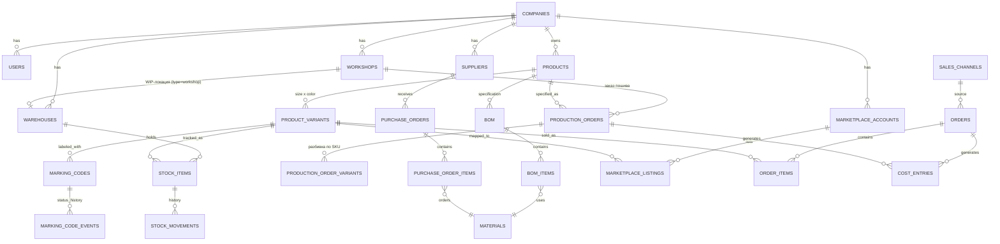

# Структура базы данных GarmentOS

> СУБД — PostgreSQL, ORM — Drizzle (обоснование в [`TECH_STACK.md`](./TECH_STACK.md)). Таблицы сгруппированы по доменным модулям из [`ARCHITECTURE.md`](./ARCHITECTURE.md). Это концептуальная схема (уровень сущностей и связей), а не финальный DDL — конкретные миграции создаются на Фазе 1.

## 0. Аудит бизнес-модели (2026-07-24) — почему схема ниже отличается от первой версии

Первая версия этого документа была спроектирована по умолчанию как для вертикально интегрированного производителя (собственный цех, этапы кроя/пошива/ОТК/упаковки, штатные исполнители). Владелец проекта уточнил бизнес-модель: **GarmentOS обслуживает бренд одежды и селлера, а не фабрику**. Компания закупает ткани и фурнитуру, создаёт модели, размещает заказы в нескольких независимых подрядных швейных цехах, контролирует исполнение, принимает готовую продукцию, экспортирует её и продаёт через Wildberries/Ozon.

Проведён построчный аудит всех таблиц (4 вопроса на таблицу: нужна ли бизнесу / нужна ли для MVP / перенести в Future / удалить). Результат:

| Изменение | Было | Стало | Почему |
|---|---|---|---|
| Удалена `tech_specs` | Техкарта с операциями пошива и нормо-минутами на операцию | Простое поле `tech_pack_url`/`spec_notes` на `products` | Нормо-минуты на операцию — модель оплаты труда штатных швей. У нас нет штата швей — удалено, не отложено, форма структурно неприменима |
| Удалена `production_stages` | Этапы `cutting/sewing/qc/packaging` с `responsible_user_id` | Поле `status` на заказе подрядчику | Это операционка цеха *подрядчика*, мы её не ведём и не имеем там своих сотрудников |
| Убраны из MVP `production_batches`/`production_batch_variants` | Отдельный уровень «партия» между заказом и SKU | Свёрнуты в один уровень: `production_orders` + `production_order_variants` | При модели «один заказ — один цех» отдельный уровень партии — лишняя сущность; дробление приёмки решается через несколько `stock_movements` на один заказ |
| Добавлена `workshops` | — | Новая сущность | Независимые подрядные швейные цеха — центральный контрагент бизнес-модели, ранее не был смоделирован вовсе |
| Расширены `production_orders` | `product_id`, `bom_id`, `planned_quantity`, `status`, `due_date` | + `workshop_id`, `agreed_unit_price`, `materials_provided_by_us` | Заказ теперь явно означает «заказ пошива у конкретного подрядчика по согласованной цене за единицу», а не внутренний производственный наряд |
| Расширены `warehouses` | `type`: `own/marketplace_fbo/consignment` | + `type = workshop`, `workshop_id` | Ткань/фурнитура, переданные цеху (давальческая схема), остаются нашим активом до приёмки готовой продукции — моделируется как склад-локация у подрядчика через уже существующий механизм `stock_movements` (`transfer`), без нового домена |
| Расширены `cost_entries` | `material_cost`, `labor_cost`, `overhead_cost` | `labor_cost` переосмыслен как «стоимость услуг цеха» (закупленная услуга, не внутренний нормо-час) + добавлен `logistics_cost` | Оплата цеху — это закупка услуги пошива, а не внутренние трудозатраты; экспорт/доставка/таможня — реальная и отдельная статья себестоимости, ранее не учтённая |

Все остальные таблицы (Identity, Catalog, Materials & Procurement, Warehouse-механика, Sales, Marketplace Integration, Honest Sign, аудит/уведомления) прошли аудит без изменений — они не содержали предположений о собственном производстве.

## 1. Сквозные конвенции

- **Именование таблиц**: `snake_case`, множественное число (`products`, `stock_items`).
- **Первичные ключи**: `id UUID DEFAULT gen_random_uuid()` — UUID вместо serial, чтобы избежать угадываемых ID во внешних интеграциях (маркетплейсы видят наши ID через API) и упростить будущий шардинг.
- **Мультитенантность**: каждая доменная таблица содержит `company_id UUID NOT NULL REFERENCES companies(id)`. Все запросы приложения обязаны фильтровать по `company_id` (обеспечивается на уровне application layer + композитные индексы `(company_id, ...)`; путь к PostgreSQL Row-Level Security открыт на будущее).
- **Аудит-поля** на каждой таблице: `created_at TIMESTAMPTZ NOT NULL DEFAULT now()`, `updated_at TIMESTAMPTZ NOT NULL DEFAULT now()`, `created_by UUID REFERENCES users(id)`.
- **Мягкое удаление** для справочников и документов с историей (`deleted_at TIMESTAMPTZ NULL`) — обязательно для `products`, `product_variants`, `materials`, `orders` и т.д.; физическое удаление запрещено для сущностей с финансовым/комплаенс-следом (коды маркировки, проводки).
- **Деньги**: тип `numeric(14,2)` (никогда `float`), валюта фиксируется на уровне компании (мультивалютность — вне скоупа MVP).
- **Количества (SKU)**: `numeric(12,3)` — учитывает как штучный товар, так и материалы, которые могут измеряться в метрах/килограммах с дробной частью.
- **Внешние ID** (ID заказа в WB, ID SKU в Ozon и т.д.) хранятся рядом с нашим ID как `external_id text`, не заменяют собственный PK.

## 2. ER-диаграмма (укрупнённо)

## 3. Identity & Access

| Таблица | Ключевые поля | Комментарий |
|---|---|---|
| `companies` | `id`, `name`, `legal_name`, `inn`, `timezone`, `default_currency` | Тенант. Корень мультитенантности |
| `users` | `id`, `company_id`, `email`, `password_hash`, `full_name`, `is_active` | Пользователь всегда принадлежит компании |
| `roles` | `id`, `company_id NULL` (глобальные роли) или `company_id` (кастомные), `name`, `code` | Предустановленные роли уточняются в `PROJECT_VISION.md` под модель «бренд + селлер» (не производитель) — состав персон пересматривается вместе с этим аудитом |
| `permissions` | `id`, `code` (например, `warehouse.stock.write`), `module` | Гранулярные права по модулю/действию |
| `role_permissions` | `role_id`, `permission_id` | Многие-ко-многим |
| `user_roles` | `user_id`, `role_id` | Пользователь может иметь несколько ролей (актуально для малых команд) |

## 4. Catalog

| Таблица | Ключевые поля | Комментарий |
|---|---|---|
| `products` | `id`, `company_id`, `name`, `code` (артикул модели), `category`, `season`, `status` (`draft/active/discontinued`), `tech_pack_url` | Модель одежды на уровне абстракции, без размера/цвета. `tech_pack_url` — ссылка на файл спецификации/техпак (через `StorageAdapter`), заменяет отдельную таблицу `tech_specs` (см. п.0) |
| `product_variants` | `id`, `product_id`, `size`, `color`, `sku_code` (уникальный внутри компании), `barcode` (EAN/GTIN) | Конкретный SKU — единица учёта остатков и продаж |

## 5. Materials & Procurement

| Таблица | Ключевые поля | Комментарий |
|---|---|---|
| `materials` | `id`, `company_id`, `name`, `type` (`fabric/trim/accessory`), `unit` (`m/kg/pcs`), `reorder_point` | Ткани, фурнитура и прочие материалы |
| `suppliers` | `id`, `company_id`, `name`, `inn`, `contact_info` | Поставщики материалов (не швейные цеха — см. `workshops` в п.7) |
| `purchase_orders` | `id`, `company_id`, `supplier_id`, `status` (`draft/sent/partially_received/received/cancelled`), `expected_date` | Заявка/заказ поставщику материалов |
| `purchase_order_items` | `id`, `purchase_order_id`, `material_id`, `quantity`, `unit_price` | Позиции заказа |

## 6. BOM (спецификации)

| Таблица | Ключевые поля | Комментарий |
|---|---|---|
| `boms` | `id`, `company_id`, `product_id`, `version`, `status` (`draft/approved/archived`) | Спецификация версионируется — изменение нормы расхода не должно портить историю уже размещённых заказов у цехов |
| `bom_items` | `id`, `bom_id`, `material_id`, `quantity_per_unit`, `waste_percent` | Норма расхода материала на единицу модели с учётом отхода — основа для расчёта, сколько ткани/фурнитуры передать цеху под заказ (давальческая схема), и для себестоимости |

~~`tech_specs`~~ — **удалена по итогам аудита (п.0)**: таблица описывала операции пошива с нормо-минутами на операцию, что имеет смысл только при оплате труда собственных швей по сдельной ставке. Мы не ведём собственное производство, эта форма данных структурно неприменима — не Future, а полное удаление. Взамен: `products.tech_pack_url` (см. п.4) для передачи конструкторской документации в цех.

## 7. Contract Manufacturing (заказы в подрядных швейных цехах)

> Ранее назывался «Production» и предполагал внутренний производственный цикл (см. `ARCHITECTURE.md` до аудита). По итогам аудита переименован: мы не производим, мы **размещаем и контролируем заказы у независимых подрядчиков**.

| Таблица | Ключевые поля | Комментарий |
|---|---|---|
| `workshops` | `id`, `company_id`, `name`, `inn`, `contact_info`, `specialization` (например, `outerwear/knitwear/denim`), `is_active` | **Новая сущность.** Независимый подрядный швейный цех. Не поставщик материалов (см. `suppliers`) — поставщик услуги пошива |
| `production_orders` | `id`, `company_id`, `product_id`, `bom_id`, `workshop_id`, `planned_quantity`, `agreed_unit_price`, `materials_provided_by_us` (bool), `status` (`placed/in_progress/ready_for_pickup/received/cancelled`), `due_date` | Заказ пошива определённой модели у конкретного цеха по согласованной цене за единицу. `status` — простое поле вместо отдельной таблицы стадий (см. п.0); детальная прозрачность хода работ внутри цеха нам недоступна и не нужна — мы контролируем факт и срок исполнения, не внутренние операции подрядчика |
| `production_order_variants` | `production_order_id`, `product_variant_id`, `quantity` | Разбивка заказа по размеру/цвету (SKU). Заменяет упразднённую пару `production_batches`/`production_batch_variants` (см. п.0) — при необходимости дробить приёмку одного заказа на несколько партий это решается несколькими `stock_movements`/приёмками, ссылающимися на один и тот же `production_order_id`, без отдельного уровня «партия» |

**Не в MVP, возможно в Future**: `production_batches` как отдельная сущность — если появится реальная потребность в дроблении одного заказа цеху на несколько отдельных партий с независимым отслеживанием (например, разные даты готовности внутри одного заказа) — не проектируется заранее (принцип 3, эволюционная архитектура).

**Не проектируется вовсе**: детальная стадийность («крой начат», «пошив завершён», «ОТК») с привязкой к ответственному сотруднику — это операционная модель штатного цеха, которого у нас нет и не будет согласно текущей бизнес-модели.

## 8. Warehouse & Inventory

| Таблица | Ключевые поля | Комментарий |
|---|---|---|
| `warehouses` | `id`, `company_id`, `name`, `type` (`own/workshop/marketplace_fbo/consignment`), `workshop_id NULL` | `type = workshop` (+ `workshop_id`) — WIP-локация у конкретного подрядчика: материалы, переданные по давальческой схеме, остаются нашим активом до приёмки готовой продукции — учитываются как остаток на складе-у-цеха, а не как отдельный производственный домен (п.0) |
| `stock_items` | `id`, `warehouse_id`, `product_variant_id`, `quantity_on_hand`, `quantity_reserved` | Текущий остаток по SKU на складе, включая склады типа `workshop`. `quantity_reserved` — под неотгруженные заказы |
| `stock_movements` | `id`, `stock_item_id`, `type` (`receipt/shipment/adjustment/transfer`), `quantity`, `reference_type`, `reference_id`, `occurred_at` | Полная история движений — источник истины. Передача материалов цеху = `transfer` (наш склад → склад-у-цеха); списание материала по BOM при приёмке готовой продукции = `adjustment` на складе-у-цеха; приёмка готовых SKU = `receipt` на собственном складе со ссылкой на `production_order_id` |
| `inventory_counts` | `id`, `warehouse_id`, `status`, `performed_by`, `performed_at` | Инвентаризация — применяется к собственным складам; для склада-у-цеха физический пересчёт нами обычно не проводится (доверяем факту приёмки), поле не ограничивает такую возможность |
| `inventory_count_items` | `inventory_count_id`, `product_variant_id`, `expected_quantity`, `actual_quantity`, `discrepancy` | Расхождения факта и учёта — метрика успеха проекта (см. `PROJECT_VISION.md`, критерий 1) |

## 9. Sales & Orders

| Таблица | Ключевые поля | Комментарий |
|---|---|---|
| `sales_channels` | `id`, `company_id`, `type` (`marketplace/wholesale/retail/own_website`), `name` | Унифицированный источник продажи. MVP: только `marketplace` (Wildberries) |
| `orders` | `id`, `company_id`, `sales_channel_id`, `external_order_id`, `status`, `total_amount`, `ordered_at` | Единый заказ независимо от канала |
| `order_items` | `id`, `order_id`, `product_variant_id`, `quantity`, `unit_price` | Позиции заказа |

## 10. Marketplace Integration

| Таблица | Ключевые поля | Комментарий |
|---|---|---|
| `marketplaces` | `id`, `code` (`wildberries/ozon/yandex_market`), `name` | Справочник поддерживаемых площадок |
| `marketplace_accounts` | `id`, `company_id`, `marketplace_id`, `api_credentials_encrypted`, `is_active` | Личный кабинет продавца компании на площадке. Credentials хранятся зашифрованными (см. `QUALITY_STANDARDS.md`, требования безопасности) |
| `marketplace_listings` | `id`, `marketplace_account_id`, `product_variant_id`, `external_sku_id`, `current_price`, `current_stock_reported` | Связка нашего SKU с карточкой на площадке |
| `marketplace_sync_logs` | `id`, `marketplace_account_id`, `sync_type`, `status`, `started_at`, `finished_at`, `error_details` | Наблюдаемость интеграций — критично при расследовании рассинхронизации остатков |

## 11. Honest Sign (Честный Знак)

| Таблица | Ключевые поля | Комментарий |
|---|---|---|
| `marking_codes` | `id`, `company_id`, `product_variant_id`, `code_value` (DataMatrix), `status` (`issued/applied/introduced/sold/retired/damaged`), `production_order_id NULL` | Код маркировки — центральная сущность комплаенс-модуля. Обязанность по маркировке лежит на нас как на продавце/импортёре товара в оборот РФ, а не на подрядном цехе — актуальность модуля не изменилась аудитом |
| `marking_code_events` | `id`, `marking_code_id`, `event_type`, `occurred_at`, `reference_type`, `reference_id`, `payload_json` | История статусов для аудита перед ГИС МТ |

## 12. Finance

| Таблица | Ключевые поля | Комментарий |
|---|---|---|
| `cost_entries` | `id`, `company_id`, `product_variant_id`, `production_order_id NULL`, `material_cost`, `manufacturing_cost`, `logistics_cost`, `overhead_cost`, `calculated_at` | Себестоимость единицы: материалы (BOM × закупочная цена) + `manufacturing_cost` (услуга пошива, согласованная цена цеха — закупленная услуга, не внутренний нормо-час) + `logistics_cost` (доставка/экспорт/таможня — по итогам аудита выделена отдельной статьёй, ранее отсутствовала) + прочие накладные |
| `transactions` | `id`, `company_id`, `type` (`income/expense`), `amount`, `reference_type`, `reference_id`, `occurred_at` | Движение денег для управленческого учёта |
| `invoices` | `id`, `company_id`, `order_id NULL`, `purchase_order_id NULL`, `production_order_id NULL`, `status`, `amount`, `due_date` | Документы к оплате/получению — покрывает счета и от поставщиков материалов, и от подрядных цехов (добавлена ссылка на `production_order_id`) |

## 13. Общие/сквозные

| Таблица | Ключевые поля | Комментарий |
|---|---|---|
| `audit_log` | `id`, `company_id`, `user_id`, `entity_type`, `entity_id`, `action`, `before_json`, `after_json`, `occurred_at` | Аудит критичных операций (см. `ARCHITECTURE.md` п.7) |
| `notifications` | `id`, `company_id`, `user_id`, `type`, `payload_json`, `read_at` | Уведомления (низкий остаток, срыв срока заказа у цеха и т.д.) |

## 14. Индексация — базовые правила

- Композитный индекс `(company_id, id)` или включение `company_id` первым полем в любой составной индекс — так как фильтрация по тенанту присутствует в каждом запросе.
- `stock_items`: уникальный индекс `(warehouse_id, product_variant_id)`.
- `marking_codes.code_value`: уникальный индекс (глобально уникален по природе DataMatrix-кода).
- `order_items`, `stock_movements`: индекс по `occurred_at`/`ordered_at` для отчётных запросов по периодам.
- `marketplace_listings`: уникальный индекс `(marketplace_account_id, external_sku_id)`.
- `warehouses`: индекс/частичное ограничение — `workshop_id` обязателен, когда `type = 'workshop'`, и NULL иначе (проверяется на уровне application layer или CHECK-constraint).

## 15. Миграции

- Управляются через Drizzle Kit, миграции — часть `packages/db-schema`, версионируются в git, применяются в CI перед деплоем (см. `QUALITY_STANDARDS.md`).
- Правило: миграция, ломающая обратную совместимость (удаление колонки, NOT NULL без дефолта на непустой таблице), разбивается на два релиза (expand → migrate data → contract), а не выполняется одним шагом на проде.

## 16. Открытые вопросы по схеме

Вынесены в [`ARCHITECTURE_SELF_REVIEW.md`](./ARCHITECTURE_SELF_REVIEW.md): партиционирование `stock_movements`/`marking_code_events` по мере роста, стратегия RLS вместо application-level фильтрации по `company_id`, схема хранения `api_credentials_encrypted` (KMS vs application-level шифрование). Дополнено по итогам этого аудита: нужно ли моделировать «экспорт» (пересечение границы, таможенное оформление) отдельной сущностью, или для MVP достаточно факта приёмки на собственный склад в стране продаж — решение отложено до Итерации 2, см. `ARCHITECTURE_SELF_REVIEW.md`.
