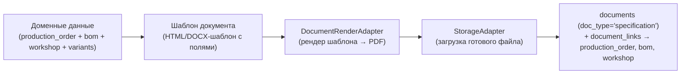

# Document Engine — архитектура (без реализации)

> Связанные документы: [`PRINCIPLES.md`](./PRINCIPLES.md) (принцип 18 «полная связанность документов», принцип 19 «Immutable Original»), [`INBOX_ARCHITECTURE.md`](./INBOX_ARCHITECTURE.md) (разделы 7.3–7.6 — Entity Timeline, ручная привязка, версии, Document Graph — уже спроектированы там как *read-модели поверх* данных, которыми управляет этот документ), [`DATABASE_SCHEMA.md`](./DATABASE_SCHEMA.md), раздел 15 (`documents`/`document_links`/`document_derivatives` — таблицы существуют с Итерации 2), [`AI_PRODUCTION_ASSISTANT_ARCHITECTURE.md`](./AI_PRODUCTION_ASSISTANT_ARCHITECTURE.md), раздел 4-5 (генерация PDF, подготовка к подписанию — главные потребители).
>
> **Статус: архитектура утверждена к проектированию, реализация не начата.**

## 0. Зачем — закрывает существующий пробел, не добавляет новую идею

Таблицы `documents`, `document_links`, `document_derivatives` спроектированы ещё в Итерации 2 (`DATABASE_SCHEMA.md`) и на них уже явно ссылается `INBOX_ARCHITECTURE.md` (`DocumentService.attach(...)`, раздел 4) — но **ни одного доменного пакета, который бы владел этими таблицами, в репозитории пока нет**. Это не забытая деталь: реализация сознательно отложена до появления первого реального потребителя (Inbox, Итерация 9), по принципу эволюционной архитектуры (`PRINCIPLES.md`, принцип 3) — не строить бизнес-логику до того, как появится вызывающий её use case.

Теперь, когда владелец проекта запросил спроектировать это заранее (до начала кодирования Inbox и AI Production Assistant, которые оба на это опираются), документ фиксирует: (1) кто владеет этими таблицами как bounded context, (2) какие use case'ы нужны обоим потребителям, (3) что добавляется нового сверх уже спроектированного в `INBOX_ARCHITECTURE.md` — генерация документов и подготовка к подписанию, которых раньше не было даже в виде идеи.

## 1. Bounded context: `packages/domain/document`

Новый доменный пакет, двенадцатый по счёту, тот же шаблон `domain/application/infrastructure/index.ts`, что и во всех остальных (`docs/REPOSITORY_STRUCTURE.md`). Владеет таблицами `documents`, `document_links`, `document_derivatives` (уже существуют в схеме — миграция не нужна, только доменный слой над ними).

**Не владеет** содержимым файлов — файлы лежат в объектном хранилище через `StorageAdapter` (`docs/INFRASTRUCTURE.md`, раздел 2.3), `documents.file_url` — только ссылка. Document Engine — это метаданные и связи, не файловое хранилище.

### 1.1. Use case'ы (то, что должно быть уже готово к моменту старта Inbox)

| Use case | Что делает | Кто вызывает |
|---|---|---|
| `attachDocument` | Создаёт `documents` + одну или несколько `document_links` (одна операция — документ может сразу привязываться к нескольким сущностям, `PRINCIPLES.md` принцип 18) | Inbox (после классификации), AI Production Assistant (генерация спецификации), ручное прикрепление из карточки сущности (`apps/web`, Итерация 11) |
| `supersedeDocument` | Создаёт новую строку `documents` со `supersedesDocumentId`, помечает предыдущую `isCurrentVersion=false` — **никогда не изменяет** `file_url` существующей строки (гарантия на уровне БД, триггер `documents_file_url_immutable`, уже существует с Итерации 2) | Inbox, при обнаружении новой редакции присланного файла (`INBOX_ARCHITECTURE.md`, раздел 7.5) |
| `linkDocumentToEntity` | Добавляет ещё одну `document_link` к уже существующему документу (без создания нового `documents`) | Ручная привязка (`INBOX_ARCHITECTURE.md`, раздел 7.4), подтверждение AI-предложения `link_document` |
| `recordDerivative` | Создаёт `document_derivatives` (OCR-текст/перевод/структурные данные/AI-саммари), ссылаясь на неизменяемый оригинал | Inbox-классификатор — результат обработки файла, не новый документ |
| `listDocumentsForEntity` | Возвращает все `document_links` (+ сами `documents`) по `(entityType, entityId)` | Карточка сущности — Entity Timeline (`INBOX_ARCHITECTURE.md`, раздел 7.3), реализуется этим use case'ом, а не отдельным запросом на стороне `apps/web` |
| `generateDocument` **(новое)** | По шаблону + доменным данным конкретной сущности формирует файл (PDF) через `DocumentRenderAdapter` (раздел 2), сохраняет результат как обычный `documents` (`doc_type` соответствующий, например `specification`) | AI Production Assistant (раздел 4 — автогенерация спецификации), в будущем — любой модуль, которому нужен готовый PDF (счета, накладные) |
| `prepareForSignature` **(новое)** | Помечает документ как требующий подписи, готовит метаданные для `ESignatureAdapter` (раздел 3) — **не подписывает** | AI Production Assistant (раздел 5), Workflow Engine (запускает шаг согласования) |

`attachDocument`/`supersedeDocument`/`linkDocumentToEntity`/`recordDerivative`/`listDocumentsForEntity` — это ровно та функциональность, которую сегодня `INBOX_ARCHITECTURE.md` описывает как уже данность (`DocumentService.attach(...)`); этот раздел впервые фиксирует их как конкретные use case'ы конкретного пакета, а не абстрактную ссылку.

## 2. Генерация документов — новый адаптер, не новая идея данных

`DocumentRenderAdapter` — интерфейс за адаптером, тем же паттерном, что `MarketplaceConnector`/`StorageAdapter` (`docs/ARCHITECTURE.md`, п.5.1 и `docs/INFRASTRUCTURE.md`, п.2.3): конкретная технология рендеринга (headless Chromium для HTML→PDF, библиотека шаблонизации DOCX, или внешний сервис) — деталь `docs/TECH_STACK.md`, не архитектурное решение этого документа. Важно только, что результат — обычный `documents`, ничем не отличающийся от документа, загруженного пользователем вручную: та же неизменяемость, та же версионность, те же связи.

**Шаблоны хранятся отдельно от доменных данных** (не в БД как структура, а как файлы шаблонов, привязанные к `doc_type` и, опционально, к компании — компании может понадобиться свой брендированный шаблон спецификации). Точный механизм хранения/редактирования шаблонов — деталь реализации, не блокирующая архитектуру: на MVP достаточно одного жёстко заданного шаблона на `doc_type`.

## 3. Подготовка к электронной подписи

**Обязательное ограничение, повторяющее то же самое, что уже зафиксировано в `AI_PRODUCTION_ASSISTANT_ARCHITECTURE.md`, раздел 5 — Document Engine не подписывает документы.** Его роль — подготовить документ и метаданные (кто должен подписать, в каком порядке, если подписантов несколько — детали порядка находятся в ведении `Workflow Engine`, не этого документа) и передать их во внешний `ESignatureAdapter`, если он подключён у компании. Сам факт подписания — событие, приходящее **от** внешней системы ЭП (через её webhook/API), которое Document Engine фиксирует как ещё одну версию/производную документа (`document_derivatives`, тип, например, `signature_proof`), а не создаёт сам.

Выбор конкретного провайдера ЭП, юридическая значимость подписи в РФ — открытый вопрос продукта, не архитектуры (см. `AI_PRODUCTION_ASSISTANT_ARCHITECTURE.md`, раздел 8).

## 4. Что не меняется относительно уже спроектированного

Этот документ **не пересматривает** ничего из `INBOX_ARCHITECTURE.md`, раздел 7 — Entity Timeline (7.3), ручная привязка (7.4), версии (7.5), Document Graph (7.6) остаются спроектированы ровно так, как там описано. Единственное отличие: там, где `INBOX_ARCHITECTURE.md` условно ссылался на «Application-слой конкретного модуля» или `DocumentService`, теперь есть конкретное имя — `packages/domain/document` с конкретным списком use case'ов (раздел 1.1). Document Graph (обход транзитивных связей, `INBOX_ARCHITECTURE.md`, раздел 7.6) по-прежнему проектируется вместе с конкретной карточкой сущности при реализации `apps/web` (Итерация 11), не заранее — остаётся в силе то же решение против преждевременной генерализации (`PRINCIPLES.md`, принцип 3).

## 5. Место в Roadmap

Реализуется **до** или **вместе с** началом Итерации 9 (Inbox) — Inbox не может прикреплять документы без него (`attachDocument`/`recordDerivative` — прямая зависимость). `generateDocument`/`prepareForSignature` (раздел 2-3) нужны позже — к моменту реализации AI Production Assistant (Фаза 2), но проектируются сейчас, чтобы Inbox с самого начала строился на пакете, готовом к этому расширению, а не на временной реализации, которую придётся переписывать.
