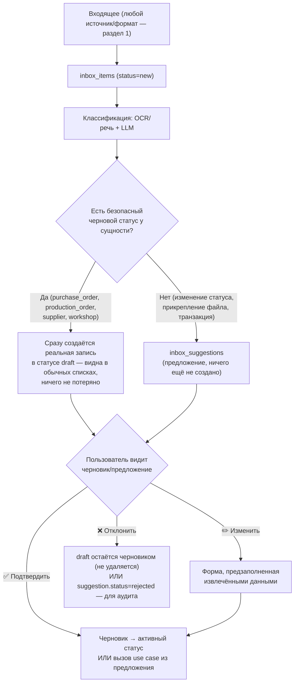

# Единая точка входа (Universal Inbox): Zero Input

> Связанные документы: [`PRINCIPLES.md`](./PRINCIPLES.md) (принцип 17 «Zero Input», принцип 18 «полная связанность документов»), [`USER_JOURNEY_AUDIT.md`](./USER_JOURNEY_AUDIT.md) (пробел №9 — главный найденный пробел), [`ARCHITECTURE.md`](./ARCHITECTURE.md) (модуль Inbox, п.12 AI-First), [`DATABASE_SCHEMA.md`](./DATABASE_SCHEMA.md) (таблицы `inbox_items`/`inbox_suggestions`/`inbox_channels`/`document_links`).
>
> **Обновлено 2026-07-24 (второй раз)** по обратной связи владельца проекта: (1) переформулирован как «единая точка входа» с моделью «черновиков»; (2) главная цель уточнена — не просто принять файл, а **автоматически связать его с максимально возможным числом существующих сущностей** (модель, SKU, коллекция, материал, поставщик, закупка, цех, заказ в цех, отгрузка, склад), с указанием уверенности по каждой связи отдельно (раздел 7).
>
> **Обновлено 2026-07-24 (третий раз) — архитектура Inbox утверждена владельцем проекта.** Финальное ревью закрыло 4 пункта до старта Итерации 3: версионность и неизменность документов (`PRINCIPLES.md`, принцип 19 «Immutable Original»; раздел 7.5 ниже), Document Graph — обход связей за пределами прямой привязки (раздел 7.6), Entity Timeline — единая история сущности (раздел 7.3, дополнено), Document Storage — подтверждена централизация независимо от канала (раздел 1).

## 0. Зачем

Владелец бизнеса работает с телефона. Информация приходит не через формы, а через Telegram, WhatsApp, WeChat, почту, фото, голосовые и скриншоты — от бухгалтера, поставщика, цеха, водителя. Требование перепечатывать её в ERP-форму — то самое, что превращает систему в «ещё одну ERP», которую не открывают.

**Ключевая идея — не «Inbox как ещё одна фича», а единая точка входа.** Для пользователя не должно иметь значения, откуда пришла информация — от бухгалтера, китайского поставщика, цеха, водителя, маркетплейса или банка. Любой входящий объект, независимо от источника и формата, проходит один и тот же конвейер:

```
Получили → AI определил тип → AI извлёк данные → AI связал с существующими сущностями
→ AI предложил действие (или создал черновик) → Пользователь подтвердил → Готово
```

**Это не отдельная фича поверх системы — это фронт-дверь во все остальные модули.** Inbox не создаёт параллельную модель данных: он либо предлагает вызов уже существующего use case'а (`updateProductionOrderStatus`, `attachDocument`, ...), либо — там, где это безопасно — сразу создаёт настоящую доменную запись в статусе «черновик» (раздел 2). Это прямое применение принципа AI-First (`ARCHITECTURE.md`, п.12): AI работает через тот же API, что и человек, не в обход домена.

## 1. Источники — единый вход независимо от формата

Пользователь никогда не выбирает «в какую форму это положить» — он просто пересылает/фотографирует/диктует, а система сама определяет, что перед ней:

| Источник/формат | Обработка |
|---|---|
| Фото (накладная, ткань на складе, готовая партия) | Мультимодальный LLM-вызов читает изображение напрямую (см. `TECH_STACK.md`) |
| PDF (инвойс, счёт, сертификат) | Извлечение текста (текстовый слой или OCR для сканов) → классификация |
| Excel/CSV (прайс-лист, накладная, реестр) | Парсинг таблицы → сопоставление колонок → предложение по каждой строке или пакетно |
| ZIP-архив с документами | Распаковывается на этапе приёма — **один ZIP превращается в N `inbox_items`**, каждый обрабатывается независимо (раздел 3) |
| Голосовое сообщение | Распознавание речи → текст → тот же классификатор, что и обычный текст |
| Обычный текст | Напрямую в классификатор |
| Пересланное сообщение Telegram (от третьего лица — поставщика, цеха) | Текст/медиа пересланного сообщения обрабатывается так же, как если бы его написали боту напрямую; исходный отправитель сохраняется в `inbox_items.source_identifier` для сопоставления (раздел 6) |
| Email (тема + текст + вложения) | Вложения разворачиваются в отдельные `inbox_items` (как ZIP), тело письма — как обычный текст |
| Ссылка на облачный документ (Google Drive/Dropbox/аналоги) | Система переходит по ссылке и **скачивает** файл через `StorageAdapter` — облачный сервис используется только как источник разового скачивания, не как хранилище (сохраняет Local-First, `PRINCIPLES.md` принцип 14: наша копия становится источником истины с момента скачивания) |

Формат — свойство содержимого `inbox_item`, а не канала. Канал (`inbox_channels.type`: `telegram/whatsapp/wechat/email/upload`) — это *как* сообщение попало в систему; что внутри (фото, Excel, голос, пересланный текст) — определяет классификатор, а не транспорт. Поэтому добавление нового формата (например, поддержка CSV) не требует нового канала — только доработки классификатора.

**Где физически хранятся файлы** (ответ на прямой вопрос): все файлы (фото, PDF, Excel, голосовые) попадают в S3-совместимое объектное хранилище через `StorageAdapter` — тот же механизм, что и для техпаков, накладных, сертификатов (`docs/INFRASTRUCTURE.md`, раздел 2.3). В БД (`documents.file_url`) хранится только ссылка/ключ, не сами байты. На Lean-старте это self-hosted MinIO на одном сервере (`docs/INFRASTRUCTURE.md`, раздел 3); при росте — любой S3-совместимый провайдер без изменений в коде (cloud-agnostic, тот же принцип, что и для остальной инфраструктуры).

**Хранилище централизовано, канал — не более чем способ доставки.** Независимо от того, пришёл файл через Telegram, Email, веб-загрузку или (в будущем) Share Sheet/WhatsApp/Google Drive — как только `inbox_item` обработан, файл лежит в одном и том же `StorageAdapter`-хранилище и представлен одной и той же строкой `documents`. Telegram/Email/канал не хранят «свою версию» файла отдельно от системы — как только объект принят, он становится частью GarmentOS и живёт по общим правилам (`document_links`, `document_derivatives`, версионность и неизменность — раздел 7.5), а не по правилам исходного мессенджера/почты. Это тот же Local-First (`PRINCIPLES.md`, принцип 14), применённый к файлам, а не только к данным заказов/остатков.

## 2. Принцип: AI предлагает или создаёт черновик — но никогда не создаёт финальную запись без подтверждения



Ни один шаг классификации не пишет напрямую в **активные, обязывающие** доменные записи — только в черновики (безопасно, обратимо) или в `inbox_suggestions` (ничего ещё не создано). Подтверждение — единственный путь к активному состоянию (`sent`, `placed`, `active`). Это даёт три свойства бесплатно: (1) полный аудит-лог уже работает без доработок; (2) ошибка классификации никогда не портит данные молча — максимум лишний черновик, который можно удалить/отклонить; (3) **пользователь никогда ничего не теряет** — даже если он не отреагировал на предложение сразу, черновик уже существует и виден в обычном списке закупок/заказов, а не только в Inbox.

### 2.1. Что становится черновиком сразу, а что остаётся предложением

| Тип сущности | Есть статус `draft`? | Поведение AI |
|---|---|---|
| `purchase_orders` (закупка ткани/фурнитуры) | Да (уже был в схеме, Итерация 2) | Бухгалтер прислал PDF счёта → AI сразу создаёт `purchase_order` со `status='draft'`, извлечённым поставщиком/материалом/ценой. Не требует подтверждения, чтобы **появиться** в списке закупок — требует подтверждения, чтобы стать `sent` |
| `production_orders` (заказ в цех) | Добавлено этим проходом (было: без черновика, сразу `placed`) | Аналогично — черновик заказа виден сразу, подтверждение переводит в `placed` |
| `suppliers` (новый поставщик) | Добавлено этим проходом (`status`: `draft/active/archived`) | AI встречает незнакомого поставщика в счёте → создаёт `supplier` со `status='draft'` с извлечёнными реквизитами, не блокируя создание черновика закупки, которая на него ссылается |
| `workshops` (новый цех) | Добавлено этим проходом (заменяет булево `is_active`) | Аналогично поставщику |
| Обновление статуса заказа, прикрепление документа, финансовая транзакция | Нет безопасного «черновика» — это изменение существующего состояния, не новая независимая запись | Остаётся `inbox_suggestion`: применяется только по подтверждению (раздел 2, правая ветка) |

Черновик — не «вторая копия данных для Inbox», а **настоящая строка в `purchase_orders`/`production_orders`/`suppliers`/`workshops`**, которую видно в обычных списках приложения (отфильтрованную по `status='draft'`), а не только в разделе «Входящие». Именно это делает утверждение «ты ничего не потерял» верным буквально, а не только по духу.

## 3. Пример сквозного сценария 1 — черновик закупки (Шаг 1 из `USER_JOURNEY_AUDIT.md`)

1. Бухгалтер пересылает боту PDF счёта от поставщика ткани.
2. Классификатор распознаёт документ как счёт на оплату, извлекает: поставщик «ООО ТканиОпт», материал «Оксфорд 280», 100 м, 320 ₽/м, дата.
3. Сразу создаётся `purchase_orders` (`status='draft'`, `ordered_at`=извлечённая дата) + `purchase_order_items` + `documents` (doc_type=invoice) со связями `document_links` **сразу к трём сущностям**: закупке (0.95), поставщику «ООО ТканиОпт» (0.93) и материалу «Оксфорд 280» (0.88) — счёт появится на всех трёх карточках, не только на странице закупки (раздел 7.3).
4. Пользователь получает: «Нашёл счёт. Создал черновик закупки: Оксфорд 280, 100 м, 320 ₽/м у ООО ТканиОпт. [✅ Подтвердить] [✏️ Изменить] [❌ Удалить]».
5. «✅ Подтвердить» — `purchase_orders.status: draft → sent`. Если пользователь ничего не нажал — черновик всё равно виден в обычном списке закупок компании, помечен как «требует подтверждения».

## 4. Пример сквозного сценария 2 — предложение без черновика (Шаг 6 из `USER_JOURNEY_AUDIT.md`)

1. Цех пишет боту в Telegram: «Заказ готов» + прикладывает фото.
2. Бот (канал `inbox_channels`, type=telegram) создаёт `inbox_items` (source=telegram, содержимое — пересланный текст + фото, `source_identifier`=контакт цеха).
3. Классификатор: распознаёт как «сообщение о завершении заказа»; по `source_identifier`/эвристике находит вероятный `production_order_id`; создаёт `inbox_suggestions` (type=`update_production_order_status`, extractedData={status: 'ready_for_pickup'}, suggestedEntityId=production_order.id, confidence=0.87) — **не черновик**, так как это изменение существующей записи, а не новая.
4. Пользователь получает: «Похоже, заказ №152 у цеха «Швейный цех №1» готов. Обновить статус и прикрепить фото? [✅ Да] [✏️ Не тот заказ] [❌ Нет]».
5. «✅ Да» вызывает `ProductionOrderService.updateStatus(id, 'ready_for_pickup')` и `DocumentService.attach(...)` — те же application services, что вызвал бы человек вручную.

Ни одна строка кода в доменных модулях не знает о существовании Inbox — он просто ещё один вызывающий (наравне с `apps/web` и `apps/api`), что и требует принцип AI-First.

## 5. Каналы — приоритет от MVP до будущих версий

Все каналы вызывают **один и тот же** Inbox pipeline (раздел 2) — ни один канал не создаёт отдельной логики обработки. Разница между каналами — только в том, как сообщение попадает в `inbox_items`; классификация, черновики, предложения, подтверждение — общий код для всех.

| № | Канал | Статус | Почему в этом месте приоритета |
|---|---|---|---|
| 🥇 | **Telegram-бот** | MVP | Ежедневная работа: открытый Bot API без коммерческого approval, нативно — текст, фото, голос, пересланные сообщения, документы (ZIP/Excel/PDF) |
| 🥈 | **Веб-загрузка файлов** | MVP | Большие файлы и массовый импорт (прайс-листы, пакет фото партии), где Telegram неудобен; не требует внешней интеграции — тот же pipeline, источник = `apps/web` |
| 🥉 | **Share Sheet iOS/Android** | Future — с появлением мобильного приложения | Не новый канал обработки — тот же `upload`-эндпоинт, только клиент. «Поделиться» из галереи/файлов в GarmentOS без открытия чата |
| 4 | **Email-алиас** | Future (Фаза 2) | Удобно для автоматических пересылок (бухгалтерия, автоматизированные счета от систем поставщиков); вложения разворачиваются как ZIP (раздел 1) |
| 5 | **WhatsApp / WeChat** | Future, по факту потребности | Разный коммерческий/технический порог входа (WhatsApp Business API — approval у Meta; WeChat — сложнее всего вне Китая); добавляются, если конкретный пилот реально в них нуждается, не заранее |
| — | **Google Drive (наблюдение за папкой)** | Future, расширение существующей обработки | Не новый pipeline — обычная ссылка на облачный документ (раздел 1) уже работает через любой канал; «наблюдение за папкой» лишь автоматизирует момент присылки ссылки, не меняет обработку |
| — | **Прямой API** | Future, по запросу интеграции | Не новый канал в модели данных — внешняя система обращается к тому же `upload`-эндпоинту, что и веб-загрузка; отдельный API-ключ/аутентификация — деталь авторизации, не pipeline |

Такой порядок даёт максимум пользы при минимальной сложности: два первых канала покрывают почти весь объём (ежедневная работа + массовый импорт) и не требуют внешних согласований; всё остальное добавляется по мере доказанной необходимости (Start Lean, `INFRASTRUCTURE.md`), а не заранее.

## 6. Типы предложений/черновиков (`inbox_suggestions.type`) — MVP

| Тип | Создаёт черновик или предложение? | Домен |
|---|---|---|
| `create_purchase_order` | Черновик (`purchase_orders.status=draft`) | Materials & Procurement |
| `create_production_order` | Черновик (`production_orders.status=draft`) | Contract Manufacturing |
| `create_supplier` / `create_workshop` | Черновик (`status=draft`) | Materials & Procurement / Contract Manufacturing |
| `link_document` | Предложение (может быть несколько на один документ — раздел 7) | Documents/`document_links` (сквозной) |
| `supersede_document` | Предложение — подтверждение создаёт новую строку `documents` с `supersedes_document_id`, не изменяет старую (раздел 7.5) | Documents (сквозной) |
| `update_production_order_status` | Предложение | Contract Manufacturing |
| `record_transaction` | Предложение | Finance |
| `update_material_prices` (из прайс-листа) | Предложение (по каждой строке или пакетно) | Materials & Procurement |
| `create_note` | Предложение | Notes (сквозной) |

Список — не жёсткий enum в БД (как и `documents.doc_type`) — валидируется на уровне application layer, чтобы новые типы добавлялись без миграции.

## 7. Сопоставление с сущностями (entity linking) — принцип 18

**Главная цель Inbox — не просто принять файл, а связать его с максимально возможным числом существующих сущностей** (`docs/PRINCIPLES.md`, принцип 18): моделью, SKU, коллекцией, материалом, поставщиком, закупкой, цехом, заказом в цех, отгрузкой, складом. Один документ обычно относится сразу к нескольким — инвойс поставщика ткани одновременно про поставщика, материал и закупку.

### 7.1. Как это устроено технически

Классификатор не ищет «единственно верную» сущность — он оценивает **независимо** каждую вероятную связь и создаёт по одной строке `inbox_suggestions` (type=`link_document`) на каждого кандидата:

```
Фото рулона ткани на складе →
  material "Оксфорд 280"      confidence 0.93  →  готово к one-tap подтверждению
  purchase_order №58           confidence 0.81  →  готово к one-tap подтверждению
  product "Худи Петроль"       confidence 0.52  →  показывается как доп. вариант
  workshop "Цех №1"             confidence 0.18  →  не показывается вовсе (ниже порога)
```

Это **не взаимоисключающий выбор** («к какой из этих сущностей это относится» — как при поиске конкретного производственного заказа для обновления статуса, раздел 4): несколько связей могут быть верны одновременно, поэтому пользователь может подтвердить сразу несколько предложений одним экраном, а не выбирать одно.

Источники для оценки связи (по возрастанию точности):
1. Явный номер заказа/счёта/артикула в тексте или на фото — точное совпадение.
2. Отправитель канала уже связан с конкретным `workshop`/`supplier` (по истории подтверждённых `inbox_items` от того же `source_identifier`) — сужает поиск.
3. Похожесть по названию материала/модели/поставщика (fuzzy match).
4. Временная эвристика — «последний активный заказ у этого цеха/материала с ближайшим `due_date`».

### 7.2. Высокая уверенность vs недостаточная

- **Высокая уверенность** (выше порога, калибруется по факту пилота — см. `ARCHITECTURE_SELF_REVIEW.md`) → готовый вариант одним нажатием: «Привязать к материалу «Оксфорд 280»? [✅]».
- **Недостаточная уверенность** → предлагается несколько вариантов на выбор («Похоже на одно из: Худи Петроль / Худи Атлас / Куртка Норд — выбрать?»), а не тихое предположение и не one-tap.
- **Ниже минимального порога** → связь не предлагается вовсе, но документ остаётся доступным для полностью ручного поиска (раздел 7.4) — низкая уверенность не значит «эта связь никогда не появится», значит только «AI не предлагает её сам».

### 7.3. Карточка сущности = вся её история (Entity Timeline; ответ на вопрос «можно ли увидеть всю историю в одном месте»)

Да — это прямое следствие модели `document_links` (`docs/DATABASE_SCHEMA.md`, раздел 15/0e): открыть карточку модели, материала, поставщика, закупки, цеха, заказа, отгрузки или склада — запрос `SELECT ... FROM document_links WHERE entity_type=... AND entity_id=...` возвращает **все** документы, когда-либо привязанные к этой сущности, независимо от канала, которым они пришли, и от того, к скольким ещё сущностям они также привязаны. Фото, присланное мимоходом в личном Telegram-чате с цехом, появляется на странице модели точно так же, как документ, загруженный через веб-форму.

Но вкладка «История» на карточке сущности — это не только документы (`PRINCIPLES.md`, принцип 18, п.5). Единая хронологическая лента объединяет:

| Источник | Что показывает |
|---|---|
| `document_links` | Документы/фото/переписка, привязанные к этой сущности (раздел 7.1) |
| `notes` | Комментарии пользователей («цех попросил перенести срок на 3 дня») |
| `audit_log` | Автоматический след изменений полей (кто и когда сменил статус, цену, количество) |
| `inbox_suggestions` (где `suggested_entity_id` = эта сущность) | Какие предложения/черновики AI создал по этой сущности и когда они были подтверждены/отклонены |
| Связанные операции модуля (для заказа в цех — `stock_movements`, `cost_entries`; для закупки — `purchase_order_items`) | Доменные события, а не только метаданные |

Это не новая таблица — единый запрос, объединяющий уже существующие источники по `(entity_type, entity_id)` и сортирующий по времени (`occurred_at`/`created_at`/`linked_at`), реализуется в Application-слое конкретного модуля при построении карточки сущности (`apps/web`, Итерация 11).

### 7.4. Ручная привязка при недостаточной уверенности (ответ на вопрос «как быстро привязать вручную»)

Два равнозначных пути, оба создают одну и ту же строку `document_links` (`source='manual'`, без AI):
1. **Из самого входящего** — если AI не был уверен или не нашёл кандидата, пользователь у карточки `inbox_item` открывает быстрый поиск («привязать к...») по названию/номеру и выбирает нужную сущность вручную — без переключения в отдельную форму.
2. **С карточки любой сущности** — на странице модели/материала/закупки и т.д. есть действие «Прикрепить документ»: выбрать из уже загруженных файлов (включая необработанные `inbox_items`) или загрузить новый — тот же путь, которым идёт AI, только без предложения и подтверждения (это уже подтверждение).

Ручная привязка никогда не заблокирована низкой уверенностью AI — это независимый путь, не «запасной вариант на случай ошибки классификатора».

### 7.5. Версии и производные данные (Immutable Original — `PRINCIPLES.md`, принцип 19)

Inbox регулярно получает несколько файлов, которые на самом деле — одна и та же логическая сущность в разных редакциях: поставщик присылает `Price_v1.xlsx`, через день — `Price_final.xlsx`, через неделю — `Price_final_NEW.xlsx`; бухгалтер присылает исправленный инвойс взамен ошибочного. Классификатор распознаёт это не как «ещё один независимый документ», а как новую версию:

1. Если новый `inbox_item` похож на уже существующий `document` того же отправителя/типа/сущности (по имени файла, содержимому, явной ссылке в сообщении «вот исправленный вариант») — AI предлагает связать его как новую версию (`supersedes_document_id`), а не как отдельный документ. Как и обычная связь (раздел 7.1), это предложение с `confidence`, требующее подтверждения при недостаточной уверенности.
2. Оригинальный файл **никогда не переписывается** — ни на этом, ни на любом другом шаге обработки (OCR, перевод, извлечение полей). Это гарантируется на уровне БД (триггер `documents_file_url_immutable`, `docs/DATABASE_SCHEMA.md` п.0f), не только соглашением классификатора.
3. Результаты обработки самого Inbox (распознанный OCR текст скана, перевод китайского прайса, извлечённые из накладной структурные поля, AI-саммари длинной переписки) сохраняются как `document_derivatives`, отдельно от оригинала. Пользователь, открыв документ, видит и оригинал, и то, что из него извлёк AI — и может свериться с оригиналом при любом сомнении в точности перевода/распознавания.

### 7.6. Document Graph — документы, связанные транзитивно

«Покажи все документы по модели «Петроль»» не должно ограничиваться документами, привязанными к модели напрямую через `document_links`. Материал из BOM модели, поставщик этого материала, закупка у него, партия пошива, цех, отгрузка — тоже связаны с моделью, только через промежуточные сущности:

```
PDF (инвойс) → Supplier → Material → BOM модели → Model
                                   ↘ Purchase Order
Model → Production Order → Workshop → Shipment → Export
```

Это не отдельная графовая БД и не новая таблица — обход существующих связей (`bom_items`, `purchase_order_items`, `production_orders` и т.д. + `document_links` на каждом узле) ограниченной глубины (2-3 перехода), специфичный для карточки конкретной сущности. Проектируется вместе с конкретной карточкой при её реализации (Итерация 11), не как отдельный универсальный модуль заранее (`PRINCIPLES.md`, принцип 18, п.6) — это осознанное решение не строить общий граф-движок без доказанной необходимости (принцип 3, эволюционная архитектура).

## 8. UX — минимизация кликов

- **One-tap confirm** — основной путь: одна кнопка, ноль экранов.
- Форма при «Изменить» открывается **предзаполненной**.
- В Telegram-боте — inline-кнопки, ответ без переключения приложения.
- В `apps/web` — раздел «Черновики» (реальные записи со `status=draft`, видны наравне с обычными данными) и раздел «Входящие» (предложения, требующие решения) — не два разных места для похожих вещей, а последовательное продолжение одного и того же списка.
- Пользователь **никогда не копирует текст/цифры руками** между сообщением и формой.

## 9. Границы и риски (честно, не только выгоды)

- **AI может ошибиться в извлечении/сопоставлении.** Митигация: черновики безопасны и обратимы (просто лишняя строка со `status='draft'`, не влияющая на остатки/себестоимость, пока не подтверждена); предложения не применяются без подтверждения.
- **Стоимость классификации.** Каждый `inbox_item` — минимум один вызов LLM/OCR/распознавания речи — реальная эксплуатационная стоимость (Cost-First, `docs/TECH_STACK.md`).
- **Приватность/комплаенс.** Тот же уровень защиты, что и для остальной системы (`ARCHITECTURE.md`, п.7) — Inbox работает с более «сырыми» данными, но не новым классом риска.
- **Не заменяет доменные инварианты.** Перевод черновика в активный статус проходит те же проверки, что и ручное создание (например, «нельзя разместить заказ в цех без утверждённого BOM») — черновик может быть создан всегда (он не обязывающий), но подтверждение («стать реальным заказом») — нет, если инвариант нарушен; пользователь увидит ошибку в момент подтверждения, а не при создании черновика.
- **Черновики накапливаются, если их не разбирать.** Нужен явный список «черновики старше N дней» (Reporting/BI) — иначе Inbox превращается в свалку неподтверждённых записей, что противоречило бы самой цели Zero Input.

## 10. Место в Roadmap

Inbox не может быть реализован раньше домена и API (Итерации 3-4, `ROADMAP.md`) — черновики создаются вызовом тех же `createPurchaseOrder`/`createProductionOrder` (с `status='draft'` вместо активного), что и ручное создание — не отдельным путём записи. Приоритизирован **выше** обобщённого веб-интерфейса с формами: Telegram-бот + Inbox — Итерация 9, `apps/web` с полными формами — Итерация 11.
