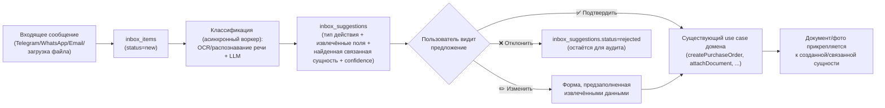

# Universal Inbox: Zero Input

> Связанные документы: [`PRINCIPLES.md`](./PRINCIPLES.md) (принцип 17, «Zero Input»), [`USER_JOURNEY_AUDIT.md`](./USER_JOURNEY_AUDIT.md) (пробел №9 — главный найденный пробел), [`ARCHITECTURE.md`](./ARCHITECTURE.md) (модуль Inbox, п.12 AI-First), [`DATABASE_SCHEMA.md`](./DATABASE_SCHEMA.md) (таблицы `inbox_items`/`inbox_suggestions`/`inbox_channels`).

## 0. Зачем

Владелец бизнеса работает с телефона. Информация приходит не через формы, а через Telegram, WhatsApp, WeChat, почту, фото, голосовые и скриншоты — от бухгалтера, поставщика, цеха, водителя. Требование перепечатывать её в ERP-форму — то самое, что превращает систему в «ещё одну ERP», которую не открывают. Universal Inbox — единая точка входа для **любой** информации: пользователь пересылает/фотографирует/диктует, система распознаёт, предлагает готовое действие, пользователь подтверждает одним нажатием.

**Это не отдельная фича поверх системы — это фронт-дверь во все остальные модули.** Inbox не создаёт параллельную модель данных: он только предлагает вызов уже существующих use case'ов (`createPurchaseOrder`, `attachDocumentTo(productionOrder)`, `updateProductionOrderStatus`, ...) с предзаполненными данными. Это прямое применение принципа AI-First (`ARCHITECTURE.md`, п.12): AI работает через тот же API, что и человек, не в обход домена.

## 1. Принцип: AI предлагает, домен исполняет, человек подтверждает

Ни один шаг классификации не пишет напрямую в доменные таблицы — только в `inbox_suggestions`. Запись в `production_orders`, `purchase_orders`, `stock_movements` и т.д. происходит исключительно через подтверждение пользователем и вызов обычного application service — то есть тот же путь, которым идёт создание сущности вручную через API. Это даёт два важных свойства бесплатно: (1) полный аудит-лог уже работает без доработок (`audit_log` фиксирует, кто и когда подтвердил создание), (2) ошибка классификации никогда не портит данные молча — она максимум создаёт неверное предложение, которое человек может отклонить.

## 2. Сущности

См. `DATABASE_SCHEMA.md` для точных полей. Кратко:

- **`inbox_channels`** — подключённые каналы компании: Telegram-бот (chat/bot token), email-алиас (`inbox+{companyId}@garmentos.app`), в будущем — WhatsApp Business API, WeChat. Один канал = один способ, которым информация попадает во «Входящие».
- **`inbox_items`** — сырое входящее сообщение: откуда пришло, кто прислал, файл (через `StorageAdapter`) или текст/голос (транскрибированный в текст), когда получено, текущий статус (`new/processing/suggested/confirmed/rejected/ignored`).
- **`inbox_suggestions`** — результат классификации: что это за документ/действие, с каким доменным use case это связано, извлечённые поля (JSON), найденная связанная сущность (например, «похоже на заказ №152» — сматченный `production_order_id`), уверенность модели, статус подтверждения.

## 3. Пример сквозного сценария (Шаг 6 из `USER_JOURNEY_AUDIT.md` — самый ручной шаг цикла)

1. Цех пишет боту в Telegram: «Заказ готов» + прикладывает фото.
2. Бот (канал `inbox_channels`, type=telegram) создаёт `inbox_items` (source=telegram, rawContent=«Заказ готов», fileUrl=фото, senderInfo=контакт цеха).
3. Асинхронный воркер классификации (аналогичен по конструкции `Marketplace Sync Worker` — I/O-bound, BullMQ, см. `ARCHITECTURE.md` п.5.1):
   - Распознаёт текст как «сообщение о завершении заказа»;
   - По `senderInfo`/контексту диалога находит вероятный `production_order_id` (например, последний активный заказ у этого цеха с приближающимся `due_date`);
   - Создаёт `inbox_suggestions` (type=`update_production_order_status`, extractedData={status: 'ready_for_pickup'}, suggestedEntityId=production_order.id, confidence=0.87).
4. Пользователь получает от бота: «Похоже, заказ №152 у цеха «Швейный цех №1» готов. Обновить статус и прикрепить фото? [✅ Да] [✏️ Не тот заказ] [❌ Нет]».
5. Нажатие «✅ Да» вызывает обычный application service `ProductionOrderService.updateStatus(id, 'ready_for_pickup')` — тот же метод, который вызвал бы человек через веб-форму — и `DocumentService.attach(productionOrderId, photo, docType='photo')`.
6. `inbox_suggestions.status = 'accepted'`, `inbox_items.status = 'confirmed'`. Аудит-лог уже содержит запись о том, кто подтвердил.

Ни одна строка кода в `ProductionOrder`/`Documents` модулях не знает о существовании Inbox — он просто ещё один вызывающий (наравне с `apps/web` и `apps/api` REST-клиентами), что и требует принцип AI-First.

## 4. Каналы — что в MVP, что в Future

| Канал | В MVP (Фаза 1)? | Почему |
|---|---|---|
| **Telegram-бот** | Да | Самый дешёвый и быстрый способ интеграции (открытый Bot API, без коммерческого approval), естественен для CIS-рынка, где именно Telegram — основной канал общения с цехами/поставщиками |
| **Загрузка файла через веб/API** (фото, PDF, Excel) | Да | Не требует внешней интеграции — тот же pipeline классификации, только источник = `apps/web`, а не бот |
| **Голосовые сообщения** (через Telegram) | Да | Telegram Bot API уже отдаёт voice-файл; распознавание речи — ещё один шаг перед тем же LLM-классификатором, не отдельный канал |
| Email-алиас | Future (Фаза 2) | Полезно (бухгалтер пересылает счета), но требует парсинга вложений/писем — не блокирует MVP |
| WhatsApp Business API | Future (Фаза 2) | Требует коммерческого аккаунта и approval у Meta — дороже и дольше по времени, чем Telegram, при сопоставимой пользе на старте |
| WeChat | Future (Фаза 2+, низкий приоритет) | Технически сложнее всего интегрировать вне Китая; релевантен в первую очередь для общения с китайскими поставщиками тканей — не блокирует MVP с одним пилотом |

Это соответствует принципу Start Lean (`INFRASTRUCTURE.md`): один канал, который закрывает 80% пользы (Telegram) — раньше, чем все каналы сразу.

## 5. Типы предложений (`inbox_suggestions.type`) — MVP

| Тип | Извлекаемые поля | Домен, который исполняет |
|---|---|---|
| `create_purchase_order` | поставщик, материал(ы), кол-во, цена, дата | Materials & Procurement |
| `attach_document` | тип документа, к какой сущности прикрепить | Documents (сквозной, п.15 `DATABASE_SCHEMA.md`) |
| `update_production_order_status` | заказ, новый статус | Contract Manufacturing |
| `record_transaction` | сумма, тип (доход/расход), назначение | Finance |
| `update_material_prices` (из прайс-листа/Excel) | список материал→новая цена | Materials & Procurement (создаёт черновик закупки или обновляет ожидаемую цену — не меняет уже проведённые заказы задним числом) |
| `create_note` | текст, к какой сущности | Notes (сквозной) |

Список — не жёсткий enum в БД (как и `documents.doc_type`, см. `DATABASE_SCHEMA.md` п.1) — валидируется на уровне application layer, чтобы новые типы предложений добавлялись без миграции.

## 6. Сопоставление с сущностями (entity linking)

Классификатору нужно понять не только «что это», но и «к чему это относится». Источники для сопоставления (по возрастанию точности):
1. Явный номер заказа/счёта в тексте («заказ №152», «инвойс INV-2026-058») — точное совпадение по `production_orders.id`/номеру документа.
2. Отправитель канала уже связан с конкретным `workshop`/`supplier` (из предыдущих подтверждённых `inbox_items` от этого же `senderInfo`) — сужает поиск.
3. Похожесть по названию материала/поставщика (fuzzy match по `materials.name`/`suppliers.name`).
4. Временная эвристика — «последний активный заказ у этого цеха с ближайшим `due_date`» (как в примере раздела 3).

Если уверенность низкая — предложение всё равно создаётся, но помечается «не уверен, уточните» и просит пользователя выбрать из 2-3 вариантов вместо one-tap подтверждения. **Система никогда не создаёт доменную запись без явного подтверждения**, независимо от уверенности — это осознанная граница (см. раздел 8).

## 7. UX — минимизация кликов

- **One-tap confirm** — основной путь: одна кнопка, ноль экранов.
- Форма при «Изменить» открывается **предзаполненной**, не пустой — пользователь правит, а не вводит с нуля.
- В Telegram-боте — inline-кнопки (`✅ Да` / `✏️ Изменить` / `❌ Нет`), ответ без переключения приложения.
- В `apps/web` — Inbox как отдельный раздел с карточками «на рассмотрении», где действие тоже одна кнопка/свайп (мобильная версия веб-интерфейса — не отдельное приложение, см. `docs/ROADMAP.md`).
- Пользователь **никогда не копирует текст/цифры руками** между сообщением и формой — это единственный явный провал UX, который Inbox обязан устранить (см. `PRINCIPLES.md`, принцип 17).

## 8. Границы и риски (честно, не только выгоды)

- **AI может ошибиться в извлечении/сопоставлении.** Митигация: ничего не пишется в домен без подтверждения (раздел 1); низкая уверенность → уточняющий вопрос, а не тихое предположение.
- **Стоимость классификации.** Каждый `inbox_item` — минимум один вызов LLM (и часто OCR/распознавание речи) — реальная эксплуатационная стоимость, растущая с объёмом сообщений. Оценивается по критериям Cost-First (`docs/TECH_STACK.md`, раздел AI-классификация) — не проектируется как «бесплатная магия».
- **Приватность/комплаенс.** Файлы и сообщения могут содержать те же ПДн, что и остальная система (см. `ARCHITECTURE.md`, п.7) — Inbox не создаёт нового класса риска, но обрабатывает более «сырые», неструктурированные данные, что требует того же уровня защиты (шифрование в хранилище, доступ по ролям).
- **Не заменяет доменные инварианты.** Даже когда предложение подтверждено одним нажатием, вызываемый use case проходит все те же проверки (например, «нельзя создать заказ в цех без утверждённого BOM», `USER_JOURNEY_AUDIT.md` пробел №6) — Inbox не является лазейкой в обход бизнес-правил.

## 9. Место в Roadmap

Inbox не может быть реализован раньше домена и API (Итерации 3-4, `ROADMAP.md`) — ему нужны существующие use case'ы, чтобы их вызывать (раздел 1). Но он приоритизирован **выше** обобщённого веб-интерфейса с формами: Telegram-бот + Inbox — часть Итерации 9 (переименована из «Wildberries-коннектор, UI» — см. `ROADMAP.md`), веб-интерфейс с полными формами — Итерация 10, для того что Inbox объективно не покрывает (настройки, объёмные отчёты, массовое редактирование).
