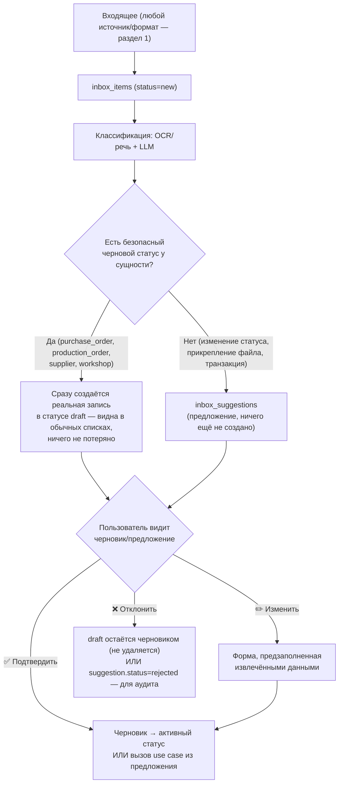

# Единая точка входа (Universal Inbox): Zero Input

> Связанные документы: [`PRINCIPLES.md`](./PRINCIPLES.md) (принцип 17, «Zero Input»), [`USER_JOURNEY_AUDIT.md`](./USER_JOURNEY_AUDIT.md) (пробел №9 — главный найденный пробел), [`ARCHITECTURE.md`](./ARCHITECTURE.md) (модуль Inbox, п.12 AI-First), [`DATABASE_SCHEMA.md`](./DATABASE_SCHEMA.md) (таблицы `inbox_items`/`inbox_suggestions`/`inbox_channels`).
>
> **Обновлено 2026-07-24** по обратной связи владельца проекта: переформулирован как «единая точка входа» (не просто загрузка файлов), расширен список источников, добавлена модель «черновиков» вместо чистых предложений.

## 0. Зачем

Владелец бизнеса работает с телефона. Информация приходит не через формы, а через Telegram, WhatsApp, WeChat, почту, фото, голосовые и скриншоты — от бухгалтера, поставщика, цеха, водителя. Требование перепечатывать её в ERP-форму — то самое, что превращает систему в «ещё одну ERP», которую не открывают.

**Ключевая идея — не «Inbox как ещё одна фича», а единая точка входа.** Для пользователя не должно иметь значения, откуда пришла информация — от бухгалтера, китайского поставщика, цеха, водителя, маркетплейса или банка. Любой входящий объект, независимо от источника и формата, проходит один и тот же конвейер:

```
Получили → AI определил тип → AI извлёк данные → AI связал с существующими сущностями
→ AI предложил действие (или создал черновик) → Пользователь подтвердил → Готово
```

**Это не отдельная фича поверх системы — это фронт-дверь во все остальные модули.** Inbox не создаёт параллельную модель данных: он либо предлагает вызов уже существующего use case'а (`updateProductionOrderStatus`, `attachDocument`, ...), либо — там, где это безопасно — сразу создаёт настоящую доменную запись в статусе «черновик» (раздел 2). Это прямое применение принципа AI-First (`ARCHITECTURE.md`, п.12): AI работает через тот же API, что и человек, не в обход домена.

## 1. Источники — единый вход независимо от формата

Пользователь никогда не выбирает «в какую форму это положить» — он просто пересылает/фотографирует/диктует, а система сама определяет, что перед ней:

| Источник/формат | Обработка |
|---|---|
| Фото (накладная, ткань на складе, готовая партия) | Мультимодальный LLM-вызов читает изображение напрямую (см. `TECH_STACK.md`) |
| PDF (инвойс, счёт, сертификат) | Извлечение текста (текстовый слой или OCR для сканов) → классификация |
| Excel/CSV (прайс-лист, накладная, реестр) | Парсинг таблицы → сопоставление колонок → предложение по каждой строке или пакетно |
| ZIP-архив с документами | Распаковывается на этапе приёма — **один ZIP превращается в N `inbox_items`**, каждый обрабатывается независимо (раздел 3) |
| Голосовое сообщение | Распознавание речи → текст → тот же классификатор, что и обычный текст |
| Обычный текст | Напрямую в классификатор |
| Пересланное сообщение Telegram (от третьего лица — поставщика, цеха) | Текст/медиа пересланного сообщения обрабатывается так же, как если бы его написали боту напрямую; исходный отправитель сохраняется в `inbox_items.source_identifier` для сопоставления (раздел 6) |
| Email (тема + текст + вложения) | Вложения разворачиваются в отдельные `inbox_items` (как ZIP), тело письма — как обычный текст |
| Ссылка на облачный документ (Google Drive/Dropbox/аналоги) | Система переходит по ссылке и **скачивает** файл через `StorageAdapter` — облачный сервис используется только как источник разового скачивания, не как хранилище (сохраняет Local-First, `PRINCIPLES.md` принцип 14: наша копия становится источником истины с момента скачивания) |

Формат — свойство содержимого `inbox_item`, а не канала. Канал (`inbox_channels.type`: `telegram/whatsapp/wechat/email/upload`) — это *как* сообщение попало в систему; что внутри (фото, Excel, голос, пересланный текст) — определяет классификатор, а не транспорт. Поэтому добавление нового формата (например, поддержка CSV) не требует нового канала — только доработки классификатора.

## 2. Принцип: AI предлагает или создаёт черновик — но никогда не создаёт финальную запись без подтверждения



Ни один шаг классификации не пишет напрямую в **активные, обязывающие** доменные записи — только в черновики (безопасно, обратимо) или в `inbox_suggestions` (ничего ещё не создано). Подтверждение — единственный путь к активному состоянию (`sent`, `placed`, `active`). Это даёт три свойства бесплатно: (1) полный аудит-лог уже работает без доработок; (2) ошибка классификации никогда не портит данные молча — максимум лишний черновик, который можно удалить/отклонить; (3) **пользователь никогда ничего не теряет** — даже если он не отреагировал на предложение сразу, черновик уже существует и виден в обычном списке закупок/заказов, а не только в Inbox.

### 2.1. Что становится черновиком сразу, а что остаётся предложением

| Тип сущности | Есть статус `draft`? | Поведение AI |
|---|---|---|
| `purchase_orders` (закупка ткани/фурнитуры) | Да (уже был в схеме, Итерация 2) | Бухгалтер прислал PDF счёта → AI сразу создаёт `purchase_order` со `status='draft'`, извлечённым поставщиком/материалом/ценой. Не требует подтверждения, чтобы **появиться** в списке закупок — требует подтверждения, чтобы стать `sent` |
| `production_orders` (заказ в цех) | Добавлено этим проходом (было: без черновика, сразу `placed`) | Аналогично — черновик заказа виден сразу, подтверждение переводит в `placed` |
| `suppliers` (новый поставщик) | Добавлено этим проходом (`status`: `draft/active/archived`) | AI встречает незнакомого поставщика в счёте → создаёт `supplier` со `status='draft'` с извлечёнными реквизитами, не блокируя создание черновика закупки, которая на него ссылается |
| `workshops` (новый цех) | Добавлено этим проходом (заменяет булево `is_active`) | Аналогично поставщику |
| Обновление статуса заказа, прикрепление документа, финансовая транзакция | Нет безопасного «черновика» — это изменение существующего состояния, не новая независимая запись | Остаётся `inbox_suggestion`: применяется только по подтверждению (раздел 2, правая ветка) |

Черновик — не «вторая копия данных для Inbox», а **настоящая строка в `purchase_orders`/`production_orders`/`suppliers`/`workshops`**, которую видно в обычных списках приложения (отфильтрованную по `status='draft'`), а не только в разделе «Входящие». Именно это делает утверждение «ты ничего не потерял» верным буквально, а не только по духу.

## 3. Пример сквозного сценария 1 — черновик закупки (Шаг 1 из `USER_JOURNEY_AUDIT.md`)

1. Бухгалтер пересылает боту PDF счёта от поставщика ткани.
2. Классификатор распознаёт документ как счёт на оплату, извлекает: поставщик «ООО ТканиОпт», материал «Оксфорд 280», 100 м, 320 ₽/м, дата.
3. Сразу создаётся `purchase_orders` (`status='draft'`, `ordered_at`=извлечённая дата) + `purchase_order_items` + `documents` (doc_type=invoice, привязан к этой закупке).
4. Пользователь получает: «Нашёл счёт. Создал черновик закупки: Оксфорд 280, 100 м, 320 ₽/м у ООО ТканиОпт. [✅ Подтвердить] [✏️ Изменить] [❌ Удалить]».
5. «✅ Подтвердить» — `purchase_orders.status: draft → sent`. Если пользователь ничего не нажал — черновик всё равно виден в обычном списке закупок компании, помечен как «требует подтверждения».

## 4. Пример сквозного сценария 2 — предложение без черновика (Шаг 6 из `USER_JOURNEY_AUDIT.md`)

1. Цех пишет боту в Telegram: «Заказ готов» + прикладывает фото.
2. Бот (канал `inbox_channels`, type=telegram) создаёт `inbox_items` (source=telegram, содержимое — пересланный текст + фото, `source_identifier`=контакт цеха).
3. Классификатор: распознаёт как «сообщение о завершении заказа»; по `source_identifier`/эвристике находит вероятный `production_order_id`; создаёт `inbox_suggestions` (type=`update_production_order_status`, extractedData={status: 'ready_for_pickup'}, suggestedEntityId=production_order.id, confidence=0.87) — **не черновик**, так как это изменение существующей записи, а не новая.
4. Пользователь получает: «Похоже, заказ №152 у цеха «Швейный цех №1» готов. Обновить статус и прикрепить фото? [✅ Да] [✏️ Не тот заказ] [❌ Нет]».
5. «✅ Да» вызывает `ProductionOrderService.updateStatus(id, 'ready_for_pickup')` и `DocumentService.attach(...)` — те же application services, что вызвал бы человек вручную.

Ни одна строка кода в доменных модулях не знает о существовании Inbox — он просто ещё один вызывающий (наравне с `apps/web` и `apps/api`), что и требует принцип AI-First.

## 5. Каналы — что в MVP, что в Future

| Канал | В MVP (Фаза 1)? | Почему |
|---|---|---|
| **Telegram-бот** | Да | Открытый Bot API без коммерческого approval, естественен для CIS-рынка; поддерживает текст, фото, голос, пересланные сообщения, документы (включая ZIP/Excel/PDF) «из коробки» |
| **Загрузка файла через веб/API** | Да | Не требует внешней интеграции — тот же pipeline, источник = `apps/web` |
| Email-алиас | Future (Фаза 2) | Требует парсинга писем/вложений — не блокирует MVP |
| WhatsApp Business API | Future (Фаза 2) | Требует коммерческого аккаунта и approval у Meta |
| WeChat | Future (Фаза 2+, низкий приоритет) | Сложнее всего интегрировать вне Китая; релевантен для китайских поставщиков тканей |

Один канал, закрывающий почти все форматы из раздела 1 (Telegram поддерживает файлы любого типа, голос и пересланные сообщения нативно) — раньше, чем несколько каналов сразу (Start Lean, `INFRASTRUCTURE.md`).

## 6. Типы предложений/черновиков (`inbox_suggestions.type`) — MVP

| Тип | Создаёт черновик или предложение? | Домен |
|---|---|---|
| `create_purchase_order` | Черновик (`purchase_orders.status=draft`) | Materials & Procurement |
| `create_production_order` | Черновик (`production_orders.status=draft`) | Contract Manufacturing |
| `create_supplier` / `create_workshop` | Черновик (`status=draft`) | Materials & Procurement / Contract Manufacturing |
| `attach_document` | Предложение | Documents (сквозной) |
| `update_production_order_status` | Предложение | Contract Manufacturing |
| `record_transaction` | Предложение | Finance |
| `update_material_prices` (из прайс-листа) | Предложение (по каждой строке или пакетно) | Materials & Procurement |
| `create_note` | Предложение | Notes (сквозной) |

Список — не жёсткий enum в БД (как и `documents.doc_type`) — валидируется на уровне application layer, чтобы новые типы добавлялись без миграции.

## 7. Сопоставление с сущностями (entity linking)

Источники для сопоставления (по возрастанию точности):
1. Явный номер заказа/счёта в тексте — точное совпадение.
2. Отправитель канала уже связан с конкретным `workshop`/`supplier` (по истории подтверждённых `inbox_items` от того же `source_identifier`) — сужает поиск и позволяет не создавать дублирующего черновика поставщика при повторном обращении того же контакта.
3. Похожесть по названию материала/поставщика (fuzzy match).
4. Временная эвристика — «последний активный заказ у этого цеха с ближайшим `due_date`».

Низкая уверенность → уточняющий вопрос вместо one-tap подтверждения. Черновик всё равно может быть создан (он безопасен и обратим), но помечается «нужно проверить связь» — например, черновик закупки создан, но привязка к конкретному поставщику не однозначна.

## 8. UX — минимизация кликов

- **One-tap confirm** — основной путь: одна кнопка, ноль экранов.
- Форма при «Изменить» открывается **предзаполненной**.
- В Telegram-боте — inline-кнопки, ответ без переключения приложения.
- В `apps/web` — раздел «Черновики» (реальные записи со `status=draft`, видны наравне с обычными данными) и раздел «Входящие» (предложения, требующие решения) — не два разных места для похожих вещей, а последовательное продолжение одного и того же списка.
- Пользователь **никогда не копирует текст/цифры руками** между сообщением и формой.

## 9. Границы и риски (честно, не только выгоды)

- **AI может ошибиться в извлечении/сопоставлении.** Митигация: черновики безопасны и обратимы (просто лишняя строка со `status='draft'`, не влияющая на остатки/себестоимость, пока не подтверждена); предложения не применяются без подтверждения.
- **Стоимость классификации.** Каждый `inbox_item` — минимум один вызов LLM/OCR/распознавания речи — реальная эксплуатационная стоимость (Cost-First, `docs/TECH_STACK.md`).
- **Приватность/комплаенс.** Тот же уровень защиты, что и для остальной системы (`ARCHITECTURE.md`, п.7) — Inbox работает с более «сырыми» данными, но не новым классом риска.
- **Не заменяет доменные инварианты.** Перевод черновика в активный статус проходит те же проверки, что и ручное создание (например, «нельзя разместить заказ в цех без утверждённого BOM») — черновик может быть создан всегда (он не обязывающий), но подтверждение («стать реальным заказом») — нет, если инвариант нарушен; пользователь увидит ошибку в момент подтверждения, а не при создании черновика.
- **Черновики накапливаются, если их не разбирать.** Нужен явный список «черновики старше N дней» (Reporting/BI) — иначе Inbox превращается в свалку неподтверждённых записей, что противоречило бы самой цели Zero Input.

## 10. Место в Roadmap

Inbox не может быть реализован раньше домена и API (Итерации 3-4, `ROADMAP.md`) — черновики создаются вызовом тех же `createPurchaseOrder`/`createProductionOrder` (с `status='draft'` вместо активного), что и ручное создание — не отдельным путём записи. Приоритизирован **выше** обобщённого веб-интерфейса с формами: Telegram-бот + Inbox — Итерация 9, `apps/web` с полными формами — Итерация 11.
