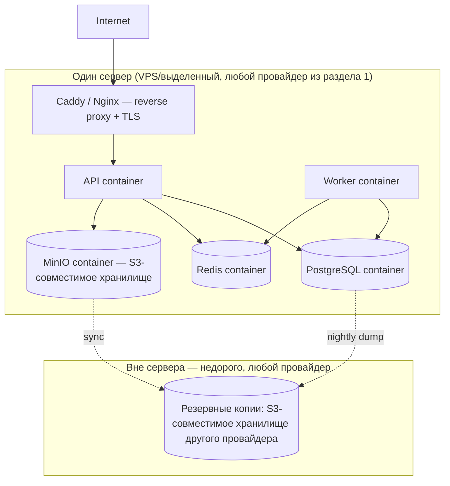

# Инфраструктура GarmentOS: Start Lean, Scale Smart

> Решение владельца проекта (зафиксировано в этом документе): **инфраструктура cloud-agnostic**, без привязки к конкретному облачному провайдеру. См. также [`ARCHITECTURE.md`](./ARCHITECTURE.md) п.9 (развёртывание), [`TECH_STACK.md`](./TECH_STACK.md), [`ARCHITECTURE_SELF_REVIEW.md`](./ARCHITECTURE_SELF_REVIEW.md) (открытый вопрос №1 — закрыт этим документом).

## 1. Принцип

**Start Lean, Scale Smart**: на старте — минимально необходимая инфраструктура с минимальными ежемесячными расходами; архитектура при этом спроектирована так, чтобы рост нагрузки закрывался добавлением ресурсов/сервисов, а не переписыванием кода или сменой платформы.

**Cloud-agnostic**: приложение не должно знать, на чьих серверах оно работает. Единственные требования к среде исполнения — Docker, доступ к PostgreSQL-совместимой БД, Redis-совместимому кэшу и S3-совместимому объектному хранилищу. Всё остальное — детали конкретного окружения, переключаемые через переменные окружения.

Целевые площадки размещения, между которыми система должна переноситься **без изменений в коде** (только конфигурация окружения):

| Площадка | Роль в стратегии |
|---|---|
| Сервер в Кыргызстане | Кандидат №1 по стоимости — оценивается наравне с остальными по критериям из раздела 4 |
| Собственный сервер (bare metal / colocation) | Максимальный контроль, минимальные операционные расходы вне аренды |
| Yandex Cloud | Кандидат для соответствия локализации ПДн граждан РФ (152-ФЗ/242-ФЗ), если потребуется |
| VK Cloud | Альтернативный РФ-провайдер с managed Postgres/Redis/S3 |
| AWS / Google Cloud / Azure | Глобальные провайдеры — доступны как опция роста/резерва, не как обязательный выбор |

## 2. Как достигается переносимость

### 2.1. Контейнеризация всего

Каждый деплоюмый компонент (`apps/api`, воркеры, `apps/web`) — Docker-образ, собираемый в CI и публикуемый в container registry (может быть GitHub Container Registry, Docker Hub, registry конкретного провайдера — выбор реестра тоже не привязывает нас к платформе, образ переносим). Ни один компонент не пишется как managed-функция конкретного облака (никаких Yandex Cloud Functions, AWS Lambda, Azure Functions в основном пути системы) — только длительно живущие процессы в контейнерах, которые одинаково запускаются `docker run` где угодно.

### 2.2. Данные — через стандартные протоколы, не проприетарные SDK

| Компонент | Как достигается переносимость |
|---|---|
| **PostgreSQL** | Подключение через стандартный `DATABASE_URL` (протокол Postgres). Работает одинаково с self-hosted контейнером, managed Postgres любого облака или РФ-провайдера. Без использования проприетарных расширений/функций конкретного облака |
| **Redis** | Подключение через стандартный `REDIS_URL`. Self-hosted контейнер или managed Redis — не имеет значения для кода приложения |
| **Object Storage** | Доступ **только** через S3-совместимый API за интерфейсом `StorageAdapter` (см. раздел 2.3) — работает с AWS S3, Yandex Object Storage, VK Cloud Storage, MinIO (self-hosted), Backblaze B2 и любым другим S3-совместимым провайдером без изменения кода домена |

### 2.3. Адаптер для объектного хранилища — тот же паттерн, что и для маркетплейсов

По аналогии с `MarketplaceConnector` (`ARCHITECTURE.md`, п.5.1), доступ к файлам (фото товаров, файлы техкарт, экспортные отчёты) инкапсулирован за единым интерфейсом:

```typescript
interface StorageAdapter {
  upload(key: string, data: Buffer, contentType: string): Promise<void>;
  download(key: string): Promise<Buffer>;
  getSignedUrl(key: string, expiresInSeconds: number): Promise<string>;
  delete(key: string): Promise<void>;
}
```

Домен работает только с `StorageAdapter`. Конкретная реализация (AWS SDK, Yandex Object Storage SDK — который тоже S3-совместим, или MinIO client) конфигурируется через переменные окружения (`S3_ENDPOINT`, `S3_ACCESS_KEY`, `S3_SECRET_KEY`, `S3_BUCKET`) и меняется без единой строчки в доменном коде.

### 2.4. 12-factor конфигурация

Все параметры окружения (строки подключения к БД/Redis/S3, ключи внешних API) передаются через переменные окружения, никогда не хардкодятся и не зависят от механизма конкретного облака (например, не используется AWS Secrets Manager как обязательная зависимость — секрет-хранилище любого провайдера, включая обычный `.env` с ограниченным доступом на старте, подходит, если инжектирует те же переменные окружения).

## 3. Эталонный стек Фазы 1 (Lean-старт)

Минимально необходимая продовая среда — **один сервер** (VPS или выделенный), поднятый через Docker Compose:



Почему так, а не managed-сервисы с первого дня:
- Managed Postgres/Redis/S3 стоят кратно дороже self-hosted контейнеров на старте, а нагрузка 1-3 пилотных компаний (см. `PROJECT_VISION.md`) не требует их надёжностных гарантий.
- Резервные копии **обязательны с первого дня** (не экономим на бэкапах) и хранятся физически на другом провайдере/локации, чем основной сервер — это дешёвая страховка от потери данных/недоступности одной площадки.
- Один сервер — сознательный компромисс: при простое всей системы это простой для всех пилотов. Это принимается как риск на Фазе 1 (малое число пользователей, некритичные окна обслуживания) и явно пересматривается при переходе к Фазе 2 (раздел 5).

## 4. Как принимается решение о конкретной площадке/технологии

Любой выбор конкретного провайдера или managed-сервиса взамен self-hosted оценивается по всем пяти критериям, не по одному:

| Критерий | Вопрос |
|---|---|
| Стоимость | Сколько это стоит в месяц при текущей нагрузке, и как растёт стоимость при 10x росте данных/трафика? |
| Простота обслуживания | Сколько человеко-часов в месяц требует self-hosted alternative по сравнению с managed? |
| Производительность | Достаточно ли для целевых p95 из `QUALITY_STANDARDS.md`? |
| Надёжность | Какой фактический uptime/SLA, есть ли встроенное резервирование? |
| Масштабируемость | Что происходит, когда текущее решение упирается в потолок — постепенное расширение или миграция? |

**Решение по умолчанию для Фазы 1**: self-hosted в Docker Compose на самом дешёвом надёжном сервере среди площадок раздела 1 (конкретный провайдер выбирается по факту сравнения цен на момент запуска — не фиксируется в этом документе, чтобы не устареть). Managed-сервис вместо self-hosted выбирается только тогда, когда экономия человеко-часов на обслуживание перевешивает разницу в стоимости — это должно быть явно посчитано, а не предположено.

## 5. Поэтапный план (привязан к `ROADMAP.md`)

| Стадия | Когда | Инфраструктура | Триггер перехода к следующей стадии |
|---|---|---|---|
| **A — Lean-старт** | Фаза 0-1 | Один сервер, Docker Compose, self-hosted Postgres/Redis/MinIO (раздел 3) | Более 1 пилотной компании с растущей нагрузкой ИЛИ требование раздельных сред (staging/prod) |
| **B — Разделение окружений** | Начало Фазы 2 | Отдельные staging/prod, БД на отдельном хосте от API, горизонтальные реплики API за балансировщиком. **Здесь оправдан Terraform** — см. раздел 6 | Число окружений/провайдеров ≥ 2, или дрейф конфигурации между ними стал проблемой вручную |
| **C — Управляемая инфраструктура** | Фаза 3-4 | Managed Postgres/Redis/K8s **у выбранного на тот момент провайдера**, если операционные издержки self-hosted превышают экономию (посчитано по критериям раздела 4) | 100+ компаний-клиентов (цель 3 лет, `PROJECT_VISION.md`), необходимость SLA выше, чем даёт один self-hosted сервер |

Ключевое: переход между стадиями — это **добавление/замена инфраструктурных компонентов**, а не переписывание `packages/domain/*`. Домен ничего не знает об инфраструктуре (принцип 4 в `PRINCIPLES.md`) — именно это делает переход возможным без переписывания бизнес-логики.

## 6. Terraform — только когда оправдано

Terraform **не используется на Стадии A** (раздел 5): один сервер, поднятый один раз через short-скрипт/ручную настройку + `docker compose up`, не оправдывает затраты на поддержку IaC-кода.

Terraform вводится на **Стадии B**, когда выполняется хотя бы одно из условий:
- Появляется больше одного окружения (staging + prod), которые должны быть воспроизводимо идентичны.
- Появляется реальная вероятность миграции между провайдерами (например, сравнение Кыргызстан vs Yandex Cloud по факту счетов) — Terraform-модули на провайдер (используя соответствующие провайдеры Terraform: `yandex`, локальный `docker`/`libvirt` для bare metal, `aws`/`google`/`azurerm` при необходимости) снижают стоимость такой миграции.
- Инфраструктурные изменения делает больше одного человека и ручная настройка становится источником расхождений.

До этого момента инфраструктура Фазы 1 описывается как код в `infra/docker-compose.yml` и короткие provisioning-скрипты (`infra/provision/*.sh`) — этого достаточно и не создаёт мёртвый вес неиспользуемой абстракции (см. принцип 3 «эволюционная архитектура» в `PRINCIPLES.md`).

## 7. Что осознанно не используется (и почему)

| Что рассматривалось | Почему не выбрано на старте |
|---|---|
| Managed Kubernetes (любого провайдера) | Избыточная сложность и стоимость для 1-3 пилотов; путь к k8s открыт (Docker-образы уже готовы к оркестрации), вводится на Стадии C при доказанной необходимости |
| Проприетарные очереди/шины конкретного облака (SQS, Yandex Message Queue и т.д.) | Redis/BullMQ — открытый, переносимый, уже выбран в `TECH_STACK.md`; нет причины дублировать функциональность проприетарным сервисом |
| Vendor-специфичный APM/мониторинг (например, только CloudWatch) | OpenTelemetry + self-hosted Grafana/Prometheus + Sentry-совместимый self-hosted GlitchTip — переносимо между площадками, не создаёт лок-ина (см. `ARCHITECTURE.md` п.8) |
| Serverless-функции как основной механизм выполнения кода | Ломает cloud-agnostic принцип (раздел 2.1); длительно живущие контейнеры переносимы, serverless — нет |
| Managed Postgres/Redis с первого дня | Дороже self-hosted при текущей нагрузке пилотов; вводится на Стадии C, когда посчитано, что это дешевле по совокупности критериев (раздел 4), а не по умолчанию |

## 8. Важная оговорка по комплаенсу (не техническое решение — юридическое)

Выбор площадки размещения по критерию стоимости (включая Кыргызстан) **не отменяет** требований 152-ФЗ/242-ФЗ к локализации персональных данных граждан РФ, если компания-клиент GarmentOS обрабатывает такие данные (сотрудники, контрагенты, покупатели маркетплейсов). Эти требования обязывают, чтобы **запись, систематизация, накопление и хранение** ПДн граждан РФ при первичном сборе происходили на серверах, физически расположенных на территории РФ.

**Из этого следует**: cloud-agnostic архитектура (эта глава) технически позволяет разместить прод где угодно, включая Кыргызстан — но **юридическую применимость** конкретной площадки для конкретного клиента с ПДн граждан РФ должен подтвердить владелец бизнеса (при необходимости — с юристом), прежде чем такая площадка используется для боевых данных реального клиента. Технически система это не блокирует ни для одной площадки; ответственность за выбор конкретной площадки под конкретного клиента — бизнес-решение, а не архитектурное. Это отражено как открытый вопрос в `ARCHITECTURE_SELF_REVIEW.md`.

Практическое следствие: архитектура поддерживает размещение **разных пилотных компаний на разных площадках** (например, площадка в РФ-юрисдикции для клиентов, где это требуется, и более дешёвая площадка — для окружений без реальных ПДн граждан РФ, таких как staging/dev/демо) — это не требует изменений в коде, только в конфигурации деплоя.
