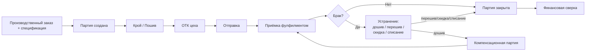

# Баланс производственной партии — архитектура (без реализации)

> Связанные документы: [`DATABASE_SCHEMA.md`](./DATABASE_SCHEMA.md), раздел 8 (Contract Manufacturing — `production_orders`/`production_order_variants`, откуда растёт этот модуль) и строка 270 («Не в MVP, возможно в Future: `production_batches` — если появится потребность дробить один заказ на несколько независимо отслеживаемых партий поставки» — эта потребность теперь явно возникла, см. раздел 0), [`PRINCIPLES.md`](./PRINCIPLES.md) (принцип 3 — эволюционная архитектура: не строить до появления реального use case; принцип 17 — Zero Input; принцип 18 — полная связанность документов; принцип 19 — Immutable Original), [`AI_PRODUCTION_ASSISTANT_ARCHITECTURE.md`](./AI_PRODUCTION_ASSISTANT_ARCHITECTURE.md) (сценарий 4 — двусторонний обмен с цехом, естественная точка расширения для будущих текстовых отчётов о браке), [`DOCUMENT_ENGINE_ARCHITECTURE.md`](./DOCUMENT_ENGINE_ARCHITECTURE.md) (фото/видео брака, акты — обычные `documents`), [`INBOX_ARCHITECTURE.md`](./INBOX_ARCHITECTURE.md), раздел 7.3 (Entity Timeline — переиспользуется для истории переписки по партии, раздел 8), [`AUTH_ARCHITECTURE.md`](./AUTH_ARCHITECTURE.md)/аудит (`packages/domain/audit`, Итерация 6 — переиспользуется для истории изменений партии, раздел 9), `docs/ROADMAP.md` (место в дорожной карте — раздел 11 ниже).
>
> **Статус: архитектура предложена к проектированию, реализация не начата.** Зафиксировано владельцем проекта (2026-07-27) явным указанием: сначала архитектурный документ, код — только после утверждения; после утверждения — отдельная итерация в Roadmap, не довесок к существующим модулям. Первая версия документа (2026-07-27) была расширена в тот же день по прямому запросу владельца проекта: не только защита от повторной оплаты, а полный жизненный цикл партии — причины и место выявления брака, способы устранения помимо компенсации, медиа и переписка, KPI цеха, обязательства цеха, история изменений.
>
> **Именование**: внутри кода/схемы используется английская терминология (`productionBatch`, `batchReconciliation` — техническое название процесса сверки, раздел 4), но модуль в интерфейсе и в разговоре с пользователем называется **«Баланс производственной партии»** / **«Контроль производства»** — не «Production Reconciliation» (термин непонятен бизнесу, зафиксировано владельцем проекта).

## 0. Зачем — реальная потребность, а не гипотетическая функция

При проектировании `Contract Manufacturing` (Итерация 3, Фаза 0) `production_batches` были **сознательно исключены** из MVP: один заказ пошива моделировался как единая сущность (`production_orders` + `production_order_variants`), без отдельного отслеживания партий поставки — с явной пометкой «Future, если появится потребность» (`DATABASE_SCHEMA.md`, строка 270).

Эта потребность теперь названа владельцем проекта конкретно, на реальном сценарии аутсорс-производства: **цех присылает партию не всегда полностью и не всегда без брака, и последующая допоставка компенсирует именно этот брак — не является новым заказом**. Пример:

- Заказано 1000 изделий, оплачено 1000 по договору.
- Цех отгружает партию, фулфилмент принимает 900 — 100 признано браком.
- Через 1-2 недели цех присылает 100 изделий довшива.
- **Это не новый заказ и не новая партия к оплате** — это компенсация брака первой партии. Без отдельного механизма бухгалтер рискует либо оплатить эти 100 изделий второй раз, либо не заметить, что заказ по факту всё ещё не закрыт, потому что 100 изделий так и не были компенсированы.

Сегодня в системе для этого нет ни структуры данных, ни use case — `production_order_variants` фиксирует только план (заказанное количество по SKU), фактически принятое — read-model поверх `stock_movements` (`DATABASE_SCHEMA.md`, раздел 8), без понятия партии, брака или компенсации вообще.

## 1. Что это НЕ («не просто учёт брака»)

Владелец проекта явно расширил рамку дважды: сначала — «это не функция, а отдельный business-модуль», затем — «это не только защита от двойной оплаты, а весь жизненный цикл партии»: заказ → спецификация → крой → пошив → ОТК цеха → отправка → приёмка фулфилментом → брак → устранение (не только компенсация, раздел 6) → повторная отправка → закрытие партии → финансовая сверка.

Один `production_order` может породить **несколько** `production_batch` — исходную и одну или более компенсационных, связанных цепочкой (раздел 3). Брак одной партии может быть закрыт **несколькими способами одновременно** (раздел 6), не только дошивом.

## 2. Bounded context: `packages/domain/production-batch`

Новый доменный пакет — тот же шаблон `domain/application/infrastructure/index.ts`, что и во всех остальных 12. Владеет новыми таблицами (миграция потребуется):

| Таблица | Ключевые поля | Назначение |
|---|---|---|
| `production_batches` | `id`, `company_id`, `production_order_id` (FK), `batch_number` (последовательный в рамках заказа), `status` (`created/cutting/sewing/qc/shipped/received/closed`), `quantity_ordered`, `quantity_shipped NULL`, `quantity_accepted NULL`, `quantity_defective NULL`, `compensates_batch_id NULL` (FK на другую `production_batches` — раздел 3), `closed_at NULL` | Аггрегатный корень модуля — одна физическая поставка от цеха, не весь заказ целиком |
| `batch_defects` | `id`, `batch_id` (FK), `category` (свободный текст, раздел 5), `detection_stage` (свободный текст, раздел 5), `quantity`, `note NULL`, `recorded_by NULL`, `recorded_at` | Факт брака: сколько, что за брак, где выявлен |
| `batch_defect_resolutions` | `id`, `batch_defect_id` (FK), `resolution_type` (`compensation/rework/discount/write_off`), `quantity`, `compensation_batch_id NULL` (FK на `production_batches`, только при `resolution_type='compensation'`), `financial_impact_note NULL`, `recorded_at` | Как именно устранён брак — раздел 6. Одна запись `batch_defects` может иметь **несколько** resolutions (например, 100 брака: 50 дошито + 20 перешито + 30 списано) |

**Не дублирует** `production_orders`/`production_order_variants` (`contract-manufacturing`) — партия ссылается на заказ через FK, не копирует его данные. **Не дублирует** `stock_movements` — физическое движение остатков (приёмка на склад) по-прежнему пишется туда же (`type=receipt`, `reference_type='production_batch'` вместо сегодняшнего `'production_order'` — единственное изменение существующей схемы, обратная совместимость сохраняется, т.к. `reference_type`/`reference_id` уже полиморфны).

### 2.1. Use case'ы

| Use case | Что делает |
|---|---|
| `createBatch` | Создаёт партию по заказу — первая партия создаётся автоматически при подтверждении `production_order` (или явно пользователем/AI), последующие — только как компенсация (`compensatesBatchId` обязателен для 2-й и далее партии одного заказа, если не указано иное) |
| `recordShipment` | Цех сообщает об отправке (Telegram, `docs/AI_PRODUCTION_ASSISTANT_ARCHITECTURE.md`, сценарий 4, или ручной ввод) — фиксирует `quantity_shipped` |
| `recordAcceptance` | Фулфилмент подтверждает приёмку — `quantity_accepted`, пишет `stock_movements` (receipt) |
| `recordDefect` | Фиксирует `batch_defects` (категория + место выявления + количество, раздел 5) — `quantity_defective` партии = сумма записей брака |
| `resolveDefect` | Фиксирует `batch_defect_resolutions` — один или несколько способов устранения конкретной записи брака (раздел 6); **не позволяет** сумме количества resolutions по одному дефекту превысить количество самого дефекта |
| `createCompensationBatch` | Создаёт новую партию с `compensatesBatchId`, вызывается из `resolveDefect` при `resolution_type='compensation'` — предзаполняет количество из соответствующей resolution, **не позволяет** превысить объём непокрытого брака (инвариант, раздел 3) |
| `closeBatch` | Закрывает партию, когда весь `quantity_defective` покрыт resolutions (компенсацией и/или перешивом/скидкой/списанием) и `quantity_accepted + скомпенсировано == quantity_ordered` — иначе явная ошибка «партия не может быть закрыта, остаток N единиц не покрыт» |
| `reconcileBatchPayment` **(техническое имя — «Production Reconciliation», раздел 4)** | Проверяет, не создаётся ли платёж/счёт на количество, уже оплаченное в компенсируемой партии — раздел 4 |

## 3. Инвариант: цепочка компенсации

Ключевой доменный инвариант, ради которого создаётся весь модуль:

> **Компенсационная партия не может компенсировать больше брака, чем зафиксировано и ещё не покрыто (через уже существующие resolutions) в исходной партии.**

`compensatesBatchId` образует цепочку (партия №19 компенсирует №18, №20 могла бы компенсировать остаток №18 или брак №19 — обе валидны, поле указывает ровно одну родительскую партию). Через историю цепочки в любой момент можно восстановить: «почему заказ №25 закрылся на 3 недели позже, чем планировалось» (владелец проекта, «История компенсаций») — это уже read-model над `production_batches`/`compensates_batch_id`, не отдельная таблица.

## 4. Баланс партии и предотвращение повторной оплаты

**Баланс партии** — read-model, не отдельная таблица (тот же принцип, что маржа в Finance, `DATABASE_SCHEMA.md`, раздел 0b): `ordered / paid / produced / shipped / accepted / defective / compensated / remaining`.

**Баланс взаиморасчётов с цехом** — то же самое, агрегированное по всем партиям всех заказов этого цеха: сколько оплачено, сколько реально принято, сколько ещё должен цех (в виде дошива), сколько должны мы (если приняли больше оплаченного — переплата в другую сторону).

**Механизм предотвращения повторной оплаты (`reconcileBatchPayment`, техническое название процесса — Production Reconciliation)**: когда создаётся `cost_entries`/`invoices` строка типа «оплата пошива» (`Finance`, `docs/DATABASE_SCHEMA.md`, раздел 0b) со ссылкой на партию, use case проверяет `compensates_batch_id` — если партия компенсационная, ожидаемая сумма оплаты за пошив по умолчанию равна нулю (эти изделия уже оплачены в исходной партии), и попытка провести полную оплату **вызывает явное предупреждение** с точной формулировкой не хуже примера владельца проекта: *«Эти N изделий уже были оплачены в партии №X — повторная оплата не требуется»*.

**Открытый вопрос владельцу проекта (бизнес-правило, не архитектура — `CLAUDE.md`, раздел 6.8):** должно ли предупреждение **блокировать** проведение оплаты (жёсткий инвариант) или только **предупреждать**, оставляя решение бухгалтеру (например, компенсационная партия иногда всё же несёт частичные расходы — материал на замену, логистика)? Это решение кодирует бизнес-правило и не реализуется в коде до явного подтверждения.

## 5. Причины и место выявления брака

**Категория брака** (`batch_defects.category`) — свободный текст, не жёсткий enum (тот же принцип, что `documents.doc_type`: у каждой компании свой словарь, не диктуется системой), но модуль поставляется с **рекомендуемым стандартным набором** (заполняется по умолчанию в UI как подсказка, не ограничение): раскрой, пошив, ткань, фурнитура, загрязнение, неправильный размер, неправильная маркировка, повреждение при перевозке, брак выявлен фулфилментом, другое.

**Место выявления** (`batch_defects.detection_stage`) — тоже свободный текст с рекомендуемым набором, соответствующим реальному пути товара: цех (внутренний ОТК) → отправка/логистика → фулфилмент (приёмка) → маркетплейс/склад → возврат покупателя. Хранится **отдельно** от категории причины, потому что это разные измерения одного факта: «что не так» и «кто/где это заметил» — второе прямо определяет, чья это ответственность (брак кроя, найденный цехом до отправки, — не то же самое по последствиям, что тот же брак, обнаруженный только после жалобы покупателя на маркетплейсе).

Оба поля вместе дают аналитическую матрицу «категория × этап» (раздел 8) — не просто накопленный процент, а понимание, на каком этапе цепочки чаще всего теряется качество.

## 6. Способы устранения брака (не только компенсация)

`batch_defect_resolutions.resolution_type`:

| Тип | Что означает | Финансовое следствие |
|---|---|---|
| `compensation` | Цех дошивает недостающее количество бесплатно — создаёт `compensation_batch` (раздел 3) | Оплата пошива за эти единицы уже произведена в исходной партии — повторно не начисляется (раздел 4) |
| `rework` | Изделие исправляется (перешив) без создания новой партии поставки | Обычно бесплатно со стороны цеха (тот же принцип, что compensation) либо частично оплачивается — решается `financial_impact_note` + связанным `cost_entries`, если стоимость реально возникла |
| `discount` | Бренд соглашается принять товар с дефектом со скидкой, не возвращая его цеху | Уменьшение суммы, причитающейся цеху за эту партию, — конкретный use case скидки в `finance` не проектируется этим документом, только связь `financial_impact_note` |
| `write_off` | Товар списывается полностью (брак невозможно исправить или продать) | Влияет на себестоимость партии (раздел 8) — списанные единицы не попадают в остаток склада, `stock_movements` типа `adjustment` |

Одна запись брака может быть закрыта **несколькими resolutions одновременно** (пример владельца проекта: 100 единиц брака → 50 дошито + 20 перешито + 30 списано) — `batch_defect_resolutions` это многие-к-одному к `batch_defects`, сумма количеств resolutions не может превышать количество исходного дефекта (инвариант `resolveDefect`).

## 7. Медиа и переписка по партии — переиспользование существующей инфраструктуры

**Фото/видео/документы брака** — не новая подсистема. `batch_defects`/`production_batches` — обычные сущности для `document_links` (`entityType='batch_defect'`/`'production_batch'`), фото и видео — обычные `documents` (`DOCUMENT_ENGINE_ARCHITECTURE.md`, принцип 18 «полная связанность документов»). Ничего специфичного для брака проектировать не нужно — механизм уже спроектирован для любой сущности.

**История переписки по партии** (пример владельца проекта: цех «отправили» → мы «нашли 47 брака» + фото → цех «дошьём») — это Entity Timeline, уже спроектированный в `INBOX_ARCHITECTURE.md`, раздел 7.3, как read-model поверх `inbox_items`/`document_links` по `(entityType, entityId)`. Требуется одно дополнение: `inbox_items`, порождённые перепиской о конкретной партии (через Telegram-сценарий 4 `AI_PRODUCTION_ASSISTANT_ARCHITECTURE.md`), должны получать `entityType='production_batch'`/`entityId` — то же самое уже происходит для `production_order` (Итерация 7). Отдельного хранилища переписки этот модуль не создаёт.

## 8. Аналитика и KPI цеха — read-models, не новые таблицы

Тот же принцип, что маржа/себестоимость (`DATABASE_SCHEMA.md`, раздел 0b: «вычисляемая метрика... принадлежит модулю Reporting/BI, не доменной таблице»). Поверх `production_batches`/`batch_defects`/`batch_defect_resolutions`:

- **Процент брака по цеху** — текущая партия против среднего за последние N партий этого цеха (пример владельца проекта: «14% против обычных 3.2%» — сам по себе повод для предупреждения пользователю, не только пассивная цифра в отчёте).
- **Процент брака по модели / по ткани / по поставщику ткани** — связь `batch_defects` → `production_order` → `product`/`bom_items` → `material`/`supplier` (уже существующие связи, новых FK не требуется).
- **Матрица «категория брака × место выявления»** (раздел 5) — где именно в цепочке чаще всего теряется качество.
- **Среднее время дошива** — от `closed_at`/создания резолюции компенсируемой партии до `closed_at` компенсационной.
- **KPI-карточка цеха** (пример владельца проекта, витрина на карточке цеха): средний срок пошива, средний % брака, среднее время дошива, количество компенсаций за период, количество просроченных обязательств (раздел 9), средняя цена пошива.
- **Производственная память** на карточке модели («средний срок пошива за 18 партий — 7.3 дня, средний брак — 2.8%, лучший цех — Ак-Сарай») — витрина тех же read-model'ей, не новая инфраструктура.

Ничего из этого раздела не блокирует реализацию разделов 2-6 — аналитика строится поверх уже накопленных данных, реализуется по мере необходимости (`PRINCIPLES.md`, принцип 3), не одновременно с первой итерацией модуля.

## 9. Обязательства цеха

Read-model, не новая сущность с собственным жизненным циклом: **открытое обязательство** — это `batch_defects`, у которых `quantity` ещё не полностью покрыто суммой `batch_defect_resolutions.quantity`. «Просрочено» — если у соответствующей resolution (или у самой записи брака) указан ожидаемый срок устранения (`promised_by`, новое поле на `batch_defect_resolutions` для типа `compensation`/`rework`), и этот срок прошёл, а `compensation_batch` не создан/не закрыт.

Пример владельца проекта — на карточке цеха отображается: «Цех должен дошить 87 изделий, срок до 12 августа, статус: ожидается» — и подсвечивается, если срок нарушен. Это прямое чтение read-model'я «открытые обязательства», не отдельно хранимое состояние — обязательство закрывается автоматически, когда соответствующий `compensation_batch` закрыт (`closeBatch`, раздел 2.1), не отдельным действием пользователя.

## 10. История изменений партии — переиспользование `audit_log`

Не новый механизм. `packages/domain/audit` (Итерация 6) уже применяется ко всем критичным операциям других модулей (`AuditService.record(companyId, userId, source, {entityType, entityId, action, beforeJson, afterJson})`) — изменения `production_batches` (плановое количество, срок, цена пошива, цех, добавление resolution) записываются туда же, `entityType='production_batch'`. Пример владельца проекта («заказ был 1000 → изменили 1200 → перенесли срок → изменили цену → изменили цех → добавили компенсацию») — это последовательность строк `audit_log` с `before_json`/`after_json`, читаемая как таймлайн на карточке партии. Никакой отдельной таблицы «история изменений» не создаётся.

## 11. Точки интеграции с существующими модулями

| Модуль | Что меняется |
|---|---|
| `contract-manufacturing` | Ничего в домене — `production_orders` остаётся владельцем заказа целиком, партии — новый child-модуль, ссылающийся на него по FK. `production_order.status` описывает заказ **в целом**; конкретный прогресс — на уровне партий |
| `warehouse` | `stock_movements.reference_type` получает значение `'production_batch'` вместо `'production_order'` для приёмки готовой продукции. Списание (`write_off`, раздел 6) — `stock_movements` типа `adjustment`. Возврат брака цеху (если физически возвращается) — `type=transfer` на склад цеха |
| `finance` | `reconcileBatchPayment` (раздел 4) — новый use case, читающий `cost_entries`/`invoices` через существующий порт. Себестоимость партии (раздел 8) учитывает `write_off`/`discount` (раздел 6) как корректировки, не новую таблицу |
| `document` | Фото брака, акты приёмки, претензии, акты компенсации — обычные `documents` с `entityType='production_batch'`/`'batch_defect'` (раздел 7) |
| `audit` | Изменения партии — существующий `AuditService`, `entityType='production_batch'` (раздел 10) |
| `ai-production-assistant` / Telegram | Естественное будущее расширение сценария 4 (`AI_PRODUCTION_ASSISTANT_ARCHITECTURE.md`) — цех сможет сообщать факт отгрузки/брак текстом («отправили 900, 100 брак»), парсится тем же `AIClassifier`; переписка становится Entity Timeline партии (раздел 7). **Не входит в первую итерацию этого модуля** — начинается с ручного/API ввода партий, Telegram-интеграция — отдельный, более поздний шаг |

## 12. Терминология (дополнение к глоссарию `CLAUDE.md`, при реализации)

| Русский термин | Английский эквивалент в коде |
|---|---|
| Партия (поставки) | `productionBatch` |
| Брак (факт) | `defect` / `batchDefect` |
| Способ устранения брака | `defectResolution` (`resolutionType`: `compensation`/`rework`/`discount`/`write_off`) |
| Компенсационная партия | `compensationBatch` (частный случай `productionBatch` с заполненным `compensatesBatchId`) |
| Место выявления брака | `detectionStage` |
| Обязательство цеха | вычисляемый read-model, не отдельная сущность (раздел 9) |
| Баланс партии | вычисляемый read-model, не отдельная сущность (раздел 4) |
| Сверка производства (техническое) | `reconcileBatchPayment` / `batchReconciliation` |

## 13. Место в Roadmap

**Не добавляется в `docs/ROADMAP.md` этим документом** — по прямому указанию владельца проекта: сначала утверждение архитектуры, отдельным решением — номер итерации и место в очереди (после текущей Итерации 7 — вертикальный сценарий 1 — но до или после Итераций 8-12, решает владелец проекта, не архитектура). Зависимости для реализации: `contract-manufacturing` (готово), `warehouse` (готово), `finance` (готово), `document` (готово, Итерация 7), `audit` (готово, Итерация 6) — модуль не блокирован ничем технически, может начаться в любой момент после утверждения этого документа.
