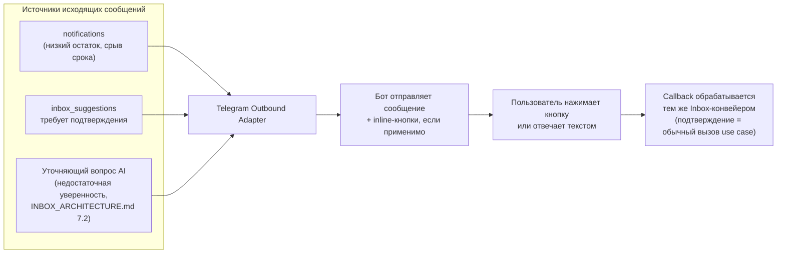

# Telegram Integration — архитектура (без реализации)

> Связанные документы: [`INBOX_ARCHITECTURE.md`](./INBOX_ARCHITECTURE.md) (раздел 1 — форматы, раздел 5 — Telegram как приоритетный канал MVP, раздел 8 — UX one-tap), [`AI_PRODUCTION_ASSISTANT_ARCHITECTURE.md`](./AI_PRODUCTION_ASSISTANT_ARCHITECTURE.md), раздел 6 (двусторонний обмен с цехом), [`AUTH_ARCHITECTURE.md`](./AUTH_ARCHITECTURE.md) (кто есть кто в системе), `docs/DATABASE_SCHEMA.md`, раздел 15 (`inbox_channels`, `notifications`).
>
> **Статус: архитектура утверждена к проектированию, реализация не начата.**

> **Явное ограничение скоупа (зафиксировано 2026-08-02):** GarmentOS не заменяет и не встраивает в себя переписку с цехами. Общение с подрядчиками остаётся в Telegram/WhatsApp/по телефону вне системы — GarmentOS не отправляет произвольные сообщения в цех и не ведёт диалог с исполнителем от имени пользователя. Бот, описанный в этом документе, — узкий структурированный протокол (заказ → предпросмотр → подтверждение → спецификация; статус-ответ цеха по ключевым словам), а не канал свободной переписки. Это не меняет ничего в уже спроектированной архитектуре ниже — она и так построена именно так (`ProductionOrderOrchestrationService`, не пересылка произвольного текста) — здесь лишь явно закрывается вопрос, чтобы не расширять скоуп по инерции при реализации Итераций 11/13.

## 0. Зачем отдельный документ, если Telegram уже описан в INBOX_ARCHITECTURE.md

`INBOX_ARCHITECTURE.md` описывает Telegram как один из источников **входящего** потока (раздел 1, раздел 5) — там Telegram ничем принципиально не отличается от email/веб-загрузки: сообщение попадает в `inbox_items`, дальше работает общий конвейер классификации. Этого достаточно для раздела «откуда пришли данные», но недостаточно для двух вещей, которые специфичны именно для Telegram и нужны уже в Итерации 9:

1. **Исходящие сообщения** — бот не только принимает, но и пишет: просит подтверждение (`INBOX_ARCHITECTURE.md`, раздел 8 — inline-кнопки), присылает уведомления (низкий остаток, задержка заказа), задаёт уточняющий вопрос, если уверенность классификации недостаточна (`INBOX_ARCHITECTURE.md`, раздел 7.2). Это новый поток данных **из** системы **в** Telegram, которого предыдущий документ не описывает вообще.
2. **Участники, не являющиеся пользователями системы** — цех, водитель, поставщик пишут боту, но у них нет учётной записи `users` и, следовательно, нет ни роли, ни permissions (`AUTH_ARCHITECTURE.md`). Нужен явный механизм связывания «кто написал» → «к какой компании/сущности это относится», не совпадающий с обычной аутентификацией.

Этот документ закрывает именно эти два вопроса — транспортный и организационный слой Telegram. Классификация того, что пришло, и что с этим делать дальше — по-прежнему `INBOX_ARCHITECTURE.md`, не дублируется здесь.

## 1. Модель бота: один бот на всю систему, не по одному на компанию

**Решение**: GarmentOS использует **один** Telegram-бот (один токен Bot API), общий для всех компаний-тенантов, а не отдельного бота на каждую компанию.

Обоснование:
- Создание отдельного бота на компанию потребовало бы от каждого нового клиента вручную регистрировать бота у @BotFather и передавать токен в систему — прямое нарушение Zero Input (`PRINCIPLES.md`, принцип 17) на этапе онбординга, который и так не self-service (`AUTH_ARCHITECTURE.md`, раздел 9 — компания заводится через CLI-бутстрап).
- Один бот с мультитенантным разделением на уровне данных (`company_id`) — тот же принцип, что уже применяется ко всей остальной архитектуре (`ARCHITECTURE.md`, п.6: мультитенантность — единая БД, изоляция по `company_id`, не по инфраструктуре).

Разделение по компаниям обеспечивается на уровне `inbox_channels`: каждая компания получает уникальный **инвайт-код** при бутстрапе (или добавляет его в настройках) — пользователь компании открывает диалог с ботом и отправляет `/start <код>`, бот создаёт строку `inbox_channels` (`type='telegram'`, `external_identifier` = Telegram `chat_id` этого диалога, `company_id` = компания владельца кода). Один Telegram-чат = один `inbox_channel` = одна компания — простое и однозначное отображение, не требующее отдельной инфраструктуры на клиента.

## 2. Два класса собеседников бота

| Класс | Кто | Как привязан к компании | Что может делать |
|---|---|---|---|
| **Пользователь системы** | Владелец, директор, бухгалтер и т.д. — уже существующая строка `users` | Личный `/start <код>` привязывает Telegram `chat_id` к `inbox_channels.company_id`; далее — сопоставление `chat_id → user_id` для персональных ответов бота (например, "у тебя 3 непрочитанных уведомления") | Всё, что позволяет его роль/permissions в системе — бот не даёт больше прав, чем даёт RBAC (`AUTH_ARCHITECTURE.md`) |
| **Внешний участник** (цех, поставщик, водитель) | Не имеет записи `users` — обычный контакт вне системы | `inbox_items.source_identifier` = Telegram-идентификатор отправителя (username/`user_id` Telegram); сопоставление с `workshop`/`supplier` — эвристикой по истории подтверждённых сообщений от этого идентификатора (`INBOX_ARCHITECTURE.md`, раздел 7.1, источник №2) | Ничего не делает **сам** — его сообщение становится `inbox_item`/`inbox_suggestion`, требующим подтверждения пользователя системы. Внешний участник никогда не получает прав, аналогично тому, как AI никогда не получает собственных прав (`AUTH_ARCHITECTURE.md`, раздел 13) — та же модель "источник предлагает, человек внутри компании подтверждает" |

Ключевое следствие: **бот никогда не выполняет доменное действие напрямую из сообщения внешнего участника.** Сообщение цеха о готовности заказа порождает `inbox_suggestion`, который **пользователь системы** (не обязательно тот, кто физически читает Telegram в этот момент — уведомление может уйти любому, у кого есть право на этот заказ) подтверждает тем же one-tap механизмом, что и любое другое предложение Inbox.

## 3. Исходящий поток: бот пишет первым

Три независимых повода для исходящего сообщения — не одна общая "рассылка", а три разных источника, объединённых общим транспортом:

- **`notifications` как источник** — модуль Notifications (уже реализован, Итерация 4) хранит уведомления в БД независимо от канала доставки; Telegram становится **одним из** каналов доставки, не заменяет существующую модель. Adapter подписывается на создание новых `notifications` для пользователей с привязанным Telegram-чатом и отправляет сообщение — таблица `notifications` не меняется, только появляется потребитель.
- **`inbox_suggestions` как источник** — уже существующий поток (`INBOX_ARCHITECTURE.md`), просто данный документ описывает, что "показ предложения" технически означает исходящее сообщение с inline-кнопками `[✅ Подтвердить] [✏️ Изменить] [❌ Отклонить]`, а нажатие кнопки — это callback, обрабатываемый как обычное подтверждение (`raздел 2 INBOX_ARCHITECTURE.md`, правая ветка).
- **Уточняющий вопрос** — когда уверенность классификации недостаточна (`INBOX_ARCHITECTURE.md`, раздел 7.2), бот присылает вопрос с вариантами вместо one-tap кнопки; ответ обрабатывается тем же путём.

**Telegram Outbound Adapter — тонкий адаптер, не отдельный доменный модуль.** Он не хранит состояния сверх необходимого для доставки (соответствие `user_id ↔ chat_id`, взятое из `inbox_channels`) — все содержательные данные уже лежат в `notifications`/`inbox_suggestions`.

## 4. Транспорт: webhook, не long polling

**Решение**: продакшн-бот работает через Telegram webhook (Bot API `setWebhook`), не через long polling.

Обоснование: long polling требует постоянно работающего процесса, который держит соединение с Telegram API — избыточно для cloud-agnostic инфраструктуры (`docs/INFRASTRUCTURE.md`, «Start Lean, Scale Smart»), где `apps/api` и так уже HTTP-сервер. Webhook — это ещё один HTTP-эндпоинт на уже существующем сервере (`POST /v1/telegram/webhook`, `@Public()` — Telegram не аутентифицируется через JWT системы, проверяется секретным путём URL и/или `X-Telegram-Bot-Api-Secret-Token`, отдельно от `JwtAuthGuard`).

## 5. Идемпотентность и надёжность доставки

Telegram может повторно доставить update при таймауте ответа — обработчик webhook обязан быть идемпотентным: сохранение `inbox_items` по `(inbox_channel_id, telegram_update_id)` с уникальным ограничением предотвращает дублирование одного и того же входящего сообщения, если Telegram повторит доставку. Это расширение существующей таблицы `inbox_items` одним уникальным индексом, не новая сущность.

## 6. Границы и явно не решённые вопросы

- **Голосовые сообщения и фото** обрабатываются Bot API так же, как описано в `INBOX_ARCHITECTURE.md`, раздел 1 (скачивание файла через Bot API → `StorageAdapter` → тот же конвейер) — этот документ не добавляет здесь ничего нового, только называет транспорт.
- **Групповые чаты** (например, общий чат с цехом, где пишут несколько его сотрudников) — открытый вопрос: `source_identifier` в этом случае должен различать конкретного отправителя внутри группы, а не только `chat_id` группы. Решается при реализации по факту того, как реально используются групповые чаты на пилоте — не блокирует MVP (там ожидаются в основном личные диалоги с ботом).
- **Rate limits Bot API** (30 сообщений/сек глобально, 1 сообщение/сек на чат) — эксплуатационное ограничение, учитывается в реализации Outbound Adapter (очередь отправки), не архитектурное решение этого документа.
- **Многоязычность** (цех может писать не по-русски) — не в скоупе MVP; при необходимости — расширение классификатора (`docs/TECH_STACK.md`), не Telegram-специфичная задача.

## 7. Место в Roadmap

Единственный канал MVP-Inbox — Итерация 9 (`docs/ROADMAP.md`, `INBOX_ARCHITECTURE.md`, раздел 5). Исходящий поток (раздел 3 этого документа) реализуется в той же итерации — без него Inbox не может достичь one-tap confirm в Telegram, только приём. Двусторонний обмен с цехом (раздел 2, класс "внешний участник") — часть того же Итерации 9, расширяемая сценариями AI Production Assistant (Фаза 2) без изменений в транспортном слое, описанном здесь.
