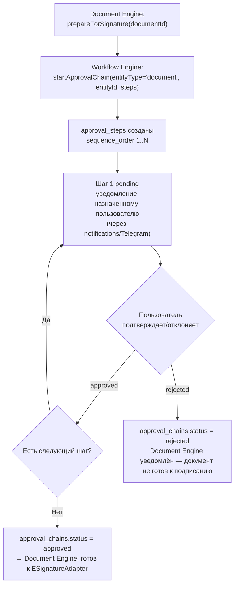

# Workflow Engine — архитектура (без реализации)

> Связанные документы: [`DOCUMENT_ENGINE_ARCHITECTURE.md`](./DOCUMENT_ENGINE_ARCHITECTURE.md), раздел 3 (подготовка к подписанию — главный драйвер этого модуля), [`AI_PRODUCTION_ASSISTANT_ARCHITECTURE.md`](./AI_PRODUCTION_ASSISTANT_ARCHITECTURE.md), раздел 5 (согласование документов), [`PRINCIPLES.md`](./PRINCIPLES.md), принцип 3 (эволюционная архитектура — не строить абстракцию раньше второго реального применения), [`AUTH_ARCHITECTURE.md`](./AUTH_ARCHITECTURE.md) (роли/permissions, от чьего имени выполняется каждый шаг).
>
> **Статус: архитектура утверждена к проектированию, реализация не начата.**

## 0. Первый вопрос, который нужно задать честно: а нужен ли вообще отдельный "движок"

В системе уже есть несколько многошаговых процессов — они реализованы как простые доменные state machine, не через общий механизм:

| Сущность | Переходы статуса |
|---|---|
| `boms` | `draft → approved` (или `archived`) |
| `production_orders` | `draft → placed → in_progress → ready_for_pickup → received` (или `cancelled`) |
| `invoices` | `draft → issued → paid`/`overdue` (или `cancelled`) |
| `marking_codes` | `issued → applied → introduced → sold` (или `damaged`/`retired`) |

Все они — **однопользовательские последовательные переходы с жёстко закодированными правилами** (кто может перевести — определяется одним permission модуля, `bom.approve`/`*.write`; куда можно перейти — доменный инвариант, проверяемый в use case). Обобщать их в общий "workflow engine" сейчас означало бы абстракцию ради абстракции — прямое нарушение принципа 3 (`PRINCIPLES.md`, эволюционная архитектура: не обобщать, пока не появился второй реальный случай, требующий обобщения). **Этот документ не переписывает и не трогает ни одну из них.**

**Реальный новый случай, которого ни одна из существующих state machine не покрывает** — согласование документа **несколькими разными людьми, в настраиваемом компанией порядке**, прежде чем документ будет готов к подписанию (`DOCUMENT_ENGINE_ARCHITECTURE.md`, раздел 3; `AI_PRODUCTION_ASSISTANT_ARCHITECTURE.md`, раздел 5): «сначала согласовывает бухгалтер, потом подписывает директор» — и этот порядок отличается от компании к компании. Ни одна из существующих таблиц не рассчитана на переменное число шагов с переменным составом участников. Это единственное обоснование для отдельного механизма — не абстрактное «на будущее», а конкретная нерешённая задача.

## 1. Границы: маленький механизм согласования, не BPMN-движок

**Явное архитектурное решение: Workflow Engine в этой версии — это узкоспециализированный механизм «цепочка согласования документа», не универсальный process engine с условными ветвлениями, параллельными шагами, таймерами и т.п.** Расширение до более общего механизма — только когда появится второй реальный процесс, требующий того же (принцип 3), не заранее.

Область применения на старте — ровно один тип объекта: `documents`, требующий согласования перед подписанием (`DOCUMENT_ENGINE_ARCHITECTURE.md`, раздел 3). Полиморфность (потенциально согласовывать что-то ещё, не только документ) закладывается в структуру данных так же дёшево, как в `document_links`/`notes`/`audit_log` (`entity_type` + `entity_id`, `DATABASE_SCHEMA.md`, раздел 1), но не реализуется для другого типа сущности, пока не появится конкретная потребность.

## 2. Модель данных (эскиз, не миграция)

```
approval_chains
  id, company_id, entity_type, entity_id, status (in_progress/approved/rejected/cancelled), created_at

approval_steps
  id, approval_chain_id, sequence_order (int),
  required_role_code | required_permission (что именно — открытый вопрос, раздел 4),
  assigned_user_id (nullable — конкретный человек, если назначен явно, а не «любой с этой ролью»),
  status (pending/approved/rejected/skipped),
  decided_by (nullable FK users), decided_at (nullable), comment (nullable)
```

- **`sequence_order`** — шаги проходятся строго по порядку; следующий шаг становится доступным только после того, как предыдущий получил `approved`. Отклонение (`rejected`) на любом шаге останавливает всю цепочку — `approval_chains.status = rejected` (компания решает, что дальше — переделать документ и начать цепочку заново или отменить процесс; это уже не забота Workflow Engine, а решение, которое принимает пользователь).
- **Явно НЕ входит в эту версию**: параллельные шаги (несколько согласующих одновременно, не по очереди), условные ветвления («если сумма > X — добавить ещё один шаг»), автоматическая эскалация по таймауту. Если один из этих сценариев станет реальной потребностью — расширение делается тогда, не сейчас (принцип 3).

## 3. Как это встраивается в существующую архитектуру



- **Workflow Engine не знает, что такое `production_order`, `bom` или `invoice`** — он получает `entityType='document'`/`entityId` и список требуемых шагов от вызывающего (Document Engine), полностью независим от домена документа. Это тот же паттерн изоляции, что и `document_links`/`audit_log` — полиморфная ссылка, не прямой FK на переменную таблицу (`DATABASE_SCHEMA.md`, раздел 1).
- **Подтверждение каждого шага — обычное аутентифицированное действие**, с тем же требованием, что и везде: выполняется от имени конкретного пользователя, попадает в `audit_log` (`entityType='approval_step'`) — никакого отдельного, "упрощённого" пути авторизации для согласования (`AUTH_ARCHITECTURE.md`, раздел 13 — принцип "AI/внешние процессы не получают собственных прав" распространяется и на автоматизированные шаги workflow: движок сам ничего не подтверждает, только организует очередь и уведомляет).
- **Уведомление о том, что наступила ваша очередь согласовывать** — использует уже существующий `notifications` (и, если подключён, Telegram-канал доставки, `TELEGRAM_INTEGRATION_ARCHITECTURE.md`, раздел 3) — не новый канал уведомлений.

## 4. Что осознанно не решено этим документом (требует решения владельца проекта, не архитектурное)

Это **бизнес-правило**, а не техническая деталь — попадает под то же требование, что и матрица permissions (`AUTH_ARCHITECTURE.md`, раздел 0: «решение, кодирующее бизнес-логику, не реализуется в коде до явного подтверждения владельца проекта»):

- **Кто по умолчанию входит в цепочку согласования документа** (какие роли/должности, в каком порядке) — вероятно настраивается компанией, а не жёстко задаётся кодом (аналогично тому, что роли — данные, не код, `AUTH_ARCHITECTURE.md`, раздел 4). Конкретный UI/API для такой настройки — вне скоупа этого документа.
- **Что происходит при отклонении** — нужно ли автоматически возвращать документ инициатору с возможностью повторной отправки, или требуется полностью новая цепочка — продуктовое решение.
- **Нужна ли эскалация по таймауту** уже в MVP этого механизма, или это осознанно отложено (раздел 1) — решается по факту первого реального использования на пилоте, не заранее.

## 5. Место в Roadmap

Реализуется как часть или сразу после `Document Engine` (не раньше него — нечего согласовывать без документа) и не раньше, чем реальный сценарий его требующий — `AI Production Assistant`, раздел 5 (Фаза 2, `docs/ROADMAP.md`). До этого момента остаётся спроектированным, но нереализованным — существующие state machine доменных модулей (раздел 0) продолжают работать без изменений и не блокируются отсутствием этого механизма.
